# CS106L: Standard C++ Programming

$$
\rm by~\mathfrak {leo\_grayrat}\hspace{1em}\rm initiated~from ~\mathfrak {10~Feb~ 2026}
$$

> 我从大一开始一直都是写的 C++ 代码，直到学完这门课我才意识到，我写的 C++ 代码大概只是 C 语言 + `cin`/`cout` 而已。	from www.csdiy.wiki

Tips: This course was originally designed primarily for transitioning **from Python** to C++.

> 本文由英语撰写，但是充满了蹩脚表达和机翻，主要是在符合原英语文本语境和方便撰写中找平衡，补药骂我写的差QwQ……*必要处有斜体中文翻译*

## L1 Welcome

C stuffs are also ok in C++...

```cpp
#include "stdio.h"
#include "stdlib.h"
int main(int argc, char *argv[]) {
	printf("%s", "Hello, world!\n");
	// a C function!
	return EXIT_SUCCESS;
}
```

But **modern** C++ be like...

```cpp
#include <iostream>
#include <string>
int main() {
	auto str = std::make_unique<std::string>("Hello World!");
    //Smart pointers 智能指针 & Templates 类模板
	std::cout << *str << std::endl;//Streams 流 & Operator Overloading 运算符重载
	return 0;
}
// Prints "Hello World!"
```

This is much better than those C++ codes that are simply `C with cin & cout`!

## L2 Types & Structs

### Compile vs Run

Interpreted languages (Python) all run in run time! → **Run Time** Error
Compiled Languages (C++) run in first compile time then run time. → **Compile Time** Error

### Types

C++ is a **statically typed** *静态类型* language. Every variable must declare a type. Once declared, the type cannot change!

> Python: Dynamic Typing. The interpreter assigns variables a type at runtime based on the variable's **value at that time**. `d=106` then `d="hello world"` is ok!

```cpp
string 		a = "test";
double 		b = 3.2 * 5 - 1;
int 		c = 5 / 2; // What does this equal?
int 		d(int foo) { return foo / 2; }
double 		e(double foo) { return foo / 2; }
int 		f(double foo) { return (int)(foo + 0.5); } // What's this?
void 		g(double c) { std::cout << c << std::endl; }
```

#### Function Overloading

Defining two functions with the **same name** but **different parameters**. *函数重载*

```cpp
double axolotl(int x) { 	// (1)
	return (double) x + 3; // typecast: int → double
}
double axolotl(double x) { 	// (2)
	return x * 3;
}
axolotl(2); 	// uses version (1), returns 5.0
axolotl(2.0); 	// uses version (2), returns 6.0
```

### Structs

Return more than one value → Structs bundle data together!

```cpp
struct StanfordID { // The 'struct' keyword can be OMITTED in C++
	string name; 	// These are called fields 字段
	string sunet; 	// Each has a name and type
	int idNumber;
};

struct StanfordID id; // Initialize struct
id.name = "THE Stanford Tree"; // Access field with '.'
id.sunet = "theTREE";
id.idNumber = 0000002;
```

#### Uniform Initialization

Use **curly braces {}** to initialize objects of all types (primitive types, classes, arrays, containers, etc.).

*统一初始化，用花括号来初始化所有类型的对象（基本类型、类、数组、容器等）*

Especially, the **list** initialization.

```cpp
// Order depends on field order in struct. '=' is optional
struct StanfordID tree = { "THE Stanford Tree", "theTREE", 0000002 };
struct StanfordID lelandjr { "Leland Stanford Jr", "thejunior", 5430282 };
```

### `std::pair`

Many structs seems alike, name=first+last, point=x+y, list=item+quantity, circle=center+radius... → **PAIR**

```CPP
std::pair<std::string, int> dozen { "Eggs", 12 };
std::string item = dozen.first; 	// "Eggs"
int quantity = dozen.second; 		// 12
```

std::pair is a template, like this  `template <typename T1, typename T2>`

#### What is an std !!?

The C++ Standard Library

You need to #include the relevant file.	`#include <string> → std::string	#include <utility> → std::pair	#include <iostream> → std::cout, std::endl`

We **prefix** standard library names with `std::`

> If we write `using namespace std`; we don't have to, but this is considered **bad style** as it can introduce ambiguity *歧义* ! (What would happen if we defined our own string?)

### Quality of life features to improve your code

```cpp
std::pair<bool, std::pair<double, double>> solveQuadratic(double a,double b,double c);
```

#### `using`

Typing out long type names gets tiring, so we can create type **aliases** *别名* with the `using` keyword.

```cpp
using Zeros = std::pair<double, double>;
using Solution = std::pair<bool, Zeros>;
Solution solveQuadratic(double a, double b, double c);
```

#### `auto`

The `auto` keyword tells the compiler to **infer** the type.

```cpp
auto result = solveQuadratic(a, b, c);
	std::pair<bool, std::pair<double, double>> result = ...; // original version
// This is exactly the same as the above!
// result still has type std::pair<bool, std::pair<double, double>>
// We just told the compiler to figure this out for us!
```

This makes your code clearer!

> But it doesn't mean we can abuse it, like `auto a=1;` is inferior to `int a=1;`.

## L3 Initialization & References

### Uniform Initialization (C++ 11)

#### Safe

```cpp
int numOne = 12.5;	int numTwo(12.5);
```

C++ **doesn't type check** with direct initialization! There might be **narrowing conversions**.

But with uniform initialization (**curly braces**), C++ does care about types...

```cpp
int numOne{12.0}; // will trigger narrowing conversion error
int numOne{12};		float numTwo{12.0}; // No error!
```

#### Ubiquitous

It works for all types like vectors, maps, and custom classes, among other things!

```cpp
std::vector<int> numbers{1, 2, 3, 4, 5};
std::map<std::string, int> ages{ {"Alice", 25},{"Bob", 30},{"Charlie", 35} };
```

> Here are some examples of **`auto`** + uniform initialization. In a word, **use `=`** when do so!
>
> ```cpp
> auto a{42}; 		// OK: initializes an int 
> auto b{1,2,3};		// error: direct-list-initialization of ‘auto’ requires exactly one element [-fpermissive]
> auto c = {42}; 		// still initializes a std::initializer_list<int>
> auto d = {1,2,3}; 	// still OK: initializes a std::initializer_list<int>
> ```

### Structured Binding (C++ 17)

> *结构化绑定*
>
> ```matlab
> [r,c]=size(A); [V,D] = eig(A);  % 此事在MATLAB中亦有记载
> ```

```cpp
std::tuple<std::string, std::string, std::string> getClassInfo() {
	...return {className, buildingName, language};
}
int main() {
	auto classInfo = getClassInfo();
	std::string className = std::get<0>(classInfo);
	std::string buildingName = std::get<1>(classInfo);
	std::string language = std::get<2>(classInfo);
	... // SO LOOOOONG! Not elegant...
}
```

A useful way to initialize some variable**s** from data structures **with fixed sizes at compile time**. Especially the ability to access multiple values **returned by a function**.

```cpp
auto [className, buildingName, language] = getClassInfo(); // Elegant!
```

Hint! Structured bindings can only be used to **declare** new variables and **cannot** be used to assign values to **existing variables**. 

> But more than that, you **can't simply {}** some elements to bind them, you need to **create a binding type** like `tuple` or `pair` or etc.!
>
> If you want to assign values like that, `std::tie` works...
>
> ```cpp
> std::tie(a, b, c) = std::tuple{1, 2, 3};// btw, simply {} is OK with `tie`
> ```

### References

*引用*  Use an ampersand (&) ; a reference is an **alias** to an **already-existing** variable.

```cpp
int num = 5;
int& ref = num;
ref = 10; // Assigning a new value through the reference
std::cout << num << std::endl; // Output: 10
```

#### Pass by Reference/Value

```cpp
void squareN(int& n){
	n = std::pow(n, 2);
}
```

Pass by reference means that n is actually going to **be modified inside** of `squareN`! But pass by value only makes a **copy** of n, n leaves **unchanged**.

Because a reference refers to the same memory as its associated variable.

#### Reference-copy bug

```cpp
void shift(std::vector<std::pair<int, int>> &nums) { //指名为nums的vector类型它的别名
    for (auto [num1, num2] : nums) {
        num1++;
        num2++;
    }
}
```

We are modifying the `std::pair`'s inside of `nums`!  

So it should be `for (auto& [num1, num2] : nums)`

### L-values vs R-values

| Property                          | l-value                        | r-value                                 |
| --------------------------------- | ------------------------------ | --------------------------------------- |
| Full Name                         | Locator Value                  | Read Value                              |
| Where with respect to equal sign? | left and right                 | right                                   |
| Memory                            | Has a **memory address**       | **Temporary** value (No memory address) |
| Example                           | int **x** = 10; int y = **x**; | int x = **10**;                         |

So, we **cannot** pass in an **r-value by reference**, because they're temporary!

```cpp
squareN(5); // error: candidate function not viable: expects an lvalue for 1st argument
```

### `const`

A qualifier for objects that declares they **cannot be modified**. *不能被修改*

```cpp
std::vector<int> vec{ 1, 2, 3 }; 				// a normal vector
const std::vector<int> const_vec{ 1, 2, 3 }; 	// a const vector
std::vector<int>& ref_vec{ vec }; 				// a reference to 'vec'
const std::vector<int>& const_ref{ vec }; 		// a const reference
```

You can't declare a **non-const reference** to a **const variable**, but vice versa is OK.

### Compiling

C++ is a compiled language. A few popular compilers include **clang and g++**

Here is how to compile a program using g++:

```shell
g++ 				-std=c++23 		main.cpp 		-o main
#compiler command	cpp version		source file		give name `main` to the executable
```

## L4 Streams

*tbh this class was a total mess n so many of the annotations didn't even make much sense :<*

### What are streams?

A general **input/output (IO)** abstraction for C++. Streams help us **read and write** data.

> Abstraction = hide unnecessary details and expose what is only relevant

```cpp
std::cout << "hello CS106L!";

// Allows user to write something into `student_input`
std::string student_input;
std::cin >> student_input;

//create a file called "data.txt"
std::ofstream fout("data.txt");
fout << "I'm writing to this file"
    
std::ifstream fin("data.txt");
std::string first_word;
//store the first word from the file into `student_input`
fin >> student_input;
```

> The `<<` `>>` is abstraction at work! We can use a consistent interface to work with input and output.

In steams, the data can be automatically **converted** from the **string to any fill in types**! Streams allow for a universal way of dealing with external data. `string "3.14" <-> double 3.14`

### What are all these types of streams?

#### `ios_base`

`ios_base` is the **foundation** for everything streams related. It maintains **State** Information & **Control** Information.

> State Information = flags that tell you the status/health of your stream
>
> e.g. `failbit` → logical error (ex. type error)	`eofbit` → reached end of string
>
> Control Information = how does the stream present the data?
>
> e.g.  should 255 be printed as "255", "FF" or "377"?

#### `basic_ios`

It ensures the stream is working correctly and where the stream comes from! Maybe its the console, keyboard, or a file...

#### `ostream` and `istream`

**o**stream is used for output, primary operator: **<<** (called the **insertion** operator *插入运算符* )

**i**stream is used for input, primary operator: **>>** (called the **extraction** operator *提取运算符* )

The Input/Output Stream is **inherited** from the aforementioned i/ostream, it's a way to read data from a source / write data to a destination.

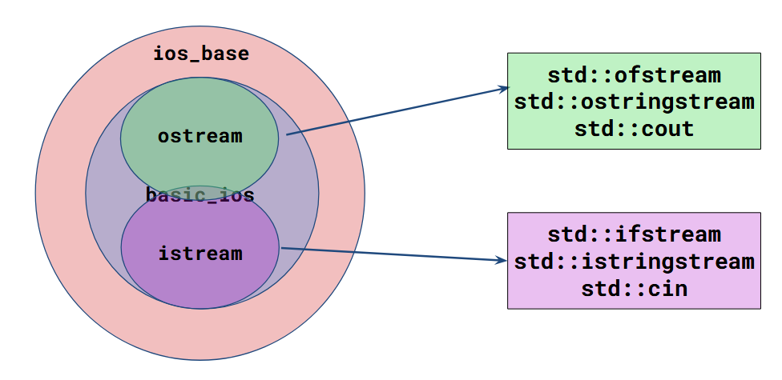

This intersection part of istream&ostream is known as **iostream**, which takes has all of the characteristics of ostream and istream!

#### What streams actually are?

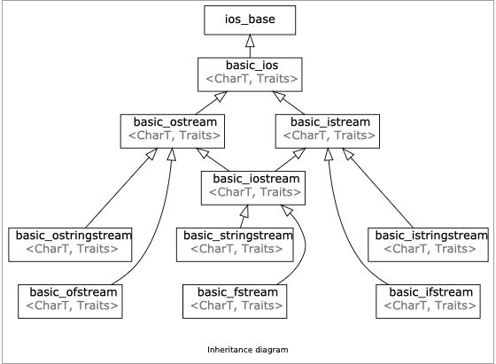

### `std::stringstream`

A stringstream is an input stream + output stream both!

It is a way to **treat strings as streams**, and is useful for use-cases that deal with **mixing** data types.

```cpp
void foo() {
    /// partial Bjarne Quote
    std::string initial_quote = "Bjarne Stroustrup C makes it easy to shoot yourself in the foot\n";
    
    /// create a stringstream
    std::stringstream ss(initial_quote);//initialize `stringstream` with string constructor
    // since this is a stream, we can also INSERT the initial_quote like this!
    /*
    std::stringstream ss;
	ss << initial_quote;
    */
    
    /// data destinations
    std::string first;
    std::string last;
    std::string language, extracted_quote;
    
    ss >> first >> last >> language >> extracted_quote;
    std::cout << first << " " << last << " said this: "<< language << " " << extracted_quote << std::endl;
    // Result: Bjarne|Stroustrup|C|makes (no more!)
}
```

#### `std::getline()`

The `>>`operator only reads **until the next whitespace**! Use `std::getline()`!

```cpp
istream& getline(istream& is, string& str, char delim)
```

`getline()` reads an input stream(`is`), up until the `delim` char (default `'\n'`) and stores it in some buffer(`str`). It ***consumes* the `delim` character**!

```cpp
ss >> first >> last >> language;
std::getline(ss, extracted_quote);
std::cout << first << " " << last << " said this: '" << language << " " << extracted_quote + "'" << std::endl;
// Result: ...|makes it easy to shoot yourself in the foot (NO '\n'!)
```

### Output Streams

> Output streams have the type `std::ostream`. `std::cout` is the **console** output stream.

```cpp
double tao = 6.28;	std::cout << tao; // We'll see nothing on the cmd! Why? 
```

Contents in buffer will **not shown** on external source until an **explicit flush** *显式刷新* occurs!

#### When do we flush?

- `std::cout <<` **`std::flush`**
- `std::cout <<` **`std::endl`** *also tells the stream to end the line*
- When you reach the **end of your program**
- When the buffer is **full**
- When **tied streams interact** (ie. cout has to flush before you **take input** via cin)

>C++ stream object for outputting *error* messages:
>
>**`cerr`**: used to output errors (unbuffered), sends errors out IMMEDIATELY
>**`clog`**: used for non-critical event logging (buffered)
#### `std::endl` vs `'\n'`

```cpp
int main()
{
    for (int i=1; i <= 5; ++i) {
    	/*(a)*/std::cout << i << std::endl; // display "1" \n "2" \n "3"...
        /*(b)*/std::cout << i << '\n';		// display "1" \n "2" \n "3"...
    	/*(c)*/std::cout << i;				// display "12345"
    }
    return 0;
}
```

Why can `'\n'` do the same work as `std:endl` does?

In many cases, standard output is **line-buffered**, and writing `'\n'` causes a flush anyway.

How to prevent this? `std::ios::sync_with_stdio(false)` can stop flushing when the output stream is **non-interactive** (i.e. file, Unix pipe).

However, if the output stream was **interactive** (i.e. terminal), the output stream still interpreted it as a **line buffer**, resulting in an immediate flush when `'\n'` was pushed to the stream.

It is suggested that we should **use `'\n'` insteaded of `std::endl`**.

### File Streams

#### Output File Streams

> OFS is NOT '*open* file streams'...

```cpp
int main() {
    /// associating file on construction
    std::ofstream ofs("hello.txt")			// Creates an output file stream to the file "hello.txt"
    if (ofs.is_open()) {					// Checks if the file is open ...
    	ofs << "Hello CS106L!" << '\n';		// and if it is, then tries to write to it!
    }				
    ofs.close();							// closes the output file stream to "hello.txt"
    ofs << "this will not get written";		// Will silently fail
    
    ofs.open("hello.txt", std::ios::app);	// reopen...
    ofs << "this will though! It's open again";
    return 0;
}
```

#### Input File Streams

```cpp
int inputFileStreamExample() {
    std::ifstream ifs("input.txt");
    if (ifs.is_open()) {
        std::string lineOne;
        std::getline(ifs, lineOne);
        std::cout << "Read from the file: " << lineOne << '\n';
	}
    ...
	return 0;
}
```

### Input Streams

> Input streams have the type `std::istream`. `std::cin` is the **console** input stream.

`std::cin` is buffered, the buffer stops at a **whitespace** ( " " space, `'\n'`, `'\t'` ).

```cpp
int main()
{
    double pi; double tao;
    std::string name;
    std::cin >> pi; 
    // Next command is a bit demanding ...
    	/*1*/std::cin >> name; 
    	/*2*/std::getline(std::cin, name); 
    	/*3*/std::getline(std::cin, name); std::getline(std::cin, name); 
    std::cin >> tao;
    std::cout << "my name is: " << name << " tao is: " << tao << " pi is: " << pi << '\n';
    return 0;
}
/// input: 3.14 '\n' Rachel Fernandez '\n' 6.2 '\n'
/// output:	pi			name					tao
//		1.	3.14		"Rachel"				(garbage value)*
//      2.  3.14		""**					(garbage value)*
//		3.	3.14		"Rachel Fernandez"		6.2
//		*: reading failure		**: empty string
```

`cin` will **NOT consume the newline character**, but **`getline` will consume it**!

$\implies$an **extra `getline`** helps to eat the `'\n'`

> More facts about `getline`:
>
> - The `std::getline` function always **replaces** the original content of the target string with the newly read content—it does **not append** content! 
> - `std::getline` stops reading when it encounters a newline character and **discards** the newline character. —This does **not** mean that discarding the newline character constitutes **reading** it.
>
> *不追加，只替换*	*不是说吃掉换行符就是读取了换行符*

**Don’t** use `getline()` and `std::cin()` **together**, unless you really really have to!

## L5 Containers

Balance: Organized & Fast <==> Less Memory Used!

### Templates & STL

#### Templates

```cpp
class IntVector 	{// Code to store a list of integers…};
class DoubleVector 	{// Code to store a list of doubles…};
// and more ...
```

What if we could keep the logic, but **change the type**? That is the `template`.

```cpp
template <typename T>
class vector {// So satisfying.};
vector<int> v1; vector<double> v2; vector<string> v3;
```

All STL containers are templates!

#### The Standard Template Library

• Created by Alexander Stepanov
• Added templates to C++ and built a well-known library
• This library is now known as the STL! And is a part of `std`

| STL contains... | Explanation                                                  | Translations                  |
| --------------- | ------------------------------------------------------------ | ----------------------------- |
| **Containers**  | How do we *store* groups of things?                          | 容器（存储）                  |
| Iterators       | How do we *traverse* containers?                             | 迭代器（遍历）                |
| Functors        | How can we represent functions *as objects*?                 | （将）函数（当作）对象        |
| Algorithms      | How do we transform and modify containers *in a generic way*? | 算法（以通用法转换/修改容器） |

Today we'll focus on Containers!

### Sequence Containers

Sequence containers store a **linear sequence** of elements.

#### Tips

- Use **range-based `for`** when possible

  Applies for all iterable containers, not just `std::vector`

  ```cpp
  for (size_t i = 0; i < vec.size(); i++) std::cout << vec[i] << " "; // No!
  for (auto elem : vec) 					std::cout << elem 	<< " "; // Yes!
  ```

  More simple, and safer.

- Use `const auto`**&** when possible

  Saves making a potentially expensive **copy** of each element.

  ```cpp
  std::vector<MassiveType> vec { ... };
  for (auto elem : vec) ...		// No!
  for (const auto& elem : v) ...	// Yes!
  ```

#### `std::vector`

`#include <vector>` required. It stores a list of elements. 

##### Implement

A single chunk of memory...

##### Interface

| What you want to do?                             | `std::vector<int>`                  |
| ------------------------------------------------ | ----------------------------------- |
| Create an empty vector                           | `std::vector<int> v;`               |
| Create a vector with specific elements           | `std::vector<int> v{1,2,3,4};`      |
| Create a vector with **n** copies of **0**       | `std::vector<int> v(n);`            |
| Create a vector with **n** copies of value **k** | `std::vector<int> v(n,k);`          |
| Add **k** to the end of the vector               | `v.push_back(k);`                   |
| Clear vector                                     | `v.clear();`                        |
| Check if **v** is empty                          | `if(v.empty())`                     |
| Get the element at index **i**                   | `int k = v.at(i);`  `int k = v[i];` |
| Replace the element at index **i**               | `v.at(i) = k;` ` v[i] = k;`         |

`operator[]` does **not** perform **bounds checking**! Out-of-bounds access will result in **undefined** behavior, and will **not** throw an **error**! But it is *faster*~

Use `vec.at(i)` in such circumstance will trigger a `std::out_of_range` runtime error.

##### Weekness

`std::vector` has **no `push_front`**! To insert an element at the top of a vector, all other elements must be shifted one position backward ... It is *slow*~

#### `std::deque`

`#include <deque>` is required.  A `deque` (pronounce as "deck") is a **double-ended** queue, allows efficient **insertion/removal** at **either end**.

##### Implement

"Array of arrays"

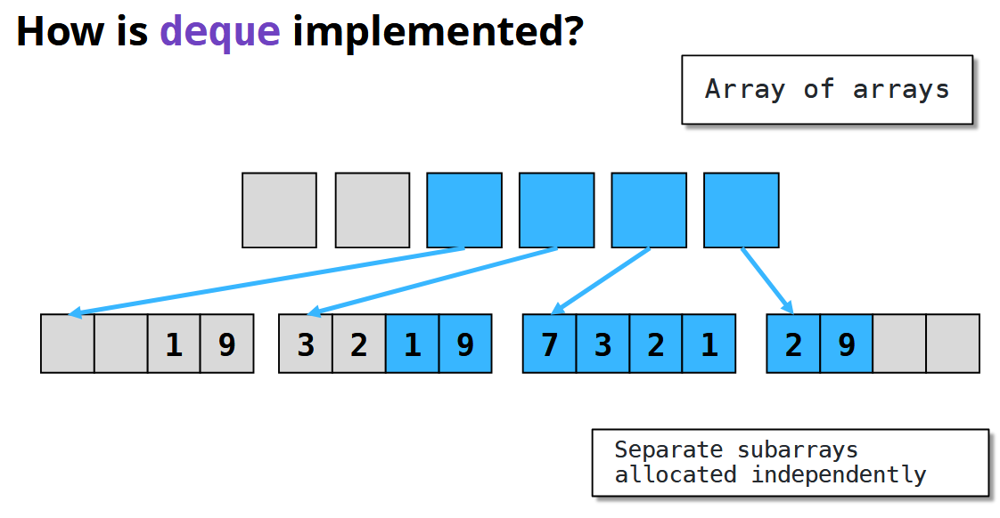

##### Interface

A `deque` has the same interface as `vector`, except we can **`push_front`**(add) / **`pop_front`**(delete).

### Associative Containers

Associative containers organize elements **by unique keys** *键* .

#### `std::map`

`#include <map>` is required. `std::map` **maps keys to values** *将键-值对应*.

```cpp
std::map<std::string, int> map {
    { "Chris", 2 },{ "CS106L", 42 },{ "Sean", 35 }
    // "Chris" is the key, 2 is the value
};

int sean = map["Sean"]; // 35
map["Chris"] = 31; 		// edit the value of key "Chris"
```

##### Interface

| What you want to do?                                 | `std::map<char, int>`                   |
| ---------------------------------------------------- | --------------------------------------- |
| Create an empty map                                  | `std::map<char, int> m;`                |
| Add key **k** with value **v** into the map          | `m[k] = v;`                             |
| Remove key **k** from the map                        | `m.erase(k);`                           |
| Check if **k** is in the map                         | `if (m.count(k))` `if (m.contains(k))`* |
| Check if the map is empty                            | `if (m.empty())`                        |
| Retrieve or overwrite value associated with key k ** | `int i = m[k];` `m[k] = i;`             |

> \*: C++ 20 required	\*\*:*auto-insert* default if such element doesn’t exist, *the value will undergo value initialization, like 0 for `int`*

##### Structure

`std::map<K, V>` stores **a collection of pair** (`std::pair<const K, V>`)

>K is **`const`** because key cannot be modified, if you do so, then the red-black tree structure inside the `map` will be destroyed...

We can iterate through the key-value pairs using a range based for loop.

```cpp
std::map<std::string, int> map;
for (auto kv : map) {
    // kv is a std::pair<const std::string, int>
    std::string key = kv.first;    int value = kv.second;
}
```

**Structured bindings** come in handy when iterating a map, no need to  retrieve the value of the key/value pair separately.

```cpp
for (const auto& [key, value] : map) {
    // key has type const std::string&, value has type const int&
}
```

##### Implement

**Binary Search** Tree (technically a **red-black** tree) *二叉树（红黑树）*

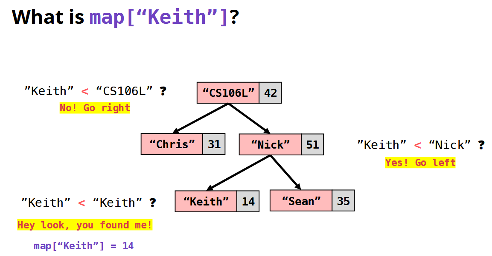

And if the element doesn't exist, it will default-insert such element into the map.

##### Tips

`std::map<K, V>` requires K to **have an operator `<`**

```cpp
std::map<int, int> map1;			// OKAY  - int has operator <
std::map<std::ifstream, int> map2;	// ERROR - std::ifstream has no operator <
```

#### `std::set`

`#include <set>` is required. It stores a collection of unique items.

To be simple, `std::set` is an `std::map` **without values**.

| What you want to do?                  | `std::set<char>`                           |
| ------------------------------------- | ------------------------------------------ |
| Create an empty set                   | `std::set<char> s;`                        |
| Add k to the set                      | `s.insert(k);`                             |
| Remove k from the set                 | `s.erase(k);`                              |
| Check if k is in the set *(\*:C++20)* | `if (s.count(k))` `if (s.contains(k)) `(*) |
| Check if the set is empty             | `if (s.empty())`                           |

`set` is also inplemented by Binary Search Tree.

The `map` & `set` have an alter ego ... `unordered_xxx`!

#### `std::unordered_map` & `std::unordered_set`

They have the same interface as `map`/`set`, but...

##### Implement

`map` is a collection of `pair`, so does `unordered_map` - it stores a collection of n *buckets* of pairs *桶数组*. But how to determine which bucket?

To add a key/value, we feed the key through a **hash function**. The hash, **modulo** *取余* the bucket count, determines **which bucket** the pair should go.

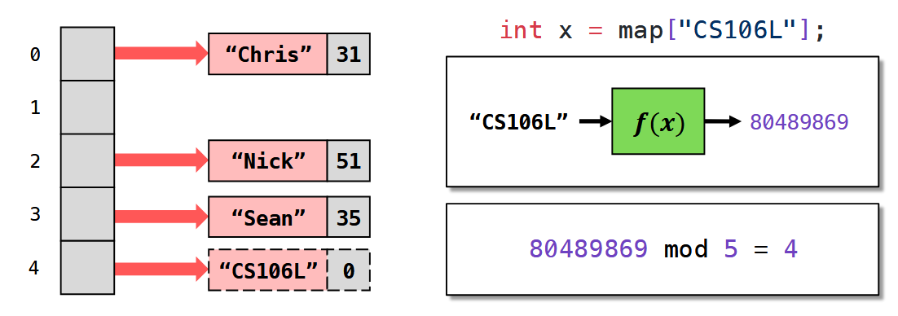

> A hash function “scrambles” a key into a `size_t` (64 bit), small changes in the input should produce large changes in the output.

If two keys hash to the same bucket, we get a **hash collision**. But no problem! We loop through the certain bucket (e.g. via *linked list*) and **check key** equality. *先匹配桶，再匹配键*

> `std::unordered_map<K, V>` requires K to be **hashable**, but most basic types (int, double, string) are hashable by default.
>
> But anyway, a good hash function *minimizes* the chance of a hash collision.

• **Load factor**: average number items per bucket
• `unordered_map` allows super fast lookup by keeping load factor **small**
• If load factor gets too large (above **1.0** by default), we **rehash**, allocating more buckets.

> ```cpp
> map.max_load_factor(2.0); // Set the max load factor
> ```

##### Compare

• `unordered_map` is usually **faster** than `map`, however, it uses **more memory** ...
• If your key type has **no** total order (operator **<**), use `unordered_map`!
• If you must choose, *`unordered_map` is a safe bet*.

### Summary

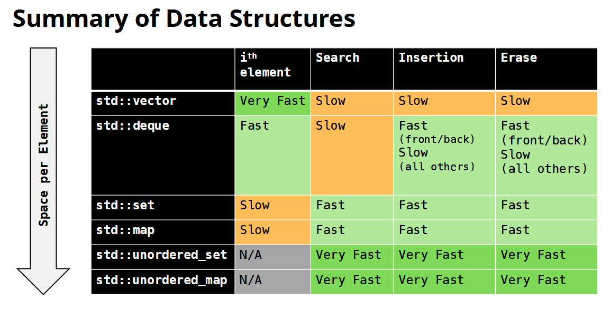

Some more containers if you’re curious!

| Name                         | Description                                  |
| ---------------------------- | -------------------------------------------- |
| `std::array`                 | A fixed-size array of items                  |
| `std::list`                  | A doubly linked list                         |
| `std::multiset (+unordered)` | A set that can contain duplicates *副本*     |
| `std::multimap (+unordered)` | Can contain multiple values for the same key |

## L7 Iterators

`for (const auto& elem : container)` How does this work? *迭代器*

### Iterator Basics

```cpp
for (var-init; condition; increment) {
	const auto& elem = /* grab element */;
}
```

We need something to track *where we are* in a container… sort of like an **index** ... Introducing **iterators**~ 

*Containers and iterators* work **together** to allow iteration.

| Who?      | Tell us what?<br/>Do what? | Interface?               | Details?                                                     |
| --------- | -------------------------- | ------------------------ | ------------------------------------------------------------ |
| Container | Where to start             | `container.begin()`      | Gets an iterator to the **first** element of the container   |
| Container | When to stop               | `container.end()`        | Gets a **past-the-end** iterator<br/>(one element **after** the end of the container) |
| Iterator  | Start                      | `auto it = c.begin();`   | Copy construction                                            |
| Iterator  | Check if we’re done        | `if (it == c.end()) ...` | Equality: are we in the same spot?                           |
| Iterator  | Grab a element             | `auto& elem = *it;`      | Dereference iterator *解引用*<br/>*undefined if `it = end()`* |
| Iterator  | Move forward               | `++it;`                  | Increment iterator forward                                   |

>About that whole thing with `Markdown` tables *not letting you merge cells*, bro

>- We usually **use the `!=`** instead of `<=` or sth like that.
>- There are **Reverse** Iterators, it goes like `auto rit=c.rbegin(); rit!=c.rend; ++rit`. Remember the `r` prefix and *don't use `--`!*

Then we have the answer!

```cpp
for (auto it = s.begin(); it != s.end(); ++it) {
	const auto& elem = *it; // it means iterator
}
```

**Using `auto`** avoids spelling out long iterator types (e.g. `std::map<int, int>::iterator`).

> Actually, the `iterator` is even more complicated, this keyword itself *is already simplified* through the use of `using` directives within class definitions!

Hint! Why not `it++`? **`++it`** avoids making an unnecessary **copy**.

> An `iterator` is a fully-fledged object, so it’s often *more expensive* to copy than, say, an `int`.

```cpp
// Prefix form - ++it: Increments it and returns a reference to same object
Iterator& operator++(){
    /*increment parts...*/
    return *this;
}

// Postfix form - it++: Increments it and returns a copy of the old value
Iterator operator++(int){
    Iterator tmp = *this;  	// copy the old value
    ++*this;                // increment
    return tmp;             // return old value (copied)
}
```

In most cases, **use `++n` instead of `n++`!**

### Iterator Types

Not all iterators are made equal! **All** iterators provide these four operations...

```cpp
auto it = c.begin(); 	++it;	*it;	it == c.end()
```

But most provide even *more*...

```cpp
--it; 		/* Move backwards*/ 		*it = elem; /* Modify */
it += n; 	/* Random access */			it1 < it2 	/* Is before? */
```

Iterator **types** determine their functionality!

| Type                    | Function                                                     | Details                                                      | Description                                                  | Examples                         |
| ----------------------- | ------------------------------------------------------------ | ------------------------------------------------------------ | ------------------------------------------------------------ | -------------------------------- |
| Output Iterator         | Allows us to **write** elements                              | `*it = elem;`                                                | \                                                            | `ostream`                        |
| Input Iterators         | Allows us to **read** elements                               | `auto elem = *it;`                                           | Most basic kind of iterator                                  | `istream`                        |
| Forward Iterator        | An **input iterator** that allows us to make **multiple passes** *支持多次遍历* | Multi-pass guarantee:<br/> if `it1==it2`, then `++it1==++it2`, no other factors will change such fact! | **All STL** container iterators fall here, but **stream** is not! | `unordered_map`, `unordered_set` |
| Bidirectional Iterators | An **forward iterator** that allows us to move forwards and **backwards** | `--it;`                                                      | \                                                            | `std::map`, `std::set`           |
| Random Access Iterators | An **bidirectional iterator** that llows us to **quickly skip** forward and backward | Not only `++` & `--`!<br/>`auto it3 = it2 - 2;` `auto& second = it[2];` | Be careful not to go **out of bounds**!                      | `std::vector`, `std::deque`      |

Why does it matter? As we’ll soon see, some **algorithms** require a certain iterator type.

```cpp
std::vector<int> vec{1,5,3,4};
std::sort(vec.begin(), vec.end());
// ✅ begin/end are random access

std::unordered_set<int> set {1,5,3,4};
std::sort(set.begin(), set.end());
// ❌ begin/end are bidirectional
```

Why have multiple iterator types?

-  Goal: provide a **uniform abstraction** over all containers

-  Caveat: the way that a container is implemented *affects how you iterate through it*

  > For example, skipping ahead 5 steps (random access).
  >
  > It is a lot easier/faster when you have a *sequence* container (vector, deque) (*simply skip* 5 elements) ...
  >
  > ... than *associative* (map, set) (you have to do "++" five times, it is a *linear-time slow operation*).
  >
  > C++ generally **avoids** providing you with **slow** methods by design, so that’s why you **can’t** do random access on a `map::iterator`.
  >
  > It's like the stl saying: "I only support single-step operations like ++ and --. If you want to advance five steps, explicitly use a loop or `std::next(it, 5)` to express it. Because that it's an operation **requiring multiple executions**."

### Pointers and Memory

An iterator **points to a container element**, but a **pointer** points to any object.

**Memory** is usually byte-addressable, with each byte numbered from 0 to 2^64-1 (64-bit system).

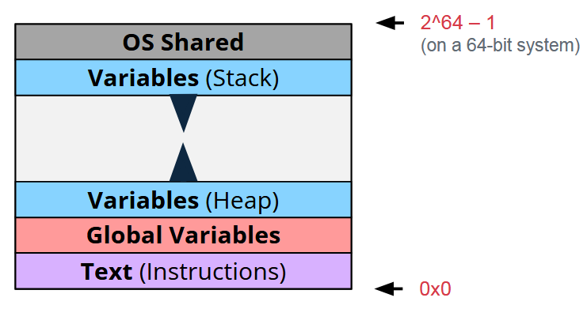

The **address** of an object is the **location of its lowest** byte. (1 byte = 8 bits)

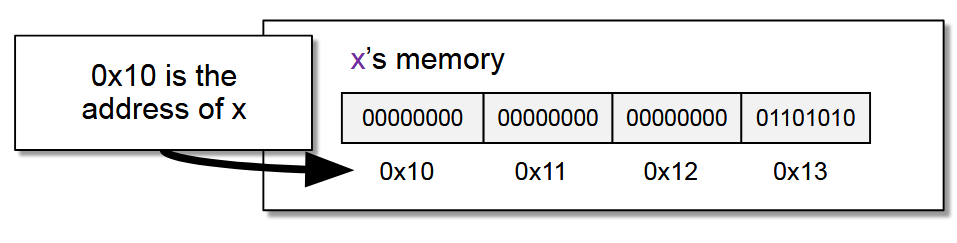

A **pointer** is the address of a variable. It's just a number, *e.g., `0x10` in the example above.*

We can have pointers to all kinds of things! For example, the array pointer ...

```cpp
std::vector<int> v {1,2,3,4,5};
int* arr = &v[0];			auto it = v.begin(); std::cout << *it << " ";
arr += 1;					it += 1; std::cout << *it << " ";
++arr;						++it; std::cout << *it << " ";
arr += 2;				    it += 2;
if (arr == &v[4])			if (it == --v.end())
//Array pointer...			//Iterators...
```

**Iterators** have a similar interface to **pointers**! You can say that `T*` is the backing type for `vector<T>::iterator`.

> In fact this isn't entirely accurate. Iterators and pointers behave identically, but iterators are essentially *generic pointers* implemented through classes. But for all intents and purposes, you can think of it this way.

## L7 Classes

*a no-logic lesson again... to make the logic clear is so motherfxcking...*

*actually it is not no-logic, this lesson progresses with the code, so the each part seems a little disjointed as we cover topics as they come up 想到哪里讲到哪里*

### Why classes?

● C has no **objects**
● No way of **encapsulating** *封装* data and the functions that operate on that data
● No ability to have *object-oriented programming (OOP)* design patterns

> What is object-oriented-programming? *面向对象编程*
>
> ● Object-oriented-programming is centered around **objects**
> ● Focuses on design and implementation of classes!
> ● Classes are the **user-defined types** that can be declared as an object!

Structs? All these fields are **public**, i.e. *can be changed* by the user, there are no direct access controls while using structs.

Classes have **public** and **private** sections! A user can only access the **public**.

### Classes

#### Header file ...

| Classes in ... | Header File (.h)                                             | Source File (.cpp)                        |
| -------------- | ------------------------------------------------------------ | ----------------------------------------- |
| Purpose        | Defines the **interface**                                    | **Implements** class functions            |
| Contains       | Function prototypes, class declarations, type definitions, macros, constants | Function implementations, executable code |
| Access         | This is shared across source files                           | Is compiled into an object file           |
| Example        | `void someFunction();`                                       | `void someFunction() {...};`              |

> In short, `interface & declarations` v.s. `implementation & definitions`

```cpp
// In the header file ...
class StanfordID {
private:
    std::string name;
    std::string sunet;
    int idNumber;
public:
    // constructor for our StudentID
    StanfordID(std::string name, std::string sunet, int idNumber);
    // method to get name, sunet, and idNumber, respectively
    std::string getName();
    std::string getSunet();
    int getID();
}
```

#### The Constructor

The constructor **initializes the state** of newly created objects.

```cpp
#include “StanfordID.h”
#include <string>

// default constructor, when there's no input
StanfordID::StanfordID() {
    name = “John Appleseed”;
    sunet = “jappleseed”;
    idNumber = 00000001;
}

// When there are inputs ... parameterized ver.!
// A. list initialization constructor
StanfordID::StanfordID(std::string name, std::string sunet, int idNumber):
name{name}, sunet{sunet}, idNumber{idNumber} {};
	// as if move the declaration sections before the {}
// B. parameterized constructor
StanfordID::StanfordID(std::string name, std::string sunet, int idNumber) {
    this->name = name;
    this->state = state;
    this->age = age;
}
```

- Use **`this`** keyword to disambiguate which `name` you’re referring to~

  > Thus we don't need to brainstorm two names for the class one and the input one ... 助ける．．．

- Constructor **Overload**! Our compilers will know which one we want to use based on the inputs.

#### Implemented members

This section stores methods to **get elements** respectively.


> The reason why that picture lies here is a 历史遗留问题, don't mind...

```cpp
//　つづき ... wait a sec what the hell is the jap fonts it uses?
void StanfordID::setName(std::string name) {
	this->name = name;	
}
void StanfordID::setSunet(std::string sunet) {
	this->sunet = sunet;
}
void StanfordID::setID(int idNumber) {
    if (idNumber >= 0){
    	this->idNumber = idNumber; // input validation
    }
}
```

You can even add **input validation**! What a secure data structure!

#### The destructor 

```cpp
//　つづき ...
StanfordID::~StanfordID() {
	// free/deallocate any data here
	delete [] my_array; // for illustration, 'cuz we're not using `new` keyword or dynamically allocating any data
}
```

The destructor is not explicitly called, it is **automatically** called when an object goes out of scope.

#### Other

**Type aliasing** : allows you to create synonymous identifiers for types *为类型创建同义标识符*

```cpp
template <typename T>
class vector {
    using iterator = T*;
    // Implementation details...
}
```

### Inheritance

> We've seen this in streams! Remember that image of `What streams actually are?` ?

Different types of objects may *need the same interface*! **Inheritance** allows you to **extend** a class by creating a **subclass** with specific properties.

```cpp
class Shape {
public:
	virtual double area() const = 0;
    // This is a pure virtual function we declare in our base class, Shape.
};
```

**Pure virtual function**: it is instantiated in the base class but overwritten in the subclass. (Dynamic Polymorphism) 

> *纯虚函数：基类提供实现，子类负责重写。（动态多态性）* 

```cpp
class Circle : public Shape {
    // Here we declare the Circle class which inherits from the Shape class
public:
    // constructor, using list initialization construction
    Circle(double radius): _radius{radius} {};
    double area() const {
    	return 3.14 * _radius * _radius;
        // Here we are overwriting the base class function area() for a circle
    }
private:
	double _radius; // encapsulation of class variables!
};
```

Another advantage of inheritance is the **encapsulation** of class variables.

> In OOP, encapsulation *封装* is the process of making a class's member variables **private** and controlling access to and modification of these variables through public methods.

#### Types of inheritance

| Type                  | public                    | protected                    | private                    |
| :-------------------- | :------------------------ | :--------------------------- | :------------------------- |
| Example               | `class B: public A {...}` | `class B: protected A {...}` | `class B: private A {...}` |
| **Public** Members    | public                    | protected                    | private                    |
| **Protected** Members | protected                 | protected                    | private                    |
| **Private** Members   | not accessible            | not accessible               | not accessible             |

>The table content refers to “such members are *adj.* in the derived class”.

#### The Diamond Problem

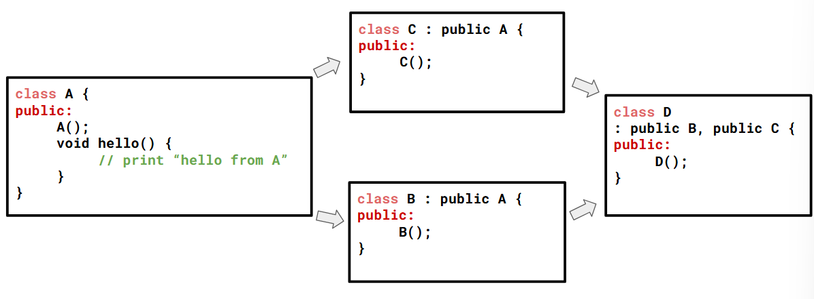

```cpp
D obj {};		// uniform initialization
obj.B::hello() 	// call B’s hello method
obj.C::hello() 	// call C’s hello method
obj.hello()		// wtf...? whose method do I call ???
```

The way to fix this is to make B and C inherit from A in a **virtual way**. Like the pass by value vs **pass by reference**!

```cpp
class C : virtual public A {
    public:
    C();
}
```

Virtual inheritance means that a derived class, in this case D, should only have **a single instance** of base classes, in this case A.

### Recap

1. Classes allow you to encapsulate functionality and data with access protections.
2. Inheritance allows us to design powerful and versatile abstractions that can help us model complex relationships in code.
3. These concepts are tricky – this lecture really highlights *the power of C++*.

## L8 Inheritance

*actually a enhanced and detailed version of the last lecture*

• A class represents an **abstraction** — it can model a real-world object, a concept, or any entity you want to organize into data and behavior.
• A class bundles **data and methods** for an object together

### A Recap on Classes

#### Memory

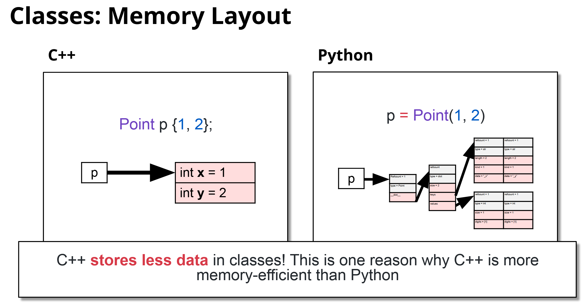

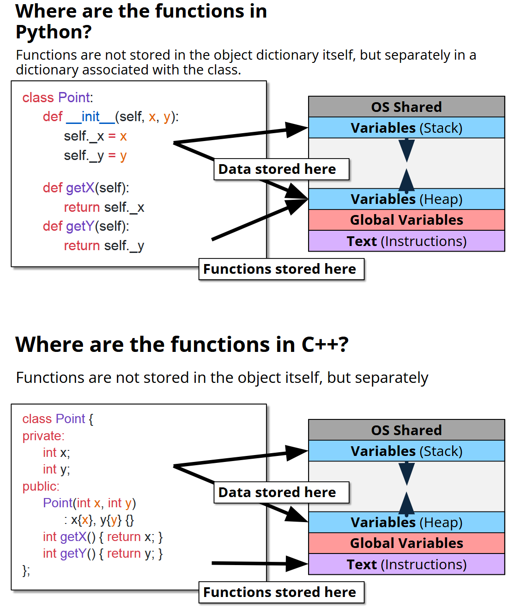

#### `this`

`this` is a pointer to the current class. But moreover, it is *passed as a parameter* to class function behind the scenes.

```cpp
int Point::getX() { return this->x; }
// ...gets turned into...
int Point_getX(Point* this) { return this->x; }

Point p {1,2}; int x = p.getX();
// ...gets turned into...
Point p {1,2}; int x = Point_getX(&p);
```

### Inheritance

A mechanism for one class to **inherit properties** from another.

#### Why?

>Many kinds of cars, but they all inherit ... • An engine	• Wheels	• A steering wheel
>
>Many kinds of shapes, but every shape has a ... • Volume	• Surface area

- There’s a lot of **redundancy** here if you define them one by one differently!

- This model is also a pain to **modify**!

  >Imagine we wanted to add an `overlapsWith` method to each object that checks if it overlaps in space with another object ... Then we'll have to write a`bool overlapsWith(const whatever& other);` function for ALL types of objects in the game ...

#### Examples

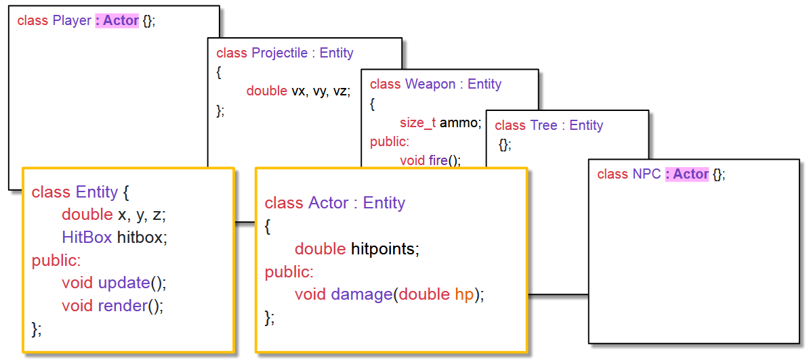

#### Comprehension

An inheritance tree defines **is-a** relationships.

> • “A Weapon is an Entity” “An NPC is an Actor, and is also an Entity”
> • An `std::ifstream` is a `std::istream` is a `std::ios`

### Object Slicing

```cpp
int main() {
    std::vector<Entity> entities { Player(), Tree(), Projectile() };
    while (true) {	// Game event loop! (runs every frame)
        for (auto& entity : entities) {
        entity.update();
        entity.render();
        }
    }
}
```

C++ lays out the fields of an object sequentially, but more than that, C++ stacks the **subclass**'s members **below** the inherited ones!

As a result, when you assign a **derived** class **to** a **base** class, it gets **sliced**! Like the `vector` above (based on the type `Entity`), or simple assignment such as `Entity example = this_is_a_projectile;`

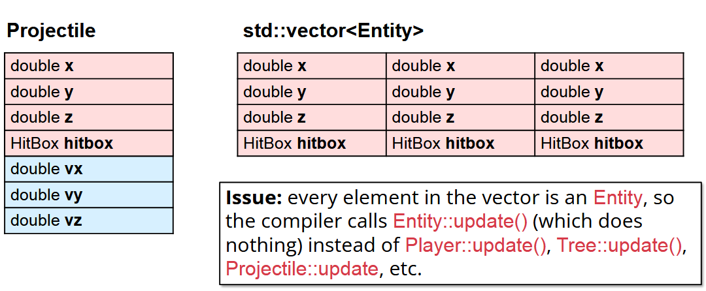

#### Solution

Use an `Entity*` **pointer** instead!

```cpp
int main() {
    Player p; Tree t; Projectile b;
    std::vector<Entity*> entities { &p, &t, &b };
    while (true) {
        for (auto& ent : entities) {
        ent->update();
        ent->render();
        }
    }
}
```

### Virtual Functions

#### Problems

Since we've used pointers above to ***avoid specifying** which class it is*, when we unreference it, how do we know it is the **base** class or the **derived** class? And when call **functions**, how does the compiler know **which method** to call?

In fact, the compiler defaults to assuming it points to **an base class**. *This is the only one it can be absolutely sure any `entity` will support.*

Using `Entity*` comes at a cost: We **“forget” which type** the object actually is!

>Notice: there is a difference between the **compile-time vs. runtime type** of the object!
>• At compile time, it is treated as an `Entity`
>• At runtime, it could be an `Entity` or any subclass, e.g. `Projectile`, `Player`, etc.

What we need is **dynamic dispatch** *动态分配* : Depending on the **runtime (dynamic) type** of the object, a different method should be called/dispatched!

#### Solutions

• Marking a function as **`virtual`** enables dynamic dispatch
• Subclasses can **override** this method

```cpp
class Entity {
public:
    virtual void update() {}
    virtual void render() {}
};

class Projectile : public Entity {
public:
	void update() override {};
};
```

**`override`** isn’t required but is good for readability! It will **check** that you are overriding a virtual method instead of creating a new one.

#### Behind the Scenes

Adding virtual to a function adds some metadata to each object.
Specifically, it adds a **pointer** (called a `vpointer`) to a **table** (called a `vtable`) that says, **for each** `virtual` method, **which function should be called** for that object!

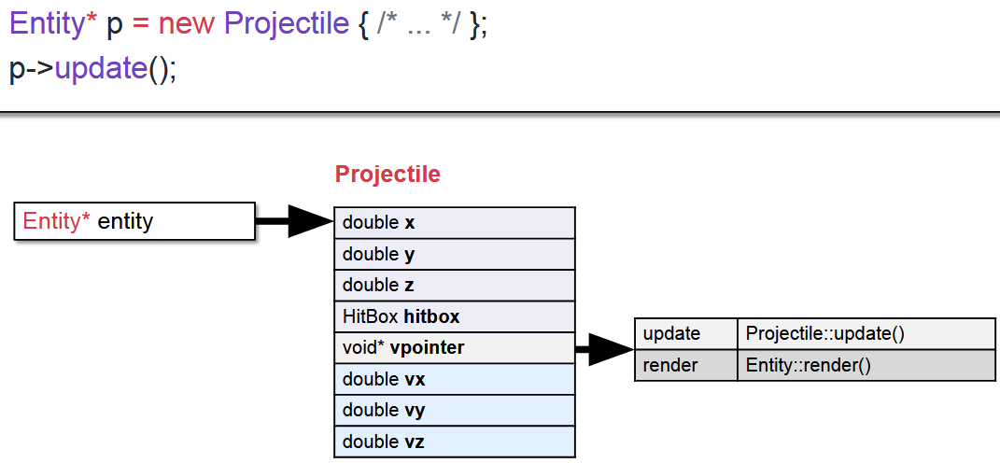

> `virtual` is kind of like Python! Both Python and C++ virtual functions store **type-specific information** (refcount, type in python).

#### Pros & Cons

- In many other languages, class functions are *virtual by default*

- Key idea: In C++, you have to **opt** in because they are more **expensive**

  - Increased **size** of memory layout of the class
  - Takes **longer** to look up `vtable` and call the method

  > In *quant finance* and industries where nanoseconds count, virtual functions are not used!

#### Pure virtual functions

Mark a virtual function as **pure virtual** by adding `= 0;` instead of an implementation!

```cpp
class Entity {
public:
    virtual void update() = 0;
    virtual void render() = 0;
};
```

• A class with one or more pure **virtual** functions is an **abstract** class, it can’t be instantiated!
• **Overriding** all of the pure virtual functions makes the class **concrete**!

```cpp
class Entity {
public:
    virtual void update() = 0;
    virtual void render() = 0;
};
Entity e; // ❌ Entity is abstract!

class Projectile
: public Entity {
public:
	void update() override {};
	void render() override {};
};
Projectile p; // ✅ Projectile is concrete
```

Pure virtual functions are useful when there’s **no clear default implementation**. 

> *e.g. the volume of any shape.* What’s the default volume of a Shape? Let’s mark it pure virtual and **let subclass decide**!

#### Closing Thoughts

Big inheritance trees tend to be *slower* and *harder to reason about*!

> In video games, approach of subclassing for every different object type is uncommon among modern game engines. **Composition** is often more flexible and just makes sense.

Prefer composition **AND** inheritance! Combining both of these ideas can give the best of both worlds.

```cpp
class Car
    : public Engine
    , public SteeringWheel
    , public Brakes
{/* Hmmm... this doesn’t seem quite right */};

class Car {
    Engine engine;
    SteeringWheel wheel;
    Brakes brakes;
}; // GREAT!

// But sometimes we should use inheritance as well!
class Engine {};
class CombustionEngine : public Engine {};
class GasEngine : public CombustionEngine {};
class DieselEngine : public CombustionEngine{};
class ElectricEngine : public Engine {};
```

$$
\hspace{1em}\rm As~I~write~this: ~\mathfrak {28~Feb~ 2026}
$$
