# 数学建模课程 无废话笔记

> 没有引入类内容（准确的说，是只有更贴近数学应用角度的引入），会精简解释，主要是知识点梳理
>
> By leo_grayrat, Initiated from 17 Jan 2026.

## 01 层次分析法 AHP

### 01.1 层次分析法模型讲解 *17 Jan*

> *この声を、想いを、僕を，信じてよ*
>
> 歌名：朗朗  
> 歌手：さとう。

#### **正互反矩阵**

所有元素为正，且沿主对角线对称的元素互为**倒数**（$`a_{ij}a_{ji}=1`$）

显然，主对角线元素均为1

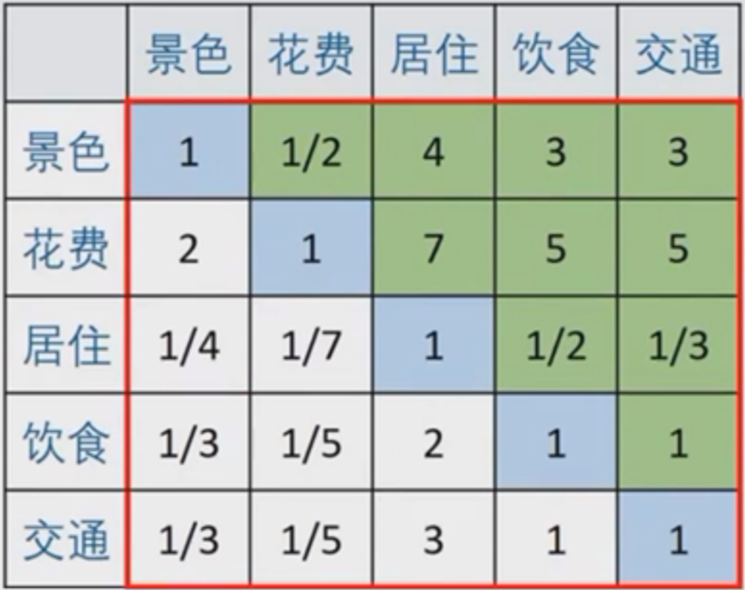

#### **判断矩阵**

把指标i相对于j的重要程度/喜爱程度/...填入矩阵形成的特殊矩阵

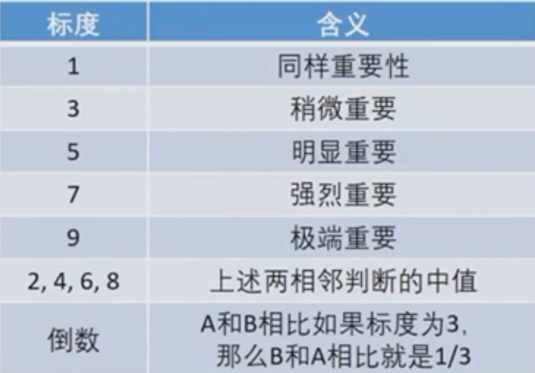

显然，我们对于给定的两个指标只用做一次比较，所以判断矩阵是是正互反矩阵

**注意！**判断矩阵在判断各个**指标**相对重要性&判断某指标下各个**对象/方案**的优秀程度下都需要用，前者得到**权重**、后者得到**分数**

#### 一致矩阵

我当时看到说要比较 $`C_n^2`$ 次还觉得很奇怪：只用拿一个指标和剩下 $`n-1`$ 个指标总共比 $`n-1`$ 次不就行了？其他的互相比较的数据我都可以**乘出来**，这样的话所有数据都会自洽

> “乘出来”用线代的语言说，就是 $`A=\mathbf{u}\mathbf{v}^{T}`$，$`\mathbf{u}`$ / $`\mathbf{v}`$ 指的是列向量
>
> 准确的说，这里v的元素与u一一对应且互为倒数

——*歪打正着*，就是我们这里的一致矩阵

满足 $`a_{ik}=a_{ij}a_{jk}`$（各行各列中成倍数关系），显然其秩为 1

> 如果A是一个秩为1的n阶方阵，那么A有一个特征值为tr(A)，其余特征值均为0
>
> 所以，一致矩阵一定有且仅有单重特征值n，(n-1)重特征值0
>
> 进一步地，可以发现特征值n对应的特征向量为
> ```math
> k[ \frac{1}{a_{11}}+\frac{1}{a_{12}}+...+\frac{1}{a_{1n}}]^T=k\mathbf{u}(k\neq0)
> ```
> 值得注意的是，这恰恰是矩阵的**第一列**的k倍

#### 一致性检验

##### 需求

> 显然，“只用拿一个指标和剩下n-1个指标总共比n-1次”这样不够置信，把所有指标互相都比较一遍才会更准确

> 有：$`n`$ 阶正互反矩阵 $`A`$ 为一致矩阵时当且仅当最大特征值 $`\lambda_{\max}=n`$；且当正互反矩阵 $`A`$ 非一致时，一定满足 $`\lambda_{\max}>n`$。
>

判断矩阵的一致性/**自洽性**越差，那么最大特征值和n就会相差越大

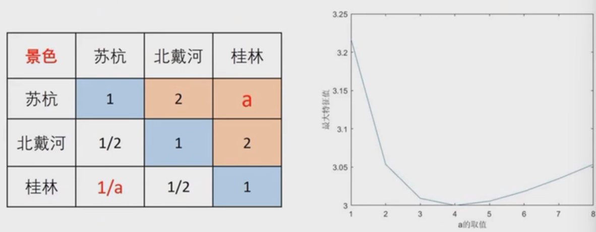

所以，我们需要确定我们得到的判断矩阵的自洽性是否在可接受的范围内	*类比卡方检验*

##### 步骤

###### **计算一致性指标CI**

```math
 CI=\frac{\lambda_{\text{max}}-n}{n-1} 
```

###### **查找对应的平均随机一致性指标RI**

> 以下数据就像很多统计类需要查的表一样，是多次随机蒙特卡洛模拟得到的

| n    | 1    | 2    | 3    | 4    | 5    | 6    | 7    | 8    | 9    | 10   | 11   | 12   | 13   | 14   | 15   |
| ---- | ---- | ---- | ---- | ---- | ---- | ---- | ---- | ---- | ---- | ---- | ---- | ---- | ---- | ---- | ---- |
| RI   | 0    | 0    | 0.52 | 0.89 | 1.12 | 1.26 | 1.36 | 1.41 | 1.46 | 1.49 | 1.52 | 1.54 | 1.56 | 1.58 | 1.59 |

在实际运用中，n 很少超过 10，如果指标的个数大于 10则更推荐二级指标体系

且n很大的时候判断矩阵和一致矩阵差异会很大，很难控制一致性

***`n=2`时矩阵一定一致**，不用进行检验，否则会出现`0/0=NaN`的情况*

###### **计算一致性比例CR**

```math
CR=\frac{CI}{RI}
```

##### **结论**

如果 CR < **0.1**，则可认为判断矩阵的一致性可以接受；否则需要对判断矩阵进行修正

实际情况下，由于权重往往是我们自己给定的，所以就**往成比例上靠**就可以了

#### 求权重/分数

我们以上的工作都是为了得到一组尽量置信度高的权重/分数，但是矩阵和权重/分数向量还是有差距

> 还记得一致矩阵的 $`A=\mathbf{u}\mathbf{v}^{T}`$ 吗？
>
> 对于一致矩阵，我们取任意列的结果都是一样的（**u**），因为他们互成比例

##### 平均

我们可以采取各种方法去**平均**每一列得到的权重/分数，有代数/几何平均的方法

> 算术平均就是对列向量们各自归一化求出的权重/分数取平均
几何平均则是对行向量求出几何平均数，之后归一化，哪一行算出来的值对应那一行的指标/方案的权重/分数
>
> ```math
> \omega_{i}=\frac{\left(\prod_{j=1}^{n} a_{ij}\right)^{\frac{1}{n}}}{\sum_{k=1}^{n}\left(\prod_{j=1}^{n} a_{kj}\right)^{\frac{1}{n}}}
> ```

##### 特征值

> 但是，对于矩阵，更好的处理方法是利用矩阵的性质
>
> 先前我们提到，一致矩阵的特征向量与其任意列线性相关，所以...

可以**求特征向量**并归一化以间接得到权重	*不是单位化！*

> 当然，既然一般情况下不是一致矩阵，那么他也不可能只有一个非零特征值

具体地说，要求**最大特征值**对应的特征向量

##### 总结

在数学建模实践中，一般是以特征值特征向量法为主要方法

> *视频中提议了这样的文案，将三种方法都使用以博取评委眼球，见仁见智吧*
>
> 以往的论文利用层次分析法解决实际问题时，都是采用其中某一种方法求权重，而不同的计算方法可能会导致结果有所偏差。为了保证结果的稳健性，本文采用了三种方法分别求出了权重，再根据得到的权重矩阵计算各方案的得分，并进行排序和综合分析，这样避免了采用单一方法所产生的偏差，得出的结论将更全面、更有效。

以及，**不要忘了归一化**，加权的权重之和得是1

#### 计算

自然，得分便是权重*分数之求和

简单的计算方法是使用**Excel的公式**，然后拖到各列中

但是会有公式对不准指标列的情况

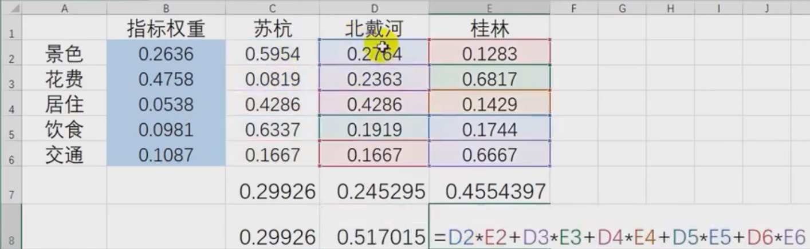

解决方法是对于固定的列，**添加 `$` 符号**（光标在数据上的时候输入一次 `$` 即可）

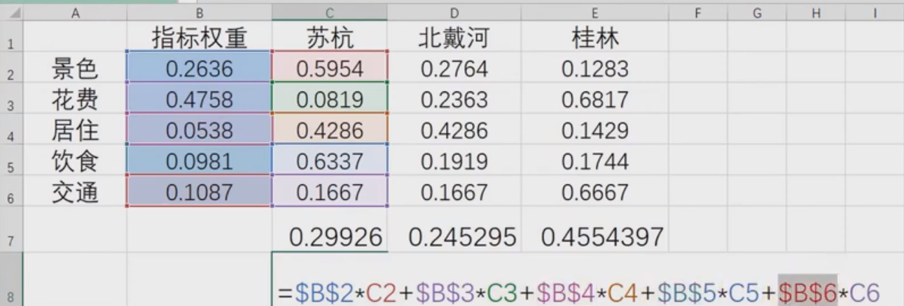

#### 总结与高阶使用

##### 整体思路

**目标**	选择目的地	→	**准则**	景色/花费/饮食...	→	**方案**	巴黎/东京/伦敦...

这样的`Objective→Criterion→Plan`层次结构需要呈现到论文中（画图）

##### 高阶

可以有多层子准则

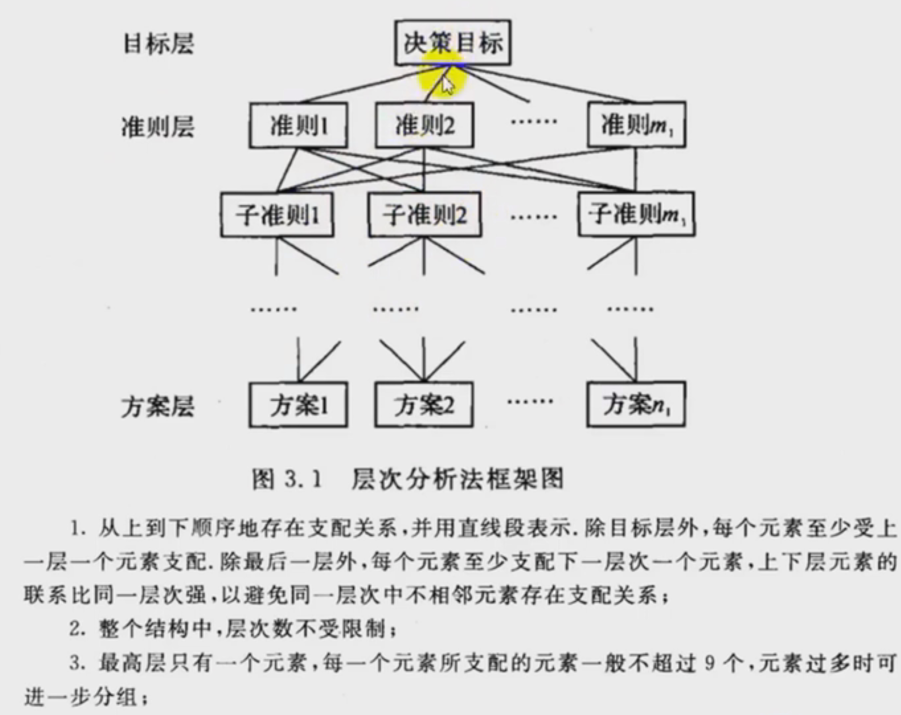

##### 示例

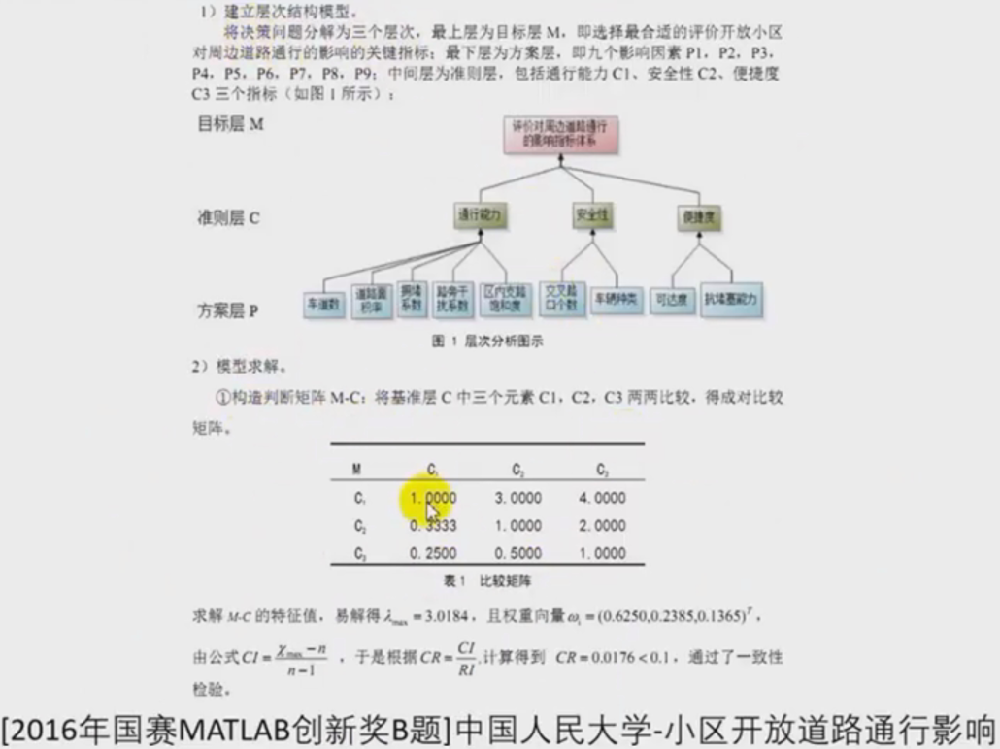

##### 画图

###### SmartArt

直接输入各项的标题

使用**对齐文本**功能，在缩进文本的同时可以让PowerPoint自动识别父对象和子对象

之后选中文本右键便可生成SmartArt图示

但是无法生成多对多的连线

###### 亿图图示（略）

------

### 01.2 Matlab入门 *17 Jan*

> *続く道のその先また 離れたってさ 何度だってさ 強く結び直したなら また会える*
>
> 歌名：三原色  
> 歌手：YOASOBI

讲的都是很基本的内容，啃数学实验课的老本就够了（

对照代码，AI给出的梳理如下，其实主要是**记住用啥函数**的问题

| MATLAB 符号/语句     | 数学意义/说明           | 示例/备注                                                    |
| -------------------- | ----------------------- | ------------------------------------------------------------ |
| `;`                  | 1. 行结束符 2. 抑制输出 | `a = 3;`                                                     |
| `%`                  | 单行注释                | `% 这是注释`                                                 |
| `%%`                 | 节分隔符                | 用于代码分节                                                 |
| `clear`              | 清除工作区所有变量      | 清空内存中的变量                                             |
| `clc`                | 清除命令行窗口文本      | 清屏                                                         |
| `disp()`             | 屏幕输出函数            | 类似于C语言的printf                                          |
| `input()`            | 输入函数                | 接收用户输入                                                 |
| `+`, `-`, `*`, `/`   | 基本算术运算            | 矩阵运算                                                     |
| `.*`, `./`           | 元素对应运算            | 逐元素运算                                                   |
| `^`                  | 矩阵乘方                | 符合线性代数定义                                             |
| `.^`                 | 元素乘方                | 每个元素同时乘方                                             |
| `strcat()`           | 字符串合并              | `strcat('字符串1','字符串2')`                                |
| `[]`字符串合并       | 字符串合并              | `['字符串1' '字符串2']`或 `['字符串1','字符串2']`            |
| `num2str()`          | 将数字转换为字符串      | `num2str(100)`                                               |
| `sum()`              | 求和函数                | 对向量或矩阵求和                                             |
| `sum(x,1)`           | 按**列**求和            | 得到行向量                                                   |
| `sum(x,2)`           | 按**行**求和            | 得到列向量                                                   |
| `sum(x(:))`          | 对整个矩阵求和          | 或使用 `sum(sum(x))`                                         |
| `()`索引             | 提取矩阵元素            | `A(2,1)`取第2行第1列元素                                     |
| **`:`索引**          | **提取整行/整列**       | `A(2,:)`取第2行全部元素 `A(:,1)`取第1列全部元素              |
| `:`范围              | 范围生成                | `2:5`表示2到5 `2:2:5`表示2,4                                 |
| `end`                | 末尾索引                | `A(2:end,:)`取第2行到最后一行                                |
| `size()`             | 求矩阵大小              | 返回行数和列数                                               |
| `[r,c] = size(A)`    | 分别获取行数和列数      | 将行数返回到r，列数返回到c                                   |
| `size(A,1)`          | **1** 返回**行数**      | 矩阵A的行数                                                  |
| `size(A,2)`          | **2 **返回**列数**      | 矩阵A的列数                                                  |
| **`repmat(A,m,n)`**  | **复制矩阵**            | 将矩阵A复制m×n块                                             |
| `inv()`              | 求逆矩阵                | `inv(B)`求B的逆矩阵                                          |
| `eig()`              | 求特征值和特征向量      | `E=eig(A)`求全部特征值 **`[V,D]=eig(A)`求特征值和特征向量** *可用于求“最大特征值”这样特定特征值的特征向量* |
| `find()`             | 返回非零元素位置        | 返回向量或矩阵中不为0的元素的位置索引                        |
| `>`                  | 大于判断                | 返回逻辑矩阵                                                 |
| `<`                  | 小于判断                | 返回逻辑矩阵                                                 |
| `==`                 | 等于判断                | 两个等号表示判断                                             |
| `if/elseif/else/end` | 判断语句                | if所在行不需要冒号，最后以end结尾                            |

值得注意的是，索引**从1开始**（不是0）

| 操作/技巧      | 功能/说明          | 快捷键/用法                       |
| -------------- | ------------------ | --------------------------------- |
| 抑制输出       | 不显示运行结果     | 在语句末尾加分号 `;`              |
| 多行注释       | 注释选中的多行代码 | 选中要注释的行，按 `Ctrl + R`     |
| 取消注释       | 取消选中的注释行   | 选中要取消注释的行，按 `Ctrl + T` |
| 清除工作区变量 | 清除所有变量       | 输入 `clear`命令                  |
| 清除命令行窗口 | 清除命令窗口输出   | 输入 `clc`命令                    |
| 初始化环境     | 清除变量和命令窗口 | 在代码开头使用：`clear; clc`      |

------

### 01.3 层次分析法代码的编写 *18 Jan*

> *闇に日が差して手を伸ばしたい、あなたと今話したい*
>
> 歌名：言伝  
> 歌手：Bialystocks

并不复杂，源代码的注释也足够清晰便于理解，只是指出几个容易出问题/巧妙的点

#### 字符串

```
disp('一致性指标 CI =');disp(CI);
% 改进后
disp(['一致性指标 CI = ',num2str(CI)]);
```

如果使用多条`disp`指令，那么结果会分行

将字符串**合并**输出就可以规避这一问题

而此时也需要**数字转字符串**派上用场

```
一致性指标 CI =
​	0.0731
一致性指标 CI = 0.0731
```

> 在中文字符和数字/英文字符夹杂出现的时候最好中间加个空格，一个小小的平面设计问题

#### 行与列

对一个矩阵，我们往往需要对其行/列单独操作，但是**不需要粗暴的遍历**

##### 取行列

见 **:** 符号	*`A(2,:)`取第2行全部元素 	`A(:,1)`取第1列全部元素*

##### 行列运算·对象

很多语句都将第二个参数设为和行列选择有关，往往**`1`针对行`2`针对列**

`sum(x,1)` `sum(x,2)` `size(A,1)` `size(A,2)` `prod(A,1)` `prod(A,2)`

一般而言，**不输入**第二个参数就**默认对行**（`1`）

##### 行列运算·**函数**

`sum`是求和，`prod`是**求积**

将一个矩阵（一般是向量）**复制**多次用**`repmat(A,m,n)`**

```
SUM_A = repmat(Sum_A,n,1)   %repeat matrix的缩写
% 等价于用遍历写的：
    SUM_A = [];
    for i = 1:n  
        SUM_A = [SUM_A; Sum_A]
    end
```

#### 逻辑矩阵 & find

##### 特征值和特征向量

要找到特定特征值的特征向量，需要记录它的特征值列号

使用`find 哪个元素==所求元素`来进行寻找

```
[V,D] = eig(A)    
Max_eig = max(max(D)) %也可以写成max(D(:))哦~
% 这时候可以用到矩阵与常数的大小判断运算
[r,c] = find(D == Max_eig , 1)
% 找到D中第一个与最大特征值相等的元素的位置，记录它的行和列。
V(:,c)
```

##### 存在性问题判断

为了解决“是否存在小于0元素”，最直观的肯定是遍历

`for i = 1:n	for j = 1:n	if A(i,j)<=0`...

但是可以结合逻辑矩阵，再结合**只要真就是1，假是0无所谓**，故使用求和（||，或逻辑）

```
if sum(sum(A <= 0)) > 0
	ERROR = 2;
end
```

#### 直接定义变量组

C语言的惯性思维：`name1 = book1 -> name`，定义时左边一定要是单个变量

但是`[r,c]=size(A);` `[V,D] = eig(A);` Matlab中完全可以用多个变量（构成的数组）接受定义

------

## 02 优劣解距离法 TOPSIS

> 逼近理想解排序法，Technique for Order Preference by Similarity to Ideal Solution

在给定了一定相关数据情况下，可以更客观地（**依赖数据**）给出评价和排序

而层次分析法主要靠**主观拟定**谁比谁重要多少（主要技术力在这个自拟的矩阵的一致性/自洽性上）

### 02.1 优劣解距离法Topsis 模型部分 *18 Jan*

> *過去を掴み捨てて未来、まやかしばかり目を逸らしたい、あの自分よりも時空よりも*
>
> 歌名：言伝  
> 歌手：Bialystocks

核心：如何**公正的评价？**→**消除**各种数据自身绝对特点，全部归一化，只保留**相对**特点

尽量保证若数据变化，得分也要变化

> 反例：如果按照倒序排名给分，那么倒数第一不管考0还是61都是一样得分

#### 矩阵化

有 `n` 个要评价的对象，`m` 个评价指标的原始矩阵

**行向量**代表一个对象的各个（原始）得分，**列向量**代表一个指标下所有对象的得分
```math
Z = \begin{bmatrix}
z_{11} & z_{12} & \cdots & z_{1m} \\
z_{21} & z_{22} & \cdots & z_{2m} \\
\vdots & \vdots & \ddots & \vdots \\
z_{n1} & z_{n2} & \cdots & z_{nm}
\end{bmatrix}
```

#### 指标范围

> 高数成绩有一个绝对范围0~100，但是更多情况下指标**没有一个绝对意义上的上下界**（如GDP增速）

从数据本身出发，故归一化在**max~min**之间

#### 指标类型

> 实质就是拿着一个一次（分段）函数图像，然后怎么操作给他归成递增的

##### 越大越好（极大型）

直接降序排序`x`即可，最简单的情况	*一般都归一到这种类型*

##### 越小越好（极小型）

翻转顺序	 `max-x`，也可`1/x`

##### 越靠近某中值越好（中间型）

绝对值式	1 - |原值 - 最佳值| / M	*M为离最佳值最远的数离最佳值的距离*

##### 越靠近某区间越好（区间型）

```math
\tilde{x}_{i}=
\begin{cases}
1-\dfrac{a-x}{M}, & x<a \\
1, & a\leq x\leq b \\
1-\dfrac{x-b}{M}, & x>b
\end{cases}
```

#### 绝对数值

显然也需要消除量纲的影响，故将（已经正向化的）评价值要归一化

但是，用的是除以列向量的**范数**而非列向量各元素之和

> 原因是我们**之后计算依赖*行向量***之间的**几何**（欧几里得）距离
>
> *如果强制归和为一，则这些向量的长度都不同，那么距离有何意义*

```math
S_{i,dim=1}=\dfrac{x-min}{max-min}=\dfrac{x-min}{(max-x)-(min-x)}=\dfrac{|x-min|}{|x-max|+|x-min|}
```

类比一维情况来推广，便有
```math
S_{i,dim=n}=\dfrac{行向量x与最小值行向量的Euclid距离}{行向量x与最小值行向量的Euclid距离+行向量x与最大值行向量的Euclid距离}=\frac{D_i^-}{D_i^++D_i^-}
```
注意，此处的最大最小值要取**每一个指标*（列向量）*各自的极值**

#### 权重

> 显然，不可能说所有指标都有相同的重要性

可以借用**层次分析法**给这些指标确定权重，注意权重**求和`Σω=1`**

#### 总结

**正向**化	→	**标准**化	→	**归一**化

------

### 02.2 优劣解距离法Topsis 代码部分 *18 Jan*

> *朝日を見て染まりだす、もう自由に、もう自由に...*
>
> 歌名：言伝  
> 歌手：Bialystocks

#### 向量与矩阵运算

m*n维的矩阵A **点乘** n维行向量B，等于这个A的**每一行**都点乘B

类似的，还有矩阵和向量的**点除**

#### 排序

**sort**函数	`sort(A)`默认**升序**&**对列**排序

降序		→	添加**descend后缀**	`sort(A,'descend')`

对行排序	→	第二个参数填**2**	`sort(A,2)`	*若为1还是对列排序*

若想保留索引，可**传入变量组	**`[sA,index] = sort(A,'descend')`

#### 从Excel导入数据

> 1. 在工作区右键，点击新建（Ctrl+N)，输入变量名称为X
> 2. 在Excel中复制数据，再回到Matlab中右键变量，点击**粘贴Excel数据（Ctrl+Shift+V）**
> 3. 关掉这个窗口，点击X变量，**右键另存为，保存为mat文件**（下次就不用复制粘贴了，只需使用load命令即可加载数据）
> 4. 注意，代码和数据要放在同一个目录下，且Matlab的当前文件夹也要是这个目录

## 03 & 04 插值和拟合算法

该两节都是处理由离散数据到一条函数曲线的问题，故合并

但是，前者侧重**补缺失值**，且假设已知数据点是**精确无误**的；后者侧重**得到大致趋势**

### 03 插值算法 *19 Jan+10 h delay*

> *この雨が上がってく時 なにもなかったように 消えてく傘花みたいに心は*
>
> 歌名：壱雫空  
> 歌手：MyGO!!!!!

#### 插值及原理

给定一些一一对应的`x,y`节点，寻找`f(x)`使**`y=f(x)`**对**所有**所给的`x,y`节点都成立

有如下分类：多项式插值	**分段插值**	*三角函数插值*（要用傅里叶变换，一般不用这种）

有插值法定理：对于多项式插值，**n+1**个互异节点存在**唯一的n次**多项式插值	*但是高次就不唯一*

> 这n+1个非齐次线性方程（**参数为自变量**，系数为1,x,x^2,...）的系数矩阵的行列式是范德蒙德行列式，不为0，故只有唯一解

#### 数值分析中的插值

```math
y=\frac{x-x_1}{x_0-x_1}y_0+\frac{x-x_0}{x_1-x_0}y_1=y_0+\frac{y_1-y_0}{x_1-x_0}(x-x_0)
```

在两点插值（一次插值）中，有两种理解方式，将其推广可以得到两种插值方法

*由于插值唯一性，两种方法求出来的**插值函数相同**，结果没有实质区别*

##### Lagrange 插值

> “$`y`$ 是 $`y_0`$ 和 $`y_1`$ 的线性成比例组合，让 $`y_0`$ 的系数**在 $`y=y_0`$ 时为 1，在另一端点时为 0**”

```math
L_{n}(x)=\sum_{k=0}^{n} y_{k} \frac{\omega_{n+1}(x)}{\left(x-x_{k}\right) \omega_{n+1}^{\prime}\left(x_{k}\right)}
```

```math
\omega_{n+1}(x)=(x-x_0)...(x-x_n)，\omega_{n+1}^{\prime}(x_k)相比\omega_{n+1}(x_k)去掉了(x_k-x_k)项
```

##### Newton 插值

> “对y **Taylor **展开，**导数用 Lagrange 中值定理**近似给出”

```math
\begin{aligned}
f(x)=&f\left(x_{0}\right) \\
+&f\left[x_{0}, x_{1}\right]\left(x-x_{0}\right) \\
+&f\left[x_{0}, x_{1}, x_{2}\right]\left(x-x_{0}\right)\left(x-x_{1}\right)+\cdots \\
+&f\left[x_{0}, x_{1}, \cdots, x_{n-2}, x_{n-1}\right]\left(x-x_{0}\right)\left(x-x_{1}\right) \cdots\left(x-x_{n-2}\right)\left(x-x_{n-1}\right) \\
+&f\left[x_{0}, x_{1}, \cdots, x_{n-1}, x_{n}\right]\left(x-x_{0}\right)\left(x-x_{1}\right) \cdots\left(x-x_{n-1}\right)\left(x-x_{n}\right)
\end{aligned}
```
> ```math
> 一阶差商：f\left[x_{0}, x_{k}\right]=\frac{f\left(x_{k}\right)-f\left(x_{0}\right)}{x_{k}-x_{0}}	
> ,
> 二阶差商：f\left[x_{0}, x_{1}, x_{2}\right]=\frac{f\left[x_{0}, x_{2}\right]-f\left[x_{0}, x_{1}\right]}{x_{2}-x_{1}}
> ```
> ```math
> K阶差商（x_{k}, x_{k-1} 可以不相邻）：
> f\left[x_{0}, x_{1}, \ldots, x_{k}\right]=\frac{f\left[x_{1}, \ldots x_{k-1}, x_{k}\right]-f\left[x_{0}, x_{1}, \ldots x_{k-1}\right]}{x_{k}-x_{0}}
> ```
> 形式就像高阶导数和低一阶倒数的关系

*这种方法有**继承性**，不用在增大插值次数时反复重新计算*

##### 分段低次插值

由于下述的 Ronge 现象，想要提高插值精度并不能单单使用高次插值

所以，我们没有必要强行要一个通用的解析式，不妨分段低次处理

常用**分段二次/抛物插值**	选取离所求节点**最近的三个**节点进行 $`L_2`$ 插值

##### 缺点

###### Ronge 现象

> [龙格现象产生的原因？ - 知乎]: https://www.zhihu.com/question/39329749

插值多项式次数越高，**并不会**更精确，尤其在**两端处波动**极大	*原因主要是这里节点相对不够密集（可能）*

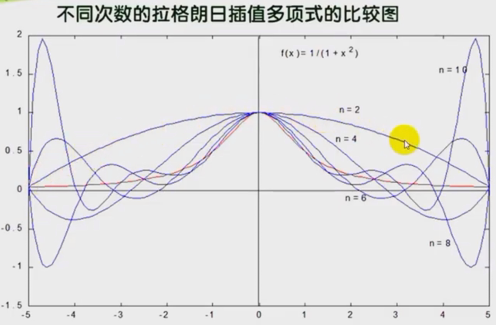

故不熟悉曲线趋势时，**不要**轻易给插值上高次数，误差可能显著增大

###### 函数性态

仅仅有相同函数值并不够，不能反映被插值函数的**性态**（单调性，导数等）

> 综上，所有以上的数学插值方法实际上**用不上**，真的想用点下面
>
> [Matlab实现线性插值、抛物插值、牛顿插值、拉格朗日插值、分段抛物插值、分段线性插值](https://blog.csdn.net/qq_46018418/article/details/121199981)

#### 数学建模中的插值

> [以下两种插值的详细说明](https://chatgpt.com/share/e/696ef1d4-9880-8007-98f1-aeaa6f05597f)

##### Hermite 插值

###### 原理

若 f(x) 在区间上有 n+1 个互异节点，则可唯一确定一个**次数不超过 2n+1** 的多项式 H(x) ，其与 f(x) 在各节点上的函数值和**一阶导数**值相同

若直接使用，则这么高的次数仍然有 Ronge 现象，故使用**分段三次** Hermite 插值多项式 *PCHIP*

###### Matlab

p = **pchip** (x, y, new_x)	x,y是已知样本点的横纵坐标，new_x是要插值处的横坐标

> 使用plot(x1, y1, x2, y2, ...)画图，参数如下
>
> | 类别       | 参数代码与说明                                         |
> | ---------- | ------------------------------------------------------ |
> | **线方式** | `-`实线, `:`点线, `-.`虚点线, `--`波折线               |
> | **点方式** | `.`圆点, `+`加号, `*`星号, `x`×形, `o`小圆             |
> | **颜色**   | `y`黄, `r`红, `g`绿, `b`蓝, `w`白, `k`黑, `m`紫, `c`青 |

##### 三次样条插值

###### 原理

$`f(x)`$ 在区间上有 $`n+1`$ 个互异节点 $`x_0\sim x_n`$，则将**二阶连续可微** & 符合各节点函数值 & 在每个子区间上是**三次**多项式的函数 $`S(x)`$ 称为 $`f(x)`$ 的**三次样条**插值函数	*本质是**分段**的*

> 显然，这个三次 n 段函数有 4n 个未知量，我们需要 4n 个方程才能确定唯一的插值函数
>
> 1. 插值条件	n+1 个节点（n 段分段的两个端点）处符合原函数值	*2n 个方程*
>
> 2. 光滑条件	n 个分段点处**二阶**连续可微（导数 / 二阶导数均连续）	*2(n-1) 个方程*
>
> 3. 边界条件	再来两个方程约束，Matlab 选用的是 **not-a-knot** 条件
>
>    第一个内点 $`x_1`$ 和倒数第一个内点 $`x_{n-1}`$ 处，**三阶导也连续**
>
>    **前两段/后两段**其实各属于**同一个**三次多项式（$`x_1`$ 和 $`x_{n-1}`$ “**不算结点**”）
>    ```math
>    S_0^{(3)}(x_1) = S_1^{(3)}(x_1), \quad S_{n-2}^{(3)}(x_{n-1}) = S_{n-1}^{(3)}(x_{n-1})
>    ```

###### Matlab

p = **spline** (x,y, new_x)

> **legend**(string1,string2,string3, … , ‘Location’)	就是**图例**
>
> 分别将字符串1、字符串2、字符串3……标注到图中，每个字符串对应的图标为画图时的图标
>
> ‘Location’ 用来指定标注显示的位置，如 'Southwest'

##### 举例与比较

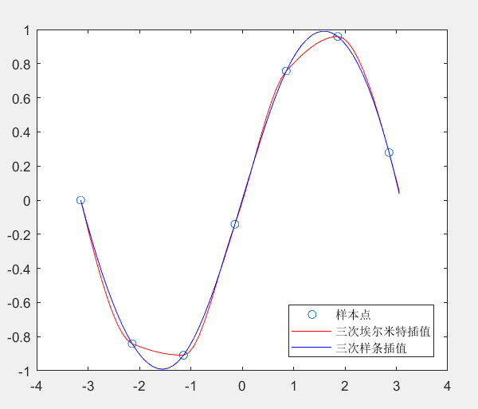

> Hermit 插值	若确实掌握节点处精确的 f'(x)（甚至 f''(x)），那能更“贴近真实动力学/物理约束”
>
> 样条插值	导数根本没有，只能用差分近似；差分导数带噪声/放大误差 ... 此时从数据本身推一个相对光滑的曲线更好

##### 其他

**n维**数据的插值	*自变量是n维*	

p = interpn(x1,x2,...,xn, y, new_x1,new_x2,...,new_xn, method)  

> method是要插值的方法	*‘linear’：线性插值（默认算法）	‘cubic’：三次插值	‘spline’：三次样条插值法(最为精准)	‘nearest’：最邻近插值算法*

> *较少使用，因为维度一高数据就不够密等*

------

### 04.1 拟合算法1 线性拟合 *19 Jan + 14 h delay*

> *君の心に 光が宿る 旅路の先で 僕らが笑う 君の１歩が僕の１００歩だ*
>
> 歌名：ハク  
> 歌手：あたらよ

**拟合思想**	尽管曲线**不能经过**每一个样本点，但只要保证**误差足够小**即可

#### 最小二乘法

拟合曲线和样本点应该尽可能接近，接近程度若用绝对值之和刻画**不好求导**，故使用**平方和**（最小平方/二乘）

残差平方和/损失函数 **$`L=\sum (y_i-kx_i-b)^2`$**，对其关于 $`k/b`$ 分别**求偏导**令其为 0，即可得到
```math
\hat{k} =\frac{\sum_{i=1}^{n}(x_i - \bar{x})(y_i - \bar{y})}{\sum_{i=1}^{n}(x_i - \bar{x})^2} = \frac{n\sum_{i=1}^{n} x_{i}y_{i} - \sum_{i=1}^{n} x_{i} \sum_{i=1}^{n} y_{i}}{n\sum_{i=1}^{n} x_{i}^{2} - (\sum_{i=1}^{n} x_{i})^2}
```

```math
\hat{b} = \bar{y} - \hat{k}\bar{x}= \frac{\sum_{i=1}^{n} x_{i}^{2} \sum_{i=1}^{n} y_{i} - \sum_{i=1}^{n} x_{i} \sum_{i=1}^{n} x_{i}y_{i}}{n\sum_{i=1}^{n} x_{i}^{2} - (\sum_{i=1}^{n} x_{i})^2}
```

> 前半是[高中教材](https://zxkeben.szxuexiao.com/html/9929.html)的结论，后半是PPT的结论，二者等价，但显然前者看起来更简单（
>
> 此外，验证二阶导可知确实是最小值不是最大值，这里并没有不严谨

#### 拟合优度

##### 推导

总体平方和 $`\mathrm{{SST}}=\sum (y_i-\bar y)^2`$	误差平方和 $`\mathrm{{SSE}}=\sum (y_i-\hat y_i)^2`$	回归平方和 $`\mathrm{{SSR}}=\sum (\hat y_i-\bar y)^2`$

有 **SST=SSE+SSR**

> - 先前求导得到了 $`\sum x_i(y_i-\hat y_i)=\sum (y_i-\hat y_i)=0`$，然后 $`\mathrm{{SST}}-\mathrm{{SSE}}-\mathrm{{SSR}}=2\sum (y_i-\hat y_i)(\hat y_i-\bar y)`$，展开带入即可
> - 但是对那两个方程更好的理解是残差均值为0&残差与x向量**正交**，e 与 X 的列空间正交
> - “求偏导=0”在几何上等价于：**最优残差必须与模型子空间正交**，因此拟合值是正交投影，SST=SSR+SSE 就是投影分解的**勾股定理**（向量=投影+正交残差）
>

> 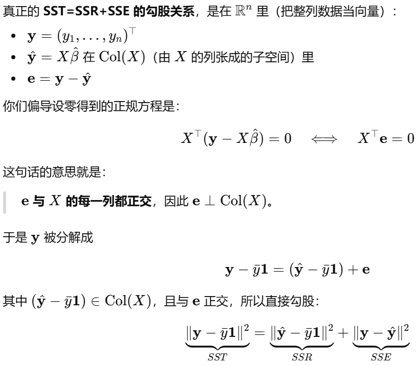

>
> *虽然用不上，但觉得很有意思，线代太神奇*

##### 定义

为消除量纲等的影响，定义拟合优度 **$`R^2`$**，其越**接近 1**拟合越好
```math
0\leq R^2=\frac{SSR}{SST}=\frac{SST-SSE}{SST}=1-\frac{SSE}{SST}\leq 1
```

##### 适用

拟合函数是**对参数线性**的函数	***不是**对自变量线性，因为这里求的是参数的值，自变量因变量已得知*

> 在函数中，参数仅以一次方出现，且不能乘以或除以其他任何的参数，并不能出现参数的复合函数形式。 
> ```math
> Y=e^{\beta_1+\beta_2x}√,Y'=asin(b+cx) × ,Y''=\frac{a}{(x-b)^2}×
> ```

若不满足，则**直接看 SSE** 即可

#### 取舍

拟合**不能一味追求更小的 SSE & 更大的 $`R^2`$**，不能也一味增高拟合多项式次数 / 拟合函数复杂程度

> 如果我们把插值的结果拿过来，那么一定有 $`\mathrm{{SSE}}=0`$ 且 $`R^2=1`$，因为它**没有任何残差**

拟合是为了得到**相对简单的**反映多个变量关系的表达式，不要一味想着 100% 精确

> 否则可能也会落入高次的 Ronge 现象中

#### 匿名函数

##### 声明

handle = **@**(arglist) anonymous_function	`z=@(x,y) x^2+y^2;`
handle~调用名	arglist~输入参数（可以多个，用逗号分隔）	anonymous_function~表达式

##### 调用

就像数学里面多元函数一样	`z(1,2)`

##### 绘图

**fplot** ( f, xinterval ) 将匿名函数 f 在指定区间 xinterval 绘图

------

### 04.2 拟合算法2 拟合工具箱 *20 Jan + 11 h delay*

> *雨上がりの空虹を描いて 皆に会いにゆくよ*
>
> 歌名：ドレミファロンド  
> 歌手：初音ミク & ４０㍍P

#### 工具箱操作

直接调用 Matlab 中 **Curve Fitting** 拟合 APP（**cftool**）

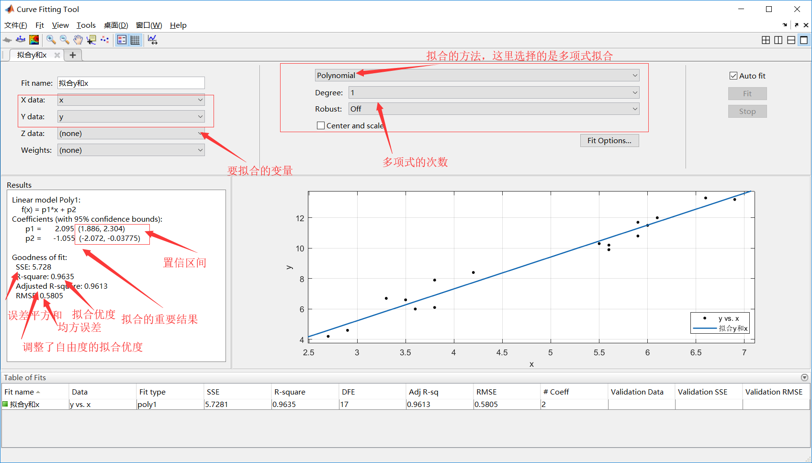

> 图中 95% 置信区间其原理跟卡方检验 & 零假设 比较像
>
> Center and Scale 指标准化

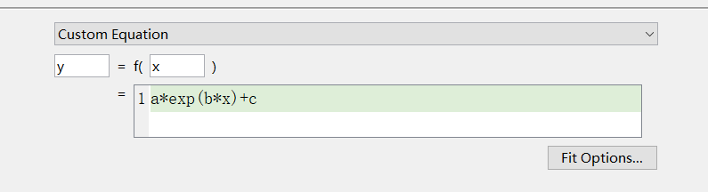

若为自定方程，还需要**输入自变量因变量**，且需要在 Fit Options 中调整最下面写的**初始拟合值**，*否则不一定会收敛*

#### 随机数

| 函数名      | 功能                       | 语法                                            | 示例                                                     |
| ----------- | -------------------------- | ----------------------------------------------- | -------------------------------------------------------- |
| **randi**   | 产生均匀分布的随机**整数** | `randi(imax, m, n)` `randi([imin, imax], m, n)` | `s1 = randi(10,2,5);` `s2 = randi([-5,5],1,10);`         |
| **rand**    | 产生均匀分布的随机**数**   | `rand(m, n)` `a + (b-a) * rand(m, n)`           | `s3 = rand(1,5);` `s4 = 2 + 3 * rand(1,5);`              |
| **normrnd** | 产生**正态分布**的随机数   | `normrnd(mu, sigma, m, n)`                      | `s5 = normrnd(0,2,3,4);`                                 |
| **roundn**  | 对任意位进行**四舍五入**   | `roundn(a, k)`                                  | `roundn(3.1415, -2)  % 3.1400` `roundn(3.1415, 2)   % 0` |

> 正态分布随机数可用于模拟扰动项

#### 应用举例

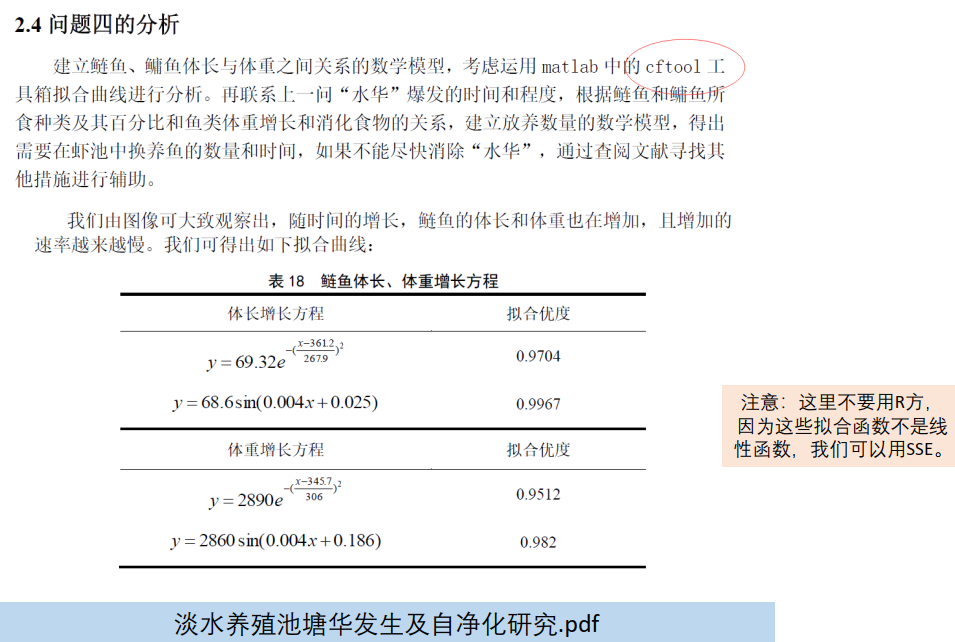

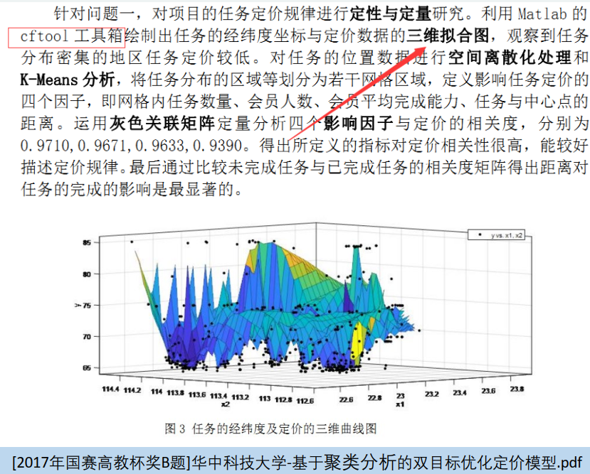

------

## 05 相关系数

**大型烧脑预警** *仅限推导和**概念理解**部分*

### 05.1 Pearson 相关系数的计算以及数据的描述性统计	*20 Jan + 12 h delay*

> *そんなときには空を見上げて 皆と一緒に歌いながら*
>
> 歌名：ドレミファロンド  
> 歌手：初音ミク & ４０㍍P

#### 总体和样本

**总体**	所要考察对象的全部个体		**样本**	从总体中所抽取的一部分个体

我们总是**希望得到总体**数据的一些特征（例如均值方差等），为此我们一般计算这些抽取的样本的统计量来**估计总体的统计量**	*如使用样本均值、 样本标准差来估计总体的均值（平均水平）和标准差（偏离程度）* 

> **统计推断**（用样本推测总体）中：
>
> 我们把总体均值（μ）、总体方差（σ²）等，视为一个**固定但未知的客观存在**。它们就像宇宙的物理常数（如重力加速度g），是描述这个世界（总体）的固有属性。我们是否去测量、如何抽样，都不会改变它。在这个意义上，它永远是**外部的、独立的参考系**，我们的目标是去“发现”（估计）它
>
> 每当我们需要用一个样本统计量（它本身是数据推导出的）去估计一个总体参数时，这个统计量往往会**“吃掉”一部分信息来定义自己**，从而导致用它来估计其他参数时，可用的独立信息（自由度）会减少

**总体**方差	`σ² = Σ(Xᵢ - μ)² / N`	**样本**方差	`s² = Σ(xᵢ - x̄)² / (n-1)`

*在其他地方也会有这样类似的**分母区别***

> 样本方差用 `x̄`代替了 `μ`。`x̄`的“**内部生成**”属性，导致了“偏差和为零”的约束，**损失1个自由度**，所以分母用 `n-1`来获得对 `σ²`的**无偏估计**；而总体则是（如人类男性平均身高）即使你用全地球的数据“算”出了它，这个计算结果 μ 本身**不会反过来约束**任何一个具体男性的身高，它只是一个描述性的客观存在的数字

#### 协方差

两组（总体 or 样本）数据 X & Y，记总体均值为 E(X) & E(Y)，样本均值为 x̅ & ȳ ，则
```math
\mathrm{Cov}_{总体}(X,Y)=\frac{\sum_{i=1}^{n}\left(X_{i}-E(X)\right)\left(Y_{i}-E(Y)\right)}{n},\mathrm{Cov}_{样本}(X,Y)=\frac{\sum_{i=1}^{n}\left(X_{i}-\bar{X}\right)\left(Y_{i}-\bar{Y}\right)}{n-1}
```

> 你小 / 大于均值时，我小 / 大于均值 → 变化方向相同 / 反

如果X、 Y**变化方向**一直相同则协方差为正，一直相反则为负，无规律（有正有负）则不会有显著大的值

*但是协方差大小依赖量纲，**不适合**做比较*

#### Pearson 相关系数

##### 定义

**协方差除以二者标准差**	*可看作标准化的协方差，类比正态分布标准化*
```math
总体标准差\sigma_x=\sqrt{\frac{\sum{(X_i-E(X))^2}}{n}},样本标准差S_x=\sqrt{\frac{\sum{(X_i-\overline X)^2}}{n-1}}
```

```math
Pearson相关系数:总体\rho_{XY}=\frac{Cov(X,Y)}{\sigma_x\sigma_y},样本\rho_{XY}=\frac{Cov(X,Y)}{S_xS_y}
```

容易证明，**|ρ|≤1**，且当且仅当Y与X成**线性关系** Y=aX+b 时**取1**，其中a**>0时取1**，a**<0时取-1**	*符合直觉*

> 是不是很像三角函数？还真是，**去均值后 X/Y 向量的夹角余弦**就是 Pearson 相关系数
>
> ```math
> \tilde{\mathbf{x}}=(x_1-\bar x,...,x_n-\bar x),\tilde{\mathbf{y}}=(y_1-\bar y,...,y_n-\bar y)→\rho_{XY}=\frac{\tilde{\mathbf{x}}\cdot \tilde{\mathbf{y}}}{|\tilde{\mathbf{x}}| |\tilde{\mathbf{y}}|}=cos\theta
> ```

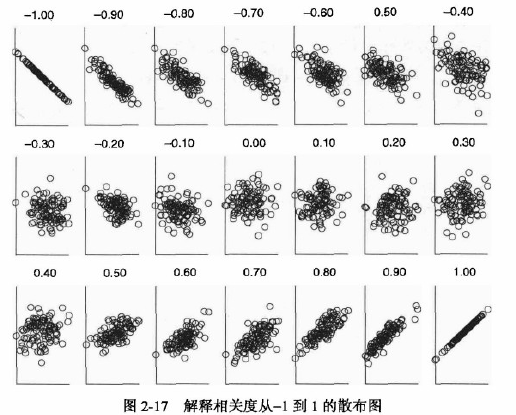

##### 误区

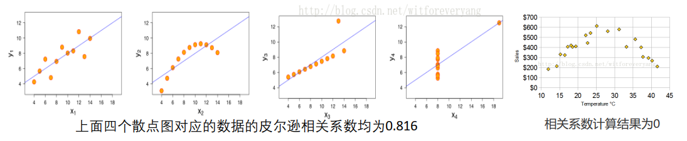

- Pearson 相关系数**只能描述线性**相关，确定变量线性相关 （**画散点图**！）之后才能使用这个描述指标
- 即使 Pearson 相关系数很大也**不代表**二者线性相关，甚至不能说明相关
- 反之也不能说明二者不相关，可能有其他关系
- **离群点 / 异常数值**对 Pearson 相关系数影响很大

此外对相关系数的解释是依赖于具体的应用背景和目的的，具体数值意义不大，更关注**显著性**（假设检验）

##### 作图

如果有多个变量，可以画**矩阵散点图**来看各个变量之间线性关系

SPSS - 图形 - 旧对话框 - 散点图/点图 - 矩阵散点图	*用 Matlab 则要多次画图，太麻烦*

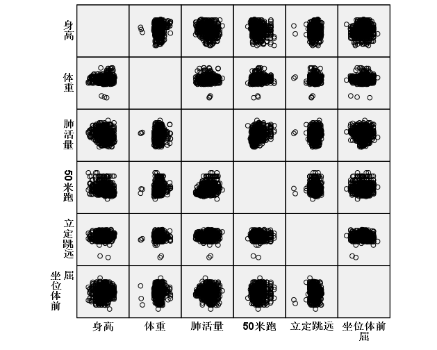

##### 计算

R = **corrcoef**(A)	返回 **A 的相关系数**的矩阵，其中 A 的列表示随机变量（指标），行表示观测值（样本）

R = **corrcoef**(A,B)	返回**两个**随机变量 A 和 B （两个向量）**之间**的系数

> 如果传入数据表的话，就用的是第一种

##### 美化

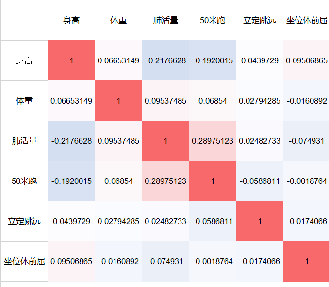

相关系数表如果美化出**色阶**会效果更好	

*开始-条件格式-色阶-选中红-白-蓝那个，然后选择条件格式-管理规则-编辑规则*  

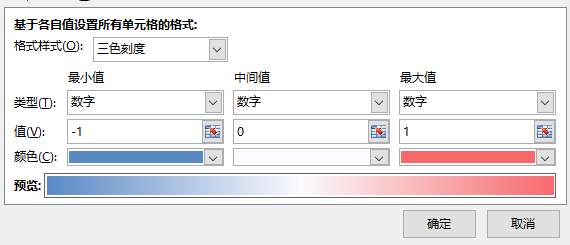

#### 描述性统计

当题目给出一些数据时，先做一些基础的统计分析是很简单但也很需要的	[*偏度与峰度的介绍*](https://zhuanlan.zhihu.com/p/84614017)

##### Matlab

```matlab
MIN = min(Test); % 每一列的最小值	MAX = max(Test); % 每一列的最大值
MEAN = mean(Test); % 每一列的均值	MEDIAN = median(Test); %每一列的中位数
SKEWNESS = skewness(Test); %每一列的偏度	KURTOSIS = kurtosis(Test); %每一列的峰度
STD = std(Test); % 每一列的标准差
RESULT = [MIN;MAX;MEAN;MEDIAN;SKEWNESS;KURTOSIS;STD]	%将这些统计量放到一个矩阵中表示
```

> 放到矩阵中之后就可以转换成统一表格了

##### Excel

标题栏 → 数据 → 数据分析 → 描述统计 → 选择输入/出区域、逐行还是逐列等 → 勾选 □汇总统计 → 确定

但是这样会有很多**重复列**（*平均 标准误差 ...* 这个信息列每一组数据都会出现一次），记得精简

##### SPSS 统计软件

分析 → 描述统计 → 描述 → 把要描述的变量拖到右边的框 → 勾选需要的统计量 → 确定

### 05.2 假设检验部分 *21 Jan*

> *夜が明ける頃、迎えにゆくよ*
>
> 歌名：１９９９  
> 歌手：羊文学

如果搞不懂，参考[高中教材上关于卡方检验的内容](https://zxkeben.szxuexiao.com/html/9930.html)，跟这里的检验的理念本质是一样的

不过其实这里主要是**概率论和数理统计**的知识速通，如果真的不懂那也可以不用管思路直接套步骤

#### 基本概念

> [一些 GPT 给出的辨析，可凑合着看看](https://chatgpt.com/share/e/6970b7e7-2a28-8007-a69b-df50173e6653)

##### 假设

原假设 $`H_0`$	备择假设 $`H_1`$	二者相反

我们在检验部分会**试图推翻原假设**，以达到检验原假设是否正确的目的

##### **显著性**水平 α

犯第一类错误 *原假设是**正确的我们却认为它错了*** 的概率

> - 除了那 α 最极端的违反原假设（在原假设下最少见）的情况，我们都**没有充分证据推翻**原假设
> - 若 α 部分极端的小概率事件发生，则**有把握**说明原假设**有问题**
> - 如果原假设其实是真的，这套规则长期会有 α 的比例误把它拒绝掉

##### 置信水平 β

β = **1 - α**	**相信**原假设**成立**的概率

> - 在那 β 比例的接近零假设条件（在原假设下最常见）的情况下，认为**没有充分证据推翻**原假设
> - 如果我们用同一种方法重复抽样 / 构造区间，那么这些区间有 β 的比例会**覆盖**被我们估计的参数的**实际值**

##### 单侧 / 双侧 检验

如零假设为 W=90，若备择假设为 W≠90 则为双侧，为 W>/<90则为单侧	*注意计算区别*

#### 密度函数

> 对于连续型随机变量，落在任意点的概率均为0，故需要讨论区间概率

##### 概率密度函数

> Probability Density Function, a.k.a. **PDF**

```math
P(a\leq X\leq b)=\int_{a}^{b} f(x) dx
```

符合上述公式的函数即概率密度函数	显然，f (x) ≥ 0，且 f (x) 在 **-∞ ~ +∞ 上的积分为 1**

$`f(x_0)`$ 代表 $`X`$ 发生在 $`x_0`$ 处的**概率强度**	*虽然概率是 0*

##### 累积分布函数

> Cumulative Distribution Function, a.k.a. **CDF**

```math
F(x)=P(X\leq x)=\int_{-\infty}^{x}f(t)dt
```

符合上述公式的函数即概率密度函数	*即 f (x) 从负无穷积到 x，X 从负无穷**累积分布**到 x 的概率*

显然，F (x) 递增 & F (-∞)=0, F (+∞)=1 & F (x) 是 f (x) 的一个**原函数**	*反之，变上限积分求导*

#### 检验步骤

##### 确定假设

*$`H_0`$ 体重和 90 kg 有明显差别 	$`H_1`$ 体重和 90 kg 无明显差别*

##### 构造分布

在原假设成立前提下，根据我们要检验的量构造一个**统计量**，其满足一种**标准分布**

> 标准正态分布 / $`t`$ 分布 / $`F`$ 分布 / $`\chi^2`$ 分布

统计量中只能包含被检验的量**一个**未知量	*W ~ N ( 90, 4 ) → Z = ( W - 90 ) / 2 ~ N ( 0, 1 )*

##### 给出接受域

在给定置信水平 β 下，求出接受域 → **P** (a ≤ 统计量 ≤ b) **= β**	*β 一般 90%/95%/99%*
```math
标准正态分布f(x)=\frac{1}{\sqrt{2\pi}}e^{-\frac{x^2}{2}}
```
*若 $`\beta=95\%`$，则有 $`F(x_{\text{{临界}}})=0.95 + (1-0.95)/2 = 0.975`$ → $`x_{\text{{临界}}} = F^{{-1}}(0.975)`$，求反函数 → 得到区间 $`[-1.96,1.96]`$*

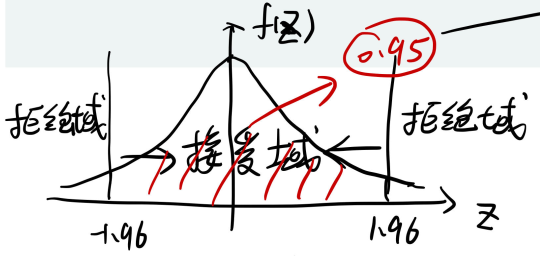

##### 代入计算并判断

用一只数据代入计算统计量得到检验值，若其在接受域内则**无法拒绝**原假设（接受），否则拒绝并接受备择假设

*真实情况：体重为 94 kg，Z = 2 > 1.96 → 在 95% 的置信水平上，拒绝原假设*

#### P值法

相比于求反函数，不妨**直接求出** Z* 对应的**拒绝域概率值**（P值），然后与给定的 α 比较，若 **P<α 则拒绝**原假设

单侧检验：*P (x>2) = 1 - F (2) = 0.0228*	双侧检验：单侧检验P值的**两倍** *P (x<-2||x>2) = **2**P (x>2) = 0.0456*

------

### 05.3 Pearson 相关系数假设检验 *21 Jan + 15 h delay*

> *１ ２ ３ でぶっ飛んだ無礼講 ３ ２ １ でslap on the bass*
>
> 歌名：IN_MY_HEAD  
> 歌手：なとり

> 前面提到过，给相关系数（r）具体的绝对数值定标准没有什么实际意义，更关注其**显著性**，下文就是对其相关程度显著性的检验

#### 前提条件

1. 实验数据通常假设是成对的**来自于正态分布**的总体

   > 因为在求 Pearson 相关性系数以后，通常还会用 t 检验之类的方法来进行皮尔逊相关性系数检验，而 t 检验是基于数据呈正态分布的假设的

   *正态分布检验见下节*

2. 实验数据之间的**差距**不能太大 	*Pearson 相关性系数受异常值的影响比较大*

3. 每组样本之间是**独立**抽样的 	*构造t统计量时需要用到*

#### 确定假设

原假设 r=0	备择假设 r≠0	*显著地异于0*

#### 构造分布

```math
t=r\sqrt{\frac{n-2}{1-r^2}}~服从自由度为~n-2~的~t~分布
```

```matlab
y = tpdf (x,28) %求t分布的概率密度值，后一个参数是自由度
```

> 以下详细内容可参考 [GPT](https://chatgpt.com/share/e/6971d92f-ea40-8007-899a-1fe6b6a71791)
>
> 显著性 → **相关**的程度**相比波动**的程度够不够大 → **ỹ** 沿着 **x̃** 方向的部分 ÷ **ỹ** 垂直于 **x̃** 方向的部分 → **cotθ**
>
> 又 **r = cosθ** → t ∝ cotθ = cosθ/sinθ = **r/√(1-r^2)**
>
> 而自由度	*去均值后，所有向量都落在一个 (n−1) 维的空间里（因为“**Σ分量等于 0**”这个约束会吃掉 1 个自由方向）；其中，**x̃ 本身**确定了这个空间里的一条 1 维方向（也就是沿着 x̃ 的那条直线方向）；于是，剩下与 x̃ 垂直的空间维数就是 **(n−2)***	再结合标准差开根号即可得到系数为√(n−2)

#### 计算检验值

代入 n 与先前求得的相关系数 r ，求得 t*

#### 给出接受域 & 判断

画出 t 分布的 PDF，给定置信水平，[查表](https://www.saiensu.co.jp/book_support/978-4-88384-140-0/t_distribution.pdf)找到该置信水平的临界值，并画出接受域拒绝域，比较并下结论

```
tinv (0.975,28) % 累积密度函数 cdf 的反函数，可用于求临界值
```

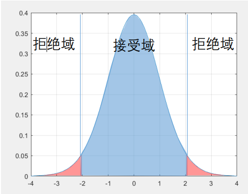

> 因为我们得到的 t* = 3.05505 > 2.048，因此我们可以下结论：在95%的置信水平上，我们拒绝原假设 H0: r = 0，因此r是显著地不为0的

#### P 值判断

```matlab
disp((1-tcdf(3.055,28))*2)	%双侧检验的p值要乘以2
```

***tcdf** 累积分布函数*

> p<0.05，说明在95%的置信水平上拒绝原假设；p>0.05，说明在95%的置信水平上无法拒绝原假设

*本例中，拒绝原假设意味着皮尔逊相关系数显著的异于 0*  

#### 批量计算

```matlab
[R,P] = corrcoef(Test)
```

R 返回的是相关系数表， P 返回的是对应于每个相关系数的p值

*Matlab 计算的是双侧检验的p值，需要单侧的话要除以 2* 

#### 绘制表格

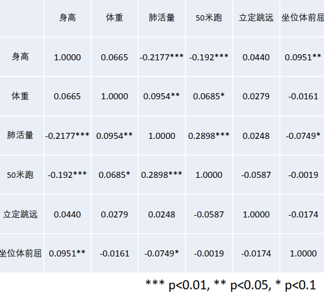

一般会**用星号多少来表征显著性**	*如果用matlab只能自己对着逻辑矩阵手动标*

使用 SPSS → 分析 → 相关 → 双变量 → 指标全移到右边 → 勾选 皮尔逊 & 标记显著性相关性 → 选择单 / 双侧检验 → 确定

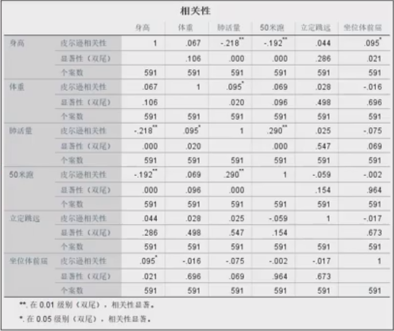

*请注意，显著性标记和色阶标记[一般而言不相容](https://chatgpt.com/share/e/6971f3b1-4ef0-8007-acdb-67908536482c)，需要取舍*

### 05.4 对数据进行正态分布检验 *21 Jan + 17 h delay*

> *皮膚を引っ張って順応して、“わたしだけ はかってたよ” 舞い上がったどの瞬間、“冗談なんて一つもない”*
>
> 歌名：微熱魔  
> 歌手：ずっと真夜中でいいのに。

#### Jarque-Bera（雅克-贝拉）检验

##### 适用范围

大样本 **n>30**

##### 偏度与峰度

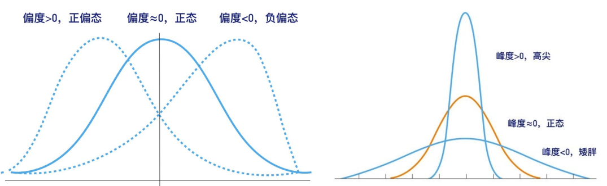

先将变量 X **标准化**为 z = (X - u) / σ	*u~均值 σ~标准差*

看左右有多对称？	**偏度** S = E (z**^3**)	*skewness 三次方可以保留正负*

看有多少偏离中心的部分？	**峰度** K = E (z**^4**)	*kurtosis 四次方不保留符号，且对边缘值放大更明显*

标准正态分布 **S=0 K=3**	*也有定义K = E (z^4) - 3的，但不是matlab所使用的*

##### [原理](https://chatgpt.com/share/e/69720503-0c28-8007-a148-6a5e2db4f6df)

用变量的**偏度和峰度和正态分布比较**，以确定其服从正态分布的显著性

若 X 服从正态分布，则在**大样本**情况下
```math
JB=\frac{n}{6}[S^2+\frac{(K-3)^2}{4}]\sim\chi ^2(2)~~~~~~~~自由度为2的卡方分布
```

> 正态分布下有如下结论	*中心极限定理：**平均值**在大样本下会变得**近似正态***
> ```math
> \sqrt{n}S\approx N(0,6),\sqrt{n}(K-3)\approx N(0,24)\Rightarrow S\sim \sqrt{\frac{6}{n}},K-3\sim \sqrt{\frac{24}{n}}
> ```
> 可以理解为正态分布的标准**应有的波动** → 以这样的标准波动作比，标准化 X 的对应参数
> ```math
> z_1=\frac{S-0}{\sqrt{6/n}},z_2=\frac{(K-3)-0}{\sqrt{24/n}}
> ```
> 标准化后二者应都符合标准正态分布，两个波动既独立又是相同尺度，可以使用平方和一起估计
>
> 而**卡方分布**的定义之一就是**标准正态的平方和** *自由度为参与平方和的变量个数*，故...	
> ```math
> z_1^2+z_2^2\sim\chi^2(2)
> ```

##### 步骤

H0：该随机变量服从正态分布	H1：该随机变量不服从正态分布

计算该变量的偏度和峰度，得到检验值JB*，并计算出其对应的p值

将p值与0.05比较，如果**小于0.05则可拒绝**原假设，否则不能拒绝原假设

##### Matlab

[h,p] = **jbtest** (x,alpha)

当输出 h **等于 1 **时，表示**拒绝**原假设； h **等于 0** 则代表**不能拒绝**原假设。

alpha ~ 显著性水平（一般取0.05）	x ~ 要检验的随机变量（**只能是向量**）

*对多组数据可以循环检验并把数据添加到同一个数组中*

> ```matlab
> H = zeros(1,6);  
> ```
>
> 建议**先初始化**再用，否则每次都要扩展数组 / 矩阵会降低运行速率

#### Shapiro-Wilk （夏皮洛-威尔克）检验

##### 适用范围

小样本 **3≤n≤30**

> 因为一般而言 SW 的 **p 值不是用一个简单的封闭分布直接算**，而是用近似算法/拟合得到的

##### Q-Q 图

比较两个概率分布的**分位数**对这两个概率分布进行比较	`qqplot(Test(:,1))`  

> 如果样本数据是正态分布，那么它应该和标准正态的分布情况相似，故对应分位数成线性关系
>
> *看排序数据是否几乎是正态模板的 **线性伸缩***

只需看 Q-Q 图上的点是否近似的在**一条直线**附近	*要求数据量非常大，否则头尾部效果很差*

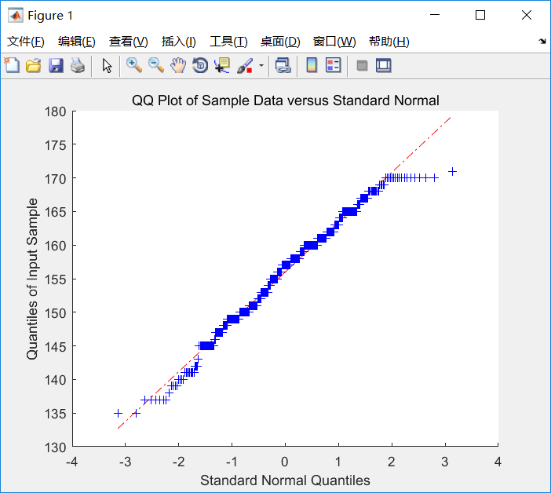

> 但是这样虽然直观，但不够量化	*不过可以配置信带/模拟包络*

##### [原理](https://chatgpt.com/share/e/69720503-0c28-8007-a148-6a5e2db4f6df)

```math
W=\frac{\sum(a_ix_{(i)})^2}{\sum(x_i-\bar x)^2}\sim cos^2\theta~(~\theta~是排序后数据~\tilde{\mathbf{x}}~和带权重正态分布~{\mathbf{\alpha}}~的夹角~)
```

> 为什么要加权？不同点的**可靠程度**不一样，而且可能**彼此相关** → 不同等也不独立
>
> - 由于其相关性，排序点的“误差”**不是**普通回归那种独立同分布误差，需要用协方差 
>
>   → 不能用普通加权回归
>
> - 直接用cosθ？**欧氏**内积暗含每个坐标方向同等且独立
>
>   强行用可以当作定性相似性分数，但是**检验**的时候怎么确定这个分数够不够显著呢？
>
> 所以，我们必须要回答*哪些偏离算正常（抽样抖动），哪些偏离不正常（真非正态）* 的问题，必须要用到**有限样本的随机性结构** *协方差 V* 
>
> *某种意义上，还是在看误差部分像不像正态的误差*
>

> 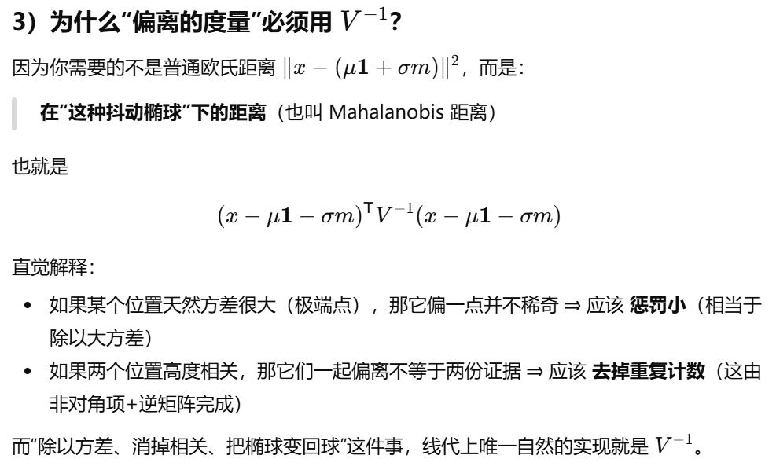

> ```math
> W=cos^2\theta,\theta=\ang(\tilde{\mathbf{x}},\mathbf{\alpha}),\alpha=\frac{V^{-1}\mathbf{m}}{||V^{-1}\mathbf{m}||},V=Cov(Z_{(1)},...,Z_{(n)}),\mathbf{m}=(\mathbb{E}[Z_{(1)}],...,\mathbb{E}[Z_{(n)}])^T
> ```

##### 步骤

（略，同 JB 法）

##### SPSS

分析 → 描述统计 → 探索 → 右侧“图” → 勾选“含检验的正态图” → 确定 → 找到*正态性检验*

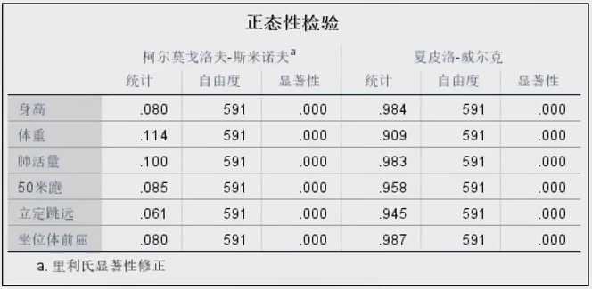

### 05.5 Spearman 相关系数 *22 Jan*

> *・・ ・ー・・ ーーー ・・・ー ・ ー・ーー ーーー ・・ー*
>
> 歌名：シリウスの心臓  
> 歌手：ヰ世界情緒

#### 定义

> 与其关注离均值的距离和方向，不如**从顺序 / 等级入手**，这样不依赖构造特定分布 or 具体数值

##### Ⅰ

```math
r_s=1-\frac{6\sum d_i^2}{n(n^2-1)}\in[-1,1],d_i为X_i \& Y_i间的等级差
```

**等级**指**从小到大**排序时这个数所在位置，若有*数值相同*（并列）则将所在位置*取算术平均*

##### Ⅱ

Matlab 使用的是**等级**之间的 **Pearson** 相关系数

#### 计算

- `corr(X , Y , 'type' , 'Spearman')`	必须是**列向量**
- `corr(X , 'type' , 'Spearman')`	计算矩阵**各列之间**的斯皮尔曼相关系数

> 一撇'表示求转置  

#### 假设检验

##### 小样本

n ≤ 30 时，直接**查[临界值表](https://www.cust.edu.tw/mathmet/Spearmancrtical.pdf)**

##### 大样本

构造统计量 $`r_s\sqrt{n-1}\sim N(0,1)`$	$`H_0:r_s=0,H_1:r_s\neq0`$

> $`\sqrt{n-1}`$来源于除以标准差（**标准化**），而标准差为$`1/(n-1)`$；服从标准正态分布源于中心极限定理

> *为什么这里突然有了文内 latex 公式？因为看了一眼 typora 指南，发现偏好里可以调，但是默认没有勾选...前面那些 html 标签将就着看吧 qwq*

计算上述检验值，求出相应的 P 值，并与 α 相比，$`p>\alpha`$则无法拒绝原假设

> 此处要用到 **normcdf**，标准正态分布的cdf函数

##### 便捷方法

```matlab
[R,P]=corr(Test, 'type' , 'Spearman')	% 直接给出相关系数和p值
```

#### 相关系数的选择

Spearman 只要满足**单调**关系（线性 / 指数 / 对数）便可适用，适用更广，但效率不够高

Pearson 在**连续**数据 / **正态**分布 / **线性**关系等依赖正态分布的条件下表现出色

**定序数据**只能用 Spearman，因为数值及数值运算是没有意义的

> 1表示差、 2表示良、 3表示优，但用2除以1得出的2并不代表任何含义

------

## 06 典型相关分析

### 06 典型相关分析 *23 Jan*

> *花散らせ今吹くこの嵐は、まさに春泥棒*
>
> 歌名：春泥棒  
> 歌手：ヨルシカ

*Canonical Correlation Analysis, 由 Hotelling 提出*

和**主成分分析**的思想比较接近，看不懂可以参考主成分分析那里

#### 目的

当我们研究变量**组**之间的关系时，直接进行很多次的两两相关分析很难得到变量**组**之间关系的清楚把握

我们可以找到各自变量组的**代表变量**之间的相关关系 → 最简单就是挑具有最大的**相关系数**的**线性组合**来代表

然后选取和最初挑选的这对**不相关**的线性组合，并**继续**选取相关系数最大的一对 ... 直到相关性被提取完毕，**不再显著**

被选出的线性组合配对称为**典型变量**，它们的相关系数称为**典型相关系数**（度量这两组变量之间联系的强度）

> 说到线性相关，从线代上就会想到向量组线性相关——求秩
>
> 但是对于现实中的统计数据基本不是整数且**难以**存在严格意义上的互相**无误差相关**关系情况下，基本而言计算出来的多个向量不可能数学上线性相关
>
> 不过我们也不需要严格的线性相关，只需要相关性显著即可，但是以上这样很难抽象出一个“线性相关程度”指标来进行显著性检验	*奇异值：真的吗*
>
> 所以统计中一般用**协方差**来代替求秩完成这个任务，对协方差进行显著性检验
>
> *以上文字其实有点误入歧途了，数据杂乱并不代表构造不出正交向量*
>
> *[真正的思路是](https://chatgpt.com/share/e/6972ff60-b1a8-8007-a5e7-1f93a1660632)：变量组之间有关系 ⇒ 两组存在“**共同波动**模式” ⇒ 用二阶统计量（协方差）把这种共同波动抽出来 ⇒ 抽出的模式在各自组内做成“**协方差正交**”*

#### 推导

##### 思路

> $`X^{(i)}`$ 指第 $`i`$ 组的变量，记$`Cov(X^{(i)},X^{(j)})=\Sigma_{ij}`$，由 $`\Sigma_{ij}`$ 组成的矩阵记为 $`\Sigma`$ 矩阵，记线性组合$`U={a}^T {X}^{(1)},V={b}^T X^{(2)}`$
>
> $`var`$ 和 $`D`$ 都是方差，$`Corr`$ 和 $`\rho`$ 都是相关系数...

固定方差 $`var(U)=var(V)=\mathbf 1`$ ，找到 $`{a}^T,b^T`$ 两组系数使**相关系数** $`\rho(U,V)`$ **最大**；若不为第一组，则还要有（*如第二组*） $`Cov(U_1,U_2)=Cov(V_1,V_2)=0`$ 协方差**为 0 **确定与前面各组线性组合**不相关**

> *固定方差因为相关系数**和量纲 / 乘倍数无关**，为避免找到了先前结果的线性组合*
> ```math
> Corr(U,V)=\frac{Cov(U,V)}{\sqrt{D(U)}\sqrt{D(V)}}=\frac{a^T\Sigma_{12}b}{\sqrt{a^T\Sigma_{11}a}\sqrt{b^T\Sigma_{22}b}}=a^T\Sigma_{12}b
> ```
> 作**变换 **$`\tilde a=\Sigma^{1/2}_{11}a,\tilde b=\Sigma^{1/2}_{22}b`$ 使 $`\tilde a,\tilde b`$ **范数为 1** ⇒ 只用研究**中间**那坨 $`C=\Sigma^{-1/2}_{11}\Sigma_{12}\Sigma^{-1/2}_{22}`$
>
> 有$`Corr(U,V)=\tilde a^TC\tilde b=<\tilde a,C\tilde b>\stackrel{\text{max}}{=} ||C\tilde b||=\sqrt{(C\tilde b)^TC\tilde b}=\sqrt{\tilde b^T(C^TC)\tilde b}`$
>
> 由**二次型**的性质，该式最大值为 $`C^TC`$ 的**最大特征值**的平方根，在 $`\tilde b`$ 为**对应特征向量**时取等
>
> 后续第 $`n`$ 对要满足和先前的 $`(n-1)`$ 对 $`\tilde b`$ *特征向量*正交 ⇒ 取**第 $`\mathbf n`$ 大**特征值的平方根及对应特征向量
>
> *用奇异值分解会更简单；也可代数用 Lagrange 函数求解*

##### 结论

记
```math
A=\Sigma_{11}^{-1}\Sigma_{12}\Sigma_{22}^{-1}\Sigma_{21}\in\mathbb{R}^{p\times p}, \qquad B=\Sigma_{22}^{-1}\Sigma_{21}\Sigma_{11}^{-1}\Sigma_{12}\in\mathbb{R}^{q\times q}
```

则 $`\rho_k^2`$ 为矩阵 $`A`$（等价地也为矩阵 $`B`$）的**第 k 大特征值**（或说 $`\rho_k`$ 按大小排序，$`1\ge\rho_1\ge \rho_2\ge \cdots \ge 0`$）

且线性组合 $`a,b`$ 是对应的**特征向量** $`A a_k=\rho_k^2 a_k, B b_k=\rho_k^2 b_k`$

#### 步骤

##### 验证前提

两组数据符合**联合正态分布**	*就是n维随机变量每个分量都符合一维正态分布，总体记为*$`N_{p+q}(\mu,\Sigma)`$

##### 标准化

*每列减均值除标准差*

**统一**单位 & 数量级（都均值 0 & 方差 1），否则*之后求得的**系数大小**很大程度反映单位选得大不大，不反映各自相对之间的重要性*

> 不过，这并不影响典型相关系数的任何数值
>
> 值得注意的是，此时协方差矩阵就是**相关系数**矩阵

##### 变量组检验

先检验**两组**变量的相关性是否显著不为 0 $`\implies H_0:\Sigma_{12}=0`$ *指不相关*
```math
似然比统计量\Lambda_0=\frac{|\hat\Sigma|}{|\hat\Sigma_{11}||\hat\Sigma_{22}|}=\prod_{i=1}^r(1-\hat\lambda^2_i)\implies Q_0=-m\ln \Lambda_0\sim \chi^2(f)
```

> 其中，$`m=(n-k-1)-\frac{1}{2}(p+q+1),f=(p-k)(q-k)`$	不过此处下标 $`k=0`$
>
> 那个行列式分式？两组互不相关时“两块散布体积”的乘积 vs 拼在一起后的“整体散布体积”$`\implies`$**耦合 / 关联**
>
> 连乘？总体无关的 $`H_0\iff \rho_1=\cdots=\rho_r=0`$，如果真的**无关则接近 1**，反之则会明显 < 1
>
> 取对数？**化积为和**，再近似$`\ln(1-x)\approx -x`$即可得到 $`p\times q`$ 个正态分布量的**平方和**$`\implies`$卡方分布

但是，显然如果后续对 $`\rho`$ 进行显著性检验时有 $`\rho`$ 能通过，则**直接印证**两组变量**相关**	*故这步可省略*

##### 确定典型相关变量数

检验（*有多少*）总体典型相关系数显著不为 0 $`\implies H_0:\lambda_{k+1}=\dots=\lambda_r=0\qquad H_1:\lambda_{k+1}\neq0`$ 

应用和上文类似的$`\Lambda_\mathbf k,Q_\mathbf k`$进行卡方检验，从$`\lambda_1`$开始**依次检验**，直到不再显著$`\lambda_{j}=\dots=0`$为止

*结论的可靠性**取决于选择的置信水平**，如果比较骑墙不妨把标准降低一点*

则提取 $`\mathbf{j-1}`$ 对典型变量进行分析

##### 后续处理

> 下述可选择性使用

###### 载荷分析

> 直接看典型变量各分量的大小来分析谁的贡献多并不够准确

对**原始变量和典型变量**之间进行相关性分析

###### 方差比例

定量测算典型变量所能解释的该组样本总方差的比例，从而测度其包含的**原始信息量**大小

#### SPSS

需要 SPSS24 以上才可像下文一样有图形化操作，否则只能敲代码

##### 步骤

1. 文件 → 导入数据 → Excel
2. 变量视图 → 检验数据类型（理应全为**标度**，*绝对数值有意义且可排序*）
3. 分析 → 相关 → 典型相关性
4. 把数据分到集合 1 和集合 2（需要 python 支持）
5. 文件 → 导出

##### 注意

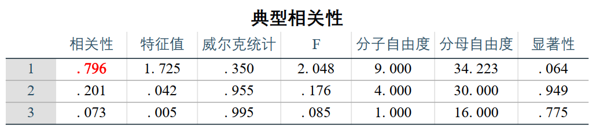

此处 （典型）相关性 改为 （典型）相关**系数**，显著性 改为 **p 值**

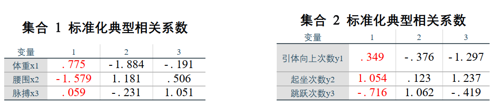

最好给集合**命名**，标题应改为 标准化典型相关变量**对应的线性组合系数**

注意**只用标准化**的那几个表，而且**只看有显著性**的对应的那几个向量

------

## 07 多元线性回归分析

**回归分析** *研究 X 和 Y 之间**相关性**的分析*

> 分为：线性回归	 0-1回归	定序回归	计数回归	生存回归，本节研究第一种

前四节其实都有点水，挺简单的

### 07.1 & 07.2 回归分析的介绍和分类 ＆ 数据的分类 *23 Jan*

> *届くよ 速度を上げて 駆け出したいの 明日まで ひとっ飛び*
>
> 歌名：drop pop candy  
> 歌手：鏡音リン / 巡音ルカ

#### 回归分析

##### 相关性

在绝大情况下，因果关系是**不能**（在数学上）严格得到的，于是退而求其次通过回归分析研究相关关系

##### 因变量

**连续数值**性变量	**0-1**型变量 *二值变量，表示两种状态，如成功*	

**定序**变量 *相对数值次序有意义，但绝对数值无意义*，如打分1~5	**计数**变量 *非负整数*

**生存**变量 *寿命类，只能知道“寿命至少比现在的寿命值长”*

##### 自变量

> 用来解释 Y 的相关变量

回归分析的任务就是通过研究X和Y的相关关系，尝试去**解释**Y的形成**机制**，进而达到通过X去**预测**Y的目的

#### 数据

| 类型         | 定义                | 建模方法                               |      思路      |
| :----------- | ------------------- | :------------------------------------- | :------------: |
| 横截面数据   | 同一时间 + 不同对象 | 多元线性回归                           |      回归      |
| 时间序列数据 | 连续时间 + 同一对象 | 移动平均 指数平滑 ARIMA GARCH VAR 协积 |      预测      |
| 面板数据     | 前两者综合          | 固定效应和随机效应 静态面板和动态面板  | 交给经管学生罢 |

------

### 07.3 对于线性的理解以及内生性问题的探究 *23 Jan*

> *夢は自分を叶える為に 生まれた証だから きっとこの心で 私のm@sterpiece*
>
> 歌名：M@STERPIECE  
> 歌手：７６５Pro Allstars

#### 一元线性回归模型

##### 定义

若 $`x\&y`$ 间满足 $`y=\beta_0+\beta_1x+\mu`$	*其中 $`\mu`$ 是无法观测且满足一定条件的**扰动项***

有预测值 $`\hat y=\hat\beta_0+\hat\beta_1x`$ ，其中 $`\hat\beta_0\&\hat\beta_1`$ 取值让 $`\sum(y_i-\hat\beta_0-\hat\beta_1x_i)^2=\sum(\hat\mu_i)^2`$ 最小	*可用 $`arg\mathop{min}\limits_{\beta_0\,\beta_1}`$ 记*

称 $`\hat\mu`$ 为**残差**

> 本质和线性拟合没有区别

##### 适用

对**参数**线性即可，自变量和因变量都可以经过**变量替换**（$`x^2,\ln x,e^x,\dots`$）转换成线性

甚至有**交叉项**都可以（$`x_1x_2=t_0`$）

> 所以需要数据**预处理**，可用 Excel Stata
>
> *Excel 中如果需要下拉很久，**双击**单元格右下角那个点即可一键推广公式到最下有效单元格*

#### 内生性

如果误差项 $`\mu`$ 和所有自变量均**不相关**，则称模型具有**外生性**

> 准确地说，外生性应该是**零条件均值** $`\mathbb E(\mu\mid X)=0`$

反之则是**内生性**，会导致估计不准确，不满足**无偏**性（期望等于被预测值）**一致**性（收敛）

> 严格的无内生性需要所有解释变量均与扰动项不相关，但难以实施

退而求其次，将解释变量**区分对待**

- 核心解释变量	**最**感兴趣 / **最**主要的变量，因此我们特别希望得到对其系数的**一致估计**（当样本容量无限增大时，**收敛**于待估计参数的真值 ）
- 控制变量	对于这些变量本身我们**并无**太大兴趣，把它们也放入回归方程主要是为了 “**控制**住” 那些对被解释变量有影响的**遗漏因素**，我们不关心它的系数等是否特别准确

> 研究学历对工资的影响，核心解释变量：学历	控制变量：性别 / 家庭背景 / 公司状况 ...

$`\implies`$实操中只要保证**核心解释变量与 𝝁 不相关**即可  

### 07.4 四种模型的解释 虚拟变量的设置以及交互项的解释 *23 Jan*

> *ずっと探している星の光が、摘まれていく*
>
> 歌名：GRIDOUT  
> 歌手：yama

#### 回归系数

##### 概述

有 $`\hat y=\hat\beta_0+\hat\beta_1x_1+\dots+\hat\beta_kx_k`$ ，其中 $`\hat\beta_0`$ **不考虑**其意义	*所有自变量不会全为 0*

 $`\hat\beta_m`$ **偏回归**系数：**偏导数**	*控制其他自变量不变，$`x_m`$ 每增加一个单位，对 $`y_m`$ 造成的变化*

**取对数**代表**百分比**的变化而非数值变化	*可以减弱异方差性 / 可能使更服从正态分布*

> 与市场价值相关的量常取对数，比例量也可

##### 分类

| 模型类型     | 回归方程              | 解释                                 |
| ------------ | --------------------- | ------------------------------------ |
| 一元线性回归 | y = a + b x + μ       | x每增加1个单位，y平均变化b个单位     |
| 双对数模型   | ln y = a + b ln x + μ | x每增加**1%**，y平均变化**b%**       |
| 半对数模型Ⅰ  | y = a + b ln x + μ    | x每增加**1%**，y平均变化b/100个单位  |
| 半对数模型Ⅱ  | ln y = a + b x + μ    | x每增加1个单位，y平均变化**(100b)%** |

#### 虚拟变量

定性变量（性别、地域）有 $`n`$ 个分类$`\implies`$设置 $`\mathbf{n-1}`$ 个虚拟变量，取值仅为 $`0`$ 或 $`1`$，且有且仅有**最多一个**取 $`1`$（代表取这个属性），若全取 $`0`$ 则为取对照组属性	*避免完全多重共线性，不能设全*  

> 为性别问题$`\implies`$设置一个虚拟变量 $`Female`$，其为1代表为女性，为0代表为男性
>
> 其系数可解释为：控制其他自变量不变，女性的平均工资与男性的平均工资的差异

#### 交互项

>  $`\hat y=\hat\beta_0+\hat\beta_1x_1+\hat\beta_2x_1x_2`$，求**偏导**得 $`\partial\hat y/\partial x_1=\beta_1+\hat\beta_2x_2`$

即解释变量p对因变量的效应也取决于另一个解释变量q的大小	*p与q存在交互效应*

> 住房面积越大，增加一间卧室导致的价格上升越多

------

### 07.5 ~ 07.6 回归的应用 案例讲解 *24 Jan*

> *どうして おいしいに慣れても おいしいは飽きないのに かみのみそ汁話*
>
> 歌名：味噌汁とバター  
> 歌手：汐れいら

#### 数据预处理 透视表

> **Excel** is stronger than I`ve expected...
>
> 按住 **Shift** 再选中一头一尾 / 一角和另一对角即可**选中整个**行 / 列 / 表格


原始表格使用**表格**功能转换后即可变成下面这样，可便捷的排序 ＆ **筛选**	*再也不怕数不足有哪几种分类了*

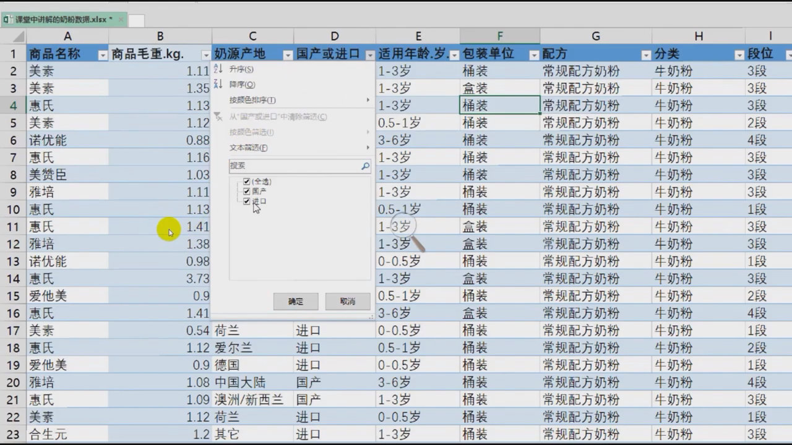

**数据透视表**也很好用，可自行探索，图中各元素都可*非常自由的编辑*

**颜色**可直接指定全表格 & 图表的色系


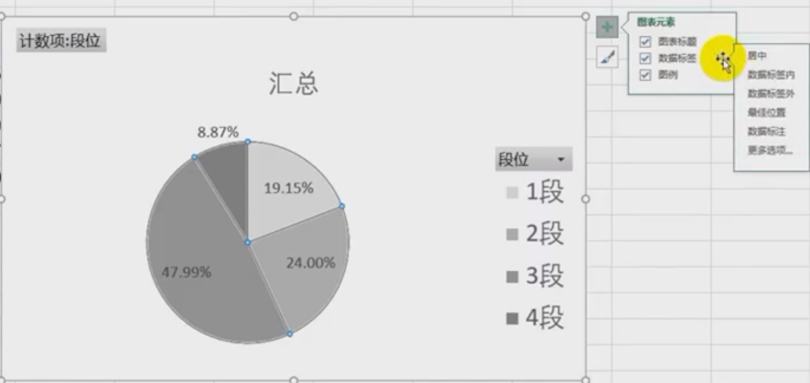

#### 描述性统计（STATA）

> [STATA 软件下载](https://pan.baidu.com/s/1V6WmgjQD3ax00TVeOd_CJQ)，该软件使用自己独特的 do 语言和 do 文件

文件 → 导入 → Excel 表格 → 将第一行作为变量名

> 需要键入变量时从右侧变量名窗口**直接选择变量**即可，不用一定敲其名字

##### 定量数据

```stata
summarize 变量1 变量2 ... 变量n  		//可简写为sum
summarize 变量1 变量2 ... 变量n, d	//更详细
```

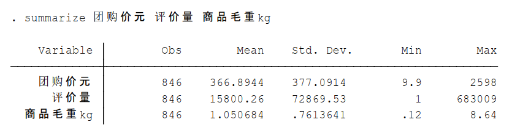

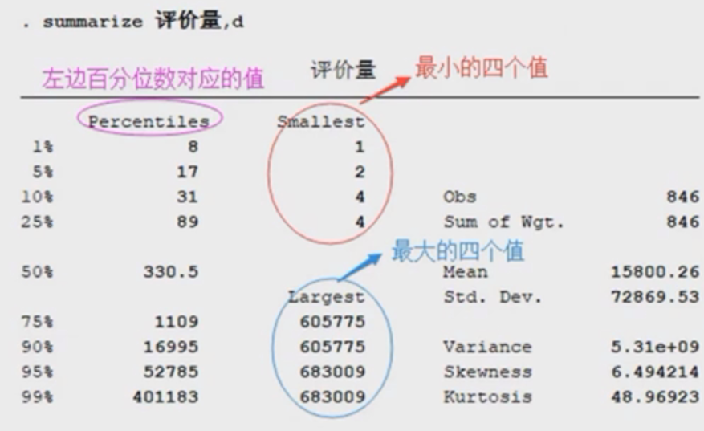

##### 定性数据

```stata
tabulate 变量名,gen(A)	//只能一个变量，可简写为tab
```

返回**频率分布**表，并**生成**对应的**虚拟变量**，以代码中的`A`字段 + 数字序号命名

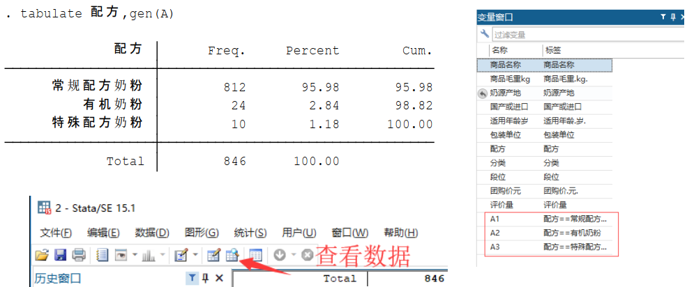

##### 注意

上述的 STATA 表格不要直接使用（[**三线**表](https://zhuanlan.zhihu.com/p/475173426)更好，且原版字体可能有问题 / 不好看）**尤其是直接截图**（难以判断原创性，且清晰度不高），可选中右键 → **用 Excel 格式**复制，在 Excel 中编辑

#### 回归（STATA）

##### 操作

```stata
regress y x1 x2 … xk//简写 reg
```

> 默认使用 OLS：*普通最小二乘估计法*

##### 输出

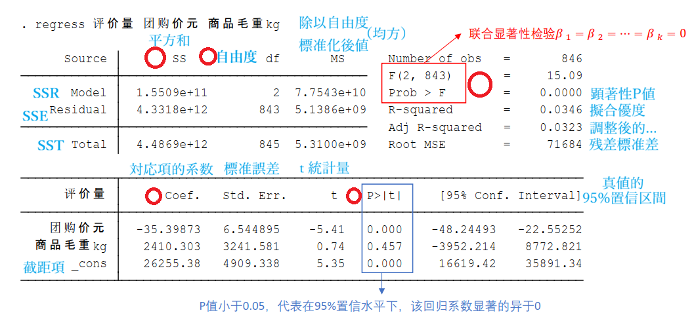

> 左上角其实是方差分析；标红圈为重要部分

##### 思路

先看能否通过**联合显著性检验**$`H_0:因变量和所给解释变量不存在任何关系`$	若通过则说明模型有价值

> 说明解释变量对评价量的影响不是纯随机的，模型中至少有一个变量是真正起作用的

再看各个解释变量的 **P 值**（from Pearson 相关系数中的 t 统计量），若小于置信水平则认为该系数**显著异于 0**

> 与 $`Coef.`$ 的绝对数值多少**没有任何关系**

最后**仅**对检验出显著异于 0 的系数进行**解释**

##### 注意

###### 虚拟变量

STATA 会自动检测数据的完全**多重共线性**问题，将多余变量 `omitted`

```stata
note: A2 omitted because of collinearity
```

###### 置信区间

最好置信区间**不包含 0**	*否则也很有可能 $`\beta`$ 几乎是 $`0`$*

###### 拟合优度

更倾向使用**调整**后的拟合优度 $`R^2_{adjusted}=1-\frac{SSE/(n-k-1)}{SST/(n-1)}`$ 多除了**自由度**

> 要求新加入的变量必须带来足够多的“信息增益”（**显著减少**$`SSE`$），才能让模型更优
>
> 否则，由于$`SST`$恒定，而$`SSE`$在引入新解释变量后不可能增加（*此前可以视为这一新解释变量的参数被限制为 0，加入后则解除了这一限制*），那么拟合优度一定随着自变量数增加而减少

但即便不如此，也很有可能拟合优度**低**，但这并**不重要**，能解释一定比例就可以了；

**只要通过 F 检验**了，就说明模型里的解释变量和被解释变量间的关系并非随机

> `R²=0.0346`意味着模型只解释了“评价量”波动的3.46%。这太正常了！影响一个商品评价量的因素成千上万：品牌、口碑、营销、季节、竞品、甚至偶然事件……这个模型只用了“价格”和“重量”两个因素，能解释3.5%的波动，已经说明这两者（尤其是价格）确实**提供了一些有效信息**。剩下的96.5%的波动被归入“残差”，恰恰反映的是实际问题的**复杂性**。

> **预测型**回归一般才会更看重 $`r^2`$（更像拟合）；**解释型**回归更多的关注模型**整体显著性**以及自变量的**统计显著性**和经济意义显著性即可

> 如果数据**不均匀** / 有异常值也可能导致这样	*参考上面的描述性统计，实际上八成评价量都在1100以下，但均值却有16000左右*

> 当然，也可以取对数 / 平方等进行处理

#### 标准化回归

##### 意义

研究哪个解释变量对因变量**影响最大** **不能**直接比较回归系数，因为受量纲等影响

$`\implies`$进行**标准化**（*减去均值除以标准差*）得到新变量，再进行回归得到标准化回归方程 & 标准化回归系数

已**判定为显著**的**标准化系数**的**绝对值越大**，说明对因变量的**影响就越大**

##### 操作

```stata
regress y x1 x2 ... xk, beta//beta可简写为b
```

##### 注意

> 常数项没有标准化回归系数	*全部标准化为了 0*

除了 `Beta` 一列标准化回归系数外，其他内容和普通回归**无差别**	*线性处理数据**不影响**标准误差 & 显著性*

#### STATA 操作补充

```stata
// 把回归结果保存在Word文档中；需要安装功能包（下一行，运行一次之后就可以注释掉了）
ssc install reg2docx, all replace
est store m1
reg2docx m1 using m1.docx, replace
// *** p<0.01  ** p<0.05 * p<0.1

// 修改变量名称，因为用中文命名变量名称有时候可能容易出现未知Bug
rename 团购价元 price
```

#### 反面教材

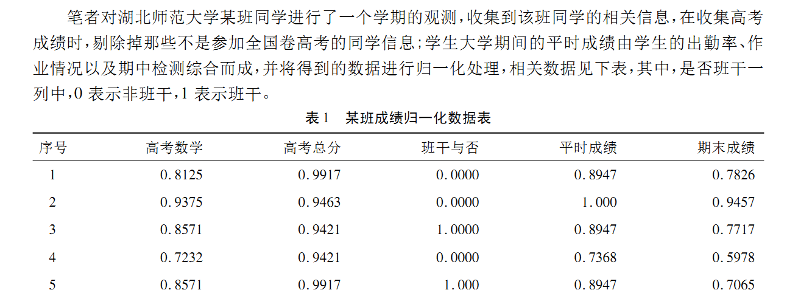

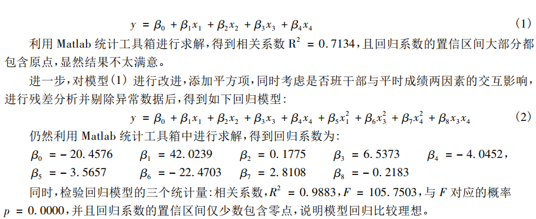

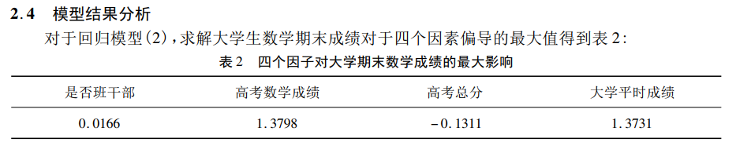

- $`R^2`$ 不是相关系数，是**拟合优度**

- 如前所述，评判多元线性回归应该看**联合独立性**检验，而非$`R^2`$

- 在解释性回归而非预测时，应该尽量让模型**更简单**，慎重添加平方项 / 交叉项（怎么解释？）

  > 一味追求更高的$`R^2`$反而又是陷入了拟合→插值（一个劲上次数）式的误区，你多添加变量$`R^2`$绝对变小啊，但是模型意义还够清晰吗？
  >
  > 如你怎么解释“给这个平方，却不给那个平方”？选都不好选

- 为什么不把拟合结果其他参数给出来？后面记得 $`F`$ 了那前面为啥没的呢？

- 可以标准回归，但不能**标准化数据再回归**，标准化之后怎么解释？解释还是要从原数据出发

  > 这里甚至还是归一化不是标准化 ... 如果你一项的范围就是从0~1，那什么叫“$`x 增加1,y 增加\beta`$”？

- 为什么虚拟变量$`x_3`$也来个平方，*完全不改变值啊*

- 看哪一个因素对我们的 Y 有最大的影响，应该用标准回归系数而**不是求偏导数**

> 07.7 主要是案例演示，没什么新内容，只有少数Excel操作，故略去

------

### 07.8 异方差 多重共线性以及逐步回归的介绍 *24 Jan*

> *透明な声は きっと 空っぽじゃない*
>
> 歌名：透明声彩  
> 歌手：YuNi

> [谁说这一讲都很简单的？（如果尝试理解）](https://chatgpt.com/share/e/69763401-9990-8007-9311-e5be752ed08a)

#### 前置知识

##### 扰动项条件

> 记 $`解释变量矩阵\mathbf{X}=(x_{ij})_{n\times n},\,误差向量\boldsymbol{\mu}=(\mu_1,\dots,\mu_n)^\top,\,整体\boldsymbol{y}=\mathbf{X}\boldsymbol{\beta}+\boldsymbol{\mu}`$（也可用$`\boldsymbol{\varepsilon}`$）
>
> $`误差的协方差矩阵\mathrm{Var}(\boldsymbol{\mu}\mid\mathbf{X})=\Sigma`$，其各元素为误差之间的协方差（对角线上则为自身的方差）

之前我们都默认扰动项是**球型**扰动项，满足以下两个条件

1. **同方差**	$`\mu_1,\dots,\mu_n`$**每一项的方差**（波动程度）均是一样的	***横截面**数据容易出现异方差*

   > $`每项方差\Sigma_{ii}=\mathrm{Var}(\mu_i)=\sigma^2整体方差`$

2. 无自相关	不同项之间协方差为 0	***时间序列**数据中容易出现自相关*

   > $`任意不同误差项之间的协方差\Sigma_{ij}=\mathrm{Cov}(\mu_i,\mu_j)=0(i\neq j)`$

##### 标准误

$`SE(\hat\beta_i)=\sqrt{\mathrm{Var}(\hat\beta_i\mid X)}`$，回归得到的**相关系数的标准差**	*右面这个不是协方差矩阵，只是协方差*

> $`\hat\beta`$ 是由 $`y`$ **线性计算**出来的，故可以写成线性变换 $`\hat\beta = A\,y`$	其中 $`A=(X^\top X)^{-1}X^\top`$ 
>
> 其中 $`X^\top X`$ Gram 矩阵 *列向量（解释变量向量）之间的内积*
>
> 线性变换有$`\mathrm{Var}(\hat\beta∣X)=A\,\mathrm{Var}(y∣X)\,A^\top`$ **方差传递**，故只用求 $`\mathrm{Var}(y\mid X)`$ 
>
> 由于 $`y=X\beta+\mu`$，而给定的 $`X`$ 情况下 $`X\beta`$ 是确定的，故 $`\mathrm{Var}(y\mid X)=\mathrm{Var}(\mu\mid X)=\sigma^2I`$ 
>
> 故$`\mathrm{Var}(\hat\beta∣X)=\sigma^2AA^\top=\sigma^2(X^\top X)^{-1}\implies 取元素代入得{\text{SE}(\hat\beta_i)=\sqrt{\sigma^2\,[(X^\top X)^{-1}]_{ii}}} `$
>
> 方差估计值$`\hat\sigma^2=\frac{\mathrm{SSE}}{n-k-1}`$，代入即可得到 $`\widehat{\mathrm{SE}}(\hat\beta_j)`$

##### 检验

###### t 检验

原假设 $`回归中某参数\beta_j=0`$	*拒绝$`\implies`$对应的该变量对因变量有显著影响*

典中典之 **实际误差 vs 标准** *无关情况下的只有噪声的* **误差**	$`t=\frac{\hat\beta_j-\beta_{j,0}}{se(\hat\beta_j)}\sim t(n-k-1)`$

###### F 检验

原假设 $`回归多个参数\beta_p=\beta_q=\dots=0\implies联合显著性检验中:所有斜率参数均为0`$

> 如何确认多个变量的显著性？比较 **完整**模型(U) vs **少了那几个变量**的模型(R) 的按维平均的 **SSE** 
>
> 此外，注意到$`完整模型空间 = 约束模型空间 \oplus 新增空间`$，故有后两空间中残差向量**正交** *减法用勾股拆开*

```math
F=\frac{(SSE_R-SSE_U)/q}{SSE_U/(n-k-1)}=\frac{(\|\boldsymbol\mu_R\|^2-\|\boldsymbol\mu_U\|^2)/q}{\|\boldsymbol\mu_U\|^2/(n-k-1)}\left[\sim\frac{\chi^2_q/q}{\chi^2_{n-k-1}/(n-k-1)}\right]\sim F_{q,\,n-k-1}
```

> 如果原假设成立，那么 y 在新增投影空间上的投影内只有正态噪声的投影，而正交投影不改变球形扰动项的形状，故分子分母各自仍是**正态分布平方和**，即满足卡方分布
>
> 两个**独立卡方**除以各自**自由度**$`\implies`$ **F 分布**

###### 不满足

> 上述两个检验的原假设不成立时，则还有真实信号（的投影）的影响，故分布会向两边平移

#### 异方差

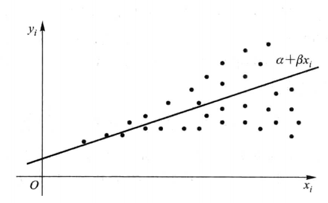

##### 后果

###### 不变

最小二乘法*OLS*估计出来的回归系数**仍然是无偏一致的**

> 外生性（零条件均值）仍满足
>

###### 变化

- **假设检验**无法使用（构造的统计量失效了）

  > 标准误失效；椭球形噪声向各方向的投影不再相同

- OLS估计量不再是最优线性无偏估计量（BLUE）

  > 不是说不是最优了，是不再有**最小方差**了，因为噪声大和噪声小的点得到了一样的权重

##### 检验

**回归结束后**再进行下列检验

*原假设	扰动项不存在异方差，条件方差为常数*  

###### 绘图

```stata
rvfplot // 画残差与拟合值的散点图
rvpplot x // 画残差与自变量x的散点图
```

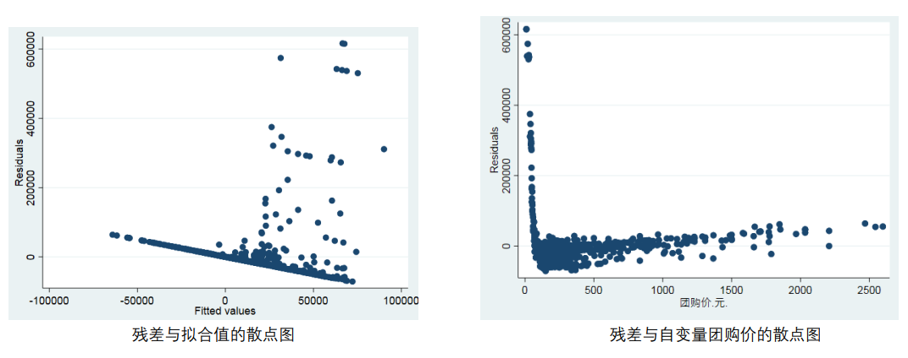

残差的**波动程度**在不同处**不同**

###### BP 检验

> Breusch and Pagen, 1979
>
> 假设误差项的（条件）方差是解释变量的**线性**函数	*条件方差函数*
>
> 原假设 $`同方差\implies给定自变量后扰动项方差=常数\,\sigma^2\implies条件方差函数中所有(m个)斜率均为\,0`$
>
> 但是真实的误差无法得知，用残差代替误差来回归并求得相关系数，若样本量为 $`n`$ 则有 $`nR^2\sim\chi^2(m)`$，相关系数只有一点点随机波动

不能用于有**平方**项 / **交叉**项的情况下

```stata
estat hettest ,rhs iid
```

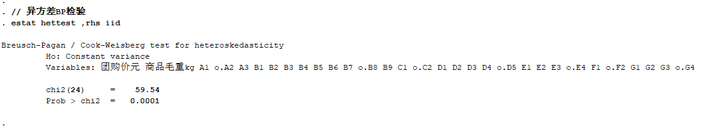

> P值小于0.05，说明在95%的置信水平下拒绝原假设，即我们认为扰动项存在异方差

###### White 检验

> 原假设 **稳健**标准误**和普通**标准误差不多$`\implies`$稳健协方差矩阵和普通协方差矩阵**之差收敛到零**矩阵

```stata
estat imtest,white
```

可以检验**任何**形式的异方差 *但不提供异方差具体形式的信息*

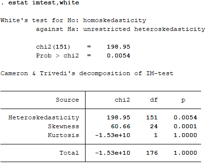

##### 解决方法

###### 广义最小二乘法 GLS

方差较大的数据包含的**信息**较少，故给予**信息量大（方差较小）**的数据更大权重

> 这里的信息和**熵权法**里面确定权重时的信息不是一个意思。异方差这里出现的信息可以理解为对于模型的**稳定程度**所做的贡献，异方差是指各个扰动项的方差不相同，那么方差较大的扰动项**破坏**模型稳定性的程度就较大，我们就说它**包含的信息量**减少。而在熵权法中，方差越大，说明这个指标**对于不同个体**而言的**变化程度**就大，那么我们在评价时就不能轻易忽视这个变量。  

但是我们并不知道**真实的 $`\Sigma`$ 协方差**结构，只能**二次建模**再去估计 & 加权，会有**偶然性**，故少用这种方法

###### OLS + 稳健的标准误

> 既然我们模型**本身**得到的还是最优结果，只是假设检验出了问题，那么**修一下假设检验（标准误）**不就行了？！

同方差时标准误恒为常数 $`\implies`$ 异方差时用**自己的残差大小**估计自己的**稳健**标准误	*前提是**大样本***

```stata
regress y x1 x2 … xk,robust//简写r
```

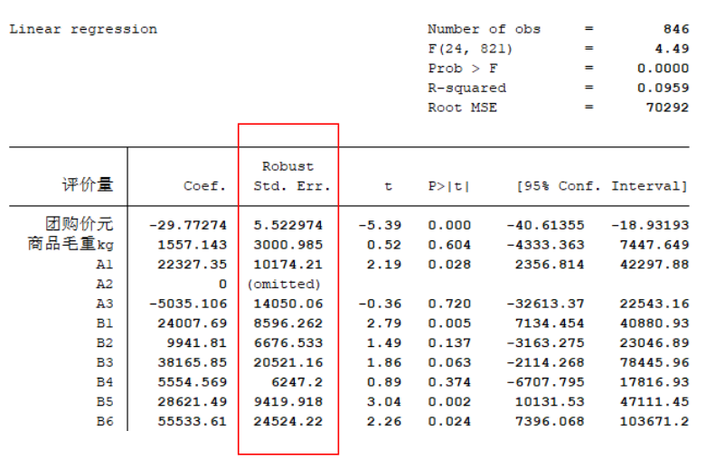

#### 多重共线性

##### 理解

回归是用 $`\mathbf x_1,\mathbf x_2`$ 的线性组合去贴近 $`\mathbf y`$：$`\hat{\mathbf y}= \hat\beta_1 \mathbf x_1+\hat\beta_2 \mathbf x_2`$

如果 $`\mathbf x_1,\mathbf x_2`$ 很“独立”（夹角大）， $`\hat\beta_1,\hat\beta_2`$ 就像在二维坐标系里的坐标（很稳定）

如果 $`\mathbf x_1,\mathbf x_2`$ 几乎平行（高度相关），就像拿两根几乎重合的杆子去定位 $`\mathbf y`$：
 $`\mathbf y`$ 往**这条方向**上投影是很确定的（模型整体的**拟合优度**还是好），但“到底**算到哪**根杆子头上”就不确定了（特定**参数的解释性**显著降低，很难区分各自的效应多少，且参数值即使变化很大也没什么影响）

极端情况（**完全**多重共线性）下，根本**无法区分**$`\hat\beta_1,\hat\beta_2`$，只能知道他们的和为某定值

> 体现在公式中，就是标准误的$`(X'X)^{-1}`$ 这一因式，括号里面会几乎是**奇异**矩阵，某些方向上**信息极少**，故求逆后那些方向会给出**巨大的放大系数**，会让些微的噪声变成标准误的巨大波动，所以 t 检验中的“信噪比”就会下降很多...

还会导致 t 检验**成功（相关性不显著了）**

##### 检验

```math
方差膨胀因子:对第m个自变量\, VIF_m=\frac1{1-R^2_{1\sim k\backslash m}},对模型VIF=max(VIF_i)\stackrel{?}{>}10
```

> $`R^2_{1\sim k\backslash m}`$是将第m个**自变量作为因变量**，对剩余自变量进行回归得到的

经验规则 $`VIF>\mathbf{10}\implies回归方程存在严重多重共线性`$

```stata
estat vif //计算各个自变量VIF
```

##### 处理

- 不关心具体回归系数，只关心**整个方程**预测被解释变量的能力$`\implies`$不必理会

- 关心具体回归系数，但多重共线性**不影响所关心变量**的显著性$`\implies`$不必理会

- 多重共线性影响了所关心变量的显著性$`\implies`$增大样本容量 or **剔除**导致严重共线性的变量

  > 理论上我们不能轻易删除变量（内生性） ，但数模对内生性要求不高，所以...
  >
  > 不过后果是可能会让 $`\hat\beta`$ 直接**偏**了

#### 逐步回归分析

##### 内容

###### 向前逐步回归 Forward selection

```stata
stepwise regress y x1 x2 … xk, pe(t) //（p值比t小）显著才加入模型中
```

###### 向后逐步回归 Backward elimination：

```stata
stepwise regress y x1 x2 … xk, pr(t) //（p值比t大）不显著就剔除出模型
```

##### 注意

- 可以在后面再加参数 **b / r**，即标准化回归系数或稳健标准误
- 自变量之间**不能有完全**多重共线性，需要手动去除
- 筛选后变量太多 / 太少$`\implies`$减小 / 增大 t
- 剔除自变量还是可能内生性，但是数模 ... 所以无所谓

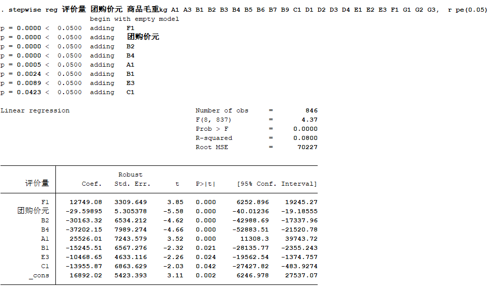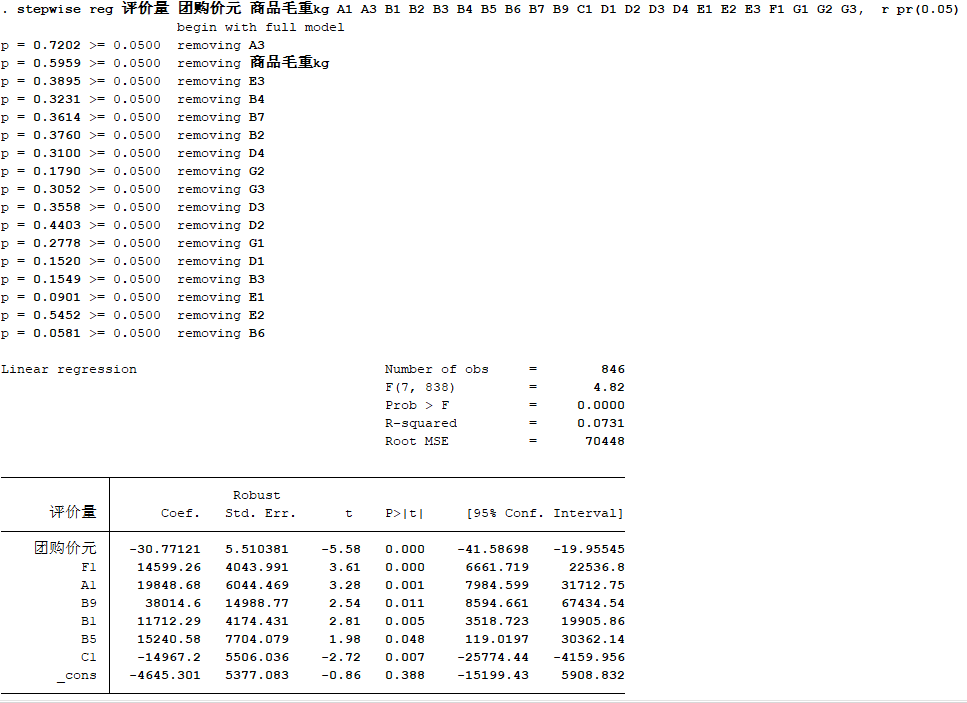

------

## 08 最短距离问题

> 突然强度下降了很多，各种意义上

### 08.1 图论的基本概念以及如何做出图论中的图形 *26 Jan*

> *大きな山の頂で 貴重な生命 身を寄せ合って あたたかな*
>
> 歌名：いきのこり●ぼくら  
> 歌手：青葉市子

#### 图

##### 介绍

由若干点和连接两点的线构成的图形	$`G(V(G),E(G)),\,顶点集 \& 边集`$

分为有向图 / 无向图；有的图边上还有**权**值（有权图）

##### 权重邻接矩阵

- 各元素表示从 i 节点到 j 节点的**权重**
- 如没有连线 / 反向，则记为 Inf
- 主对角线元素均为 0
- 如果是无向图，则该矩阵为对称矩阵

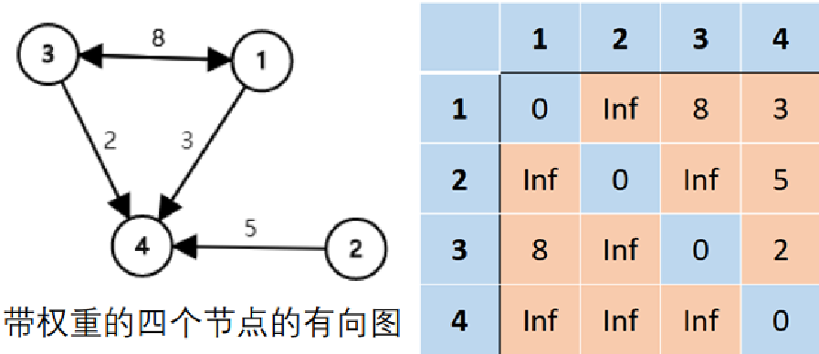

#### 作图

##### [在线](https://csacademy.com/app/graph_editor/)

先输入**节点**，再逐个输入**边起止点**

上方可切换有向无向 / 起始索引

##### Matlab

```matlab
G1 = graph(s,t,w) % 可在s和t中的对应节点之间（以w的权重）创建边，并生成一个图；不传入w参数则无权重
G2 = digraph(s,t,w) % 有向图
plot(G2, 'linewidth', 2) % 设置线的宽度
set( gca, 'XTick', [], 'YTick', [] ); % 画图后不显示坐标
```

> 两个数组是起止点，不要跟图的定义那两个集合混淆了；此外也不是像在线工具那样需要单独输入所有点

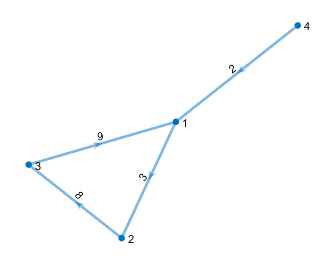

节点必须**从1开始**计数，且**不要间断**；如果是字符串，要用**大括号**包起来 `s2 = {'学校','电影院','酒店'};`

但是不是很好看，节点少还是用在线工具更好

------

### 08.2 Dijkstra 算法和 Bellman-Ford 算法求解最短路径 *26 Jan*

> *I don't believe in myself But I don't care 高く飛ぶ With my new shoes*
>
> 歌名：Cold Night  
> 歌手：HANA

Dijkstra 是荷兰语姓氏，其标准译名是**戴克斯特拉**而不是迪杰斯特拉，ij 在荷兰语中发 /aɪ/ 的音！

#### Dijkstra 算法

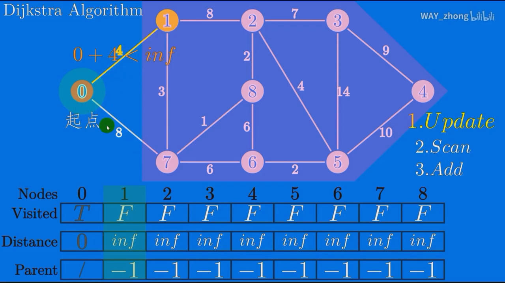

1. 算出各个从所在节点可到达但**未到达**节点离起点的距离，若比此前该点的距离值短则**更新**距离和父级
2. 扫描所有可到达但未到达节点，移动到距离最小的点
3. 将新到达节点状态改变为已到达，重复以上流程

> 最后到达终点后回溯父级即可

不能处理**负权重**

#### Bellman-Ford 算法

**不再**将节点区分为是否已访问的状态，每循环一次，贝尔曼-福特算法都会更新**所有**节点的信息

**可以**处理负权重（主要有向图），但是不能处理**负权回路**	*一个环上总权如果为负，那么绕这个环转越多次路程越短，无意义*

#### Matlab

```matlab
[P,d] = shortestpath(G,start,end,'Method',algorithm)
% G为图，start/end为起止节点，最后两个参数用于指定算法（可不填）
% P为最短路径经过的节点数组，d为最短距离
```

> algorithm 项可为 'auto'（默认，自动选择算法）, 'unweighted'（不计算权重）, 'positive'（Dijkstra 算法）, 'mixed'（有向图的 Bellman-Ford 算法）

```matlab
d = distances(G,'Method',algorithm) 				% 返回任意两点间距离构成的矩阵
[nodeIDs,dist] = nearest(G,s,d,'Method',algorithm) 	% 找给定范围内所有的点
```

------

## 09 分类模型

针对二值变量（逻辑变量）

### 09.1 逻辑回归求解二分类问题 *26 Jan*

> *「帰りたい場所がある」  誰もがこの星の子孫  約束はね 大事にね  温かく残ってる*
>
> 歌名：lulu.  
> 歌手：Mrs. GREEN APPLE

#### 线性概率模型 LPM

直接运用 $`y_i=\boldsymbol x_i^\top\boldsymbol{\beta}+u_i`$线性回归，但是并不有效

> - 由于$`y_i=0\,或\,1`$，故$`u_i=1-\boldsymbol x_i^\top\boldsymbol{\beta}\,或-\boldsymbol x_i^\top\boldsymbol{\beta}`$，显然与$`\boldsymbol x_i^\top`$有关$`\implies`$**内生**性$`\implies`$不一致 & 有偏
> - 预测值可能不在$`[0,1]`$内，不现实

#### 逻辑回归

##### 思路

直接把 0 / 1 / y hat 当作数来考虑是有问题的，不妨考虑**两点**分布 / Bernoulli 分布中的成功为 1 失败为 0

> 在这种分布中，$`E(y\mid x)=P(y=1\mid x)`$，不妨把这样的条件均值 / **得 1 概率理解为**$`\boldsymbol{\hat y}`$

假设存在某函数可确定 y hat：$`\hat y=F(\boldsymbol{x},\boldsymbol{\beta})=F(\boldsymbol{x}^\top\boldsymbol{\beta})`$，那么只要其**值域**在$`[0,1]`$上即可保证$`\hat y\in[0,1]`$

上述函数称为**连接函数**

##### 分类

- 连接函数为**标准正态**分布的**累计密度**函数 CDF$`\implies`$Probit 回归
- 连接函数为 **Sigmoid 函数** $`F=\frac{\exp(\boldsymbol{x}^\top\boldsymbol{\beta})}{1+\exp(\boldsymbol{x}^\top\boldsymbol{\beta})}\implies`$Logistic 回归

由于后者有解析表达式，故后者更方便

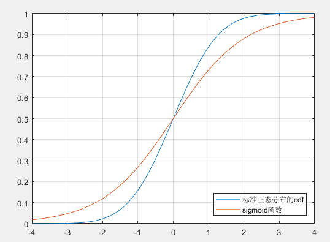

##### 求解

> 非线性模型只能极大似然估计...
>
> 最终发现需要使用数值方法（梯度下降）求解这个非线性最大化的问题...

如果 y hat ≥ 0.5，则认为预测的 y=1，反之则为 y=0

#### SPSS

##### 预处理

###### 创建虚拟变量

转换 → 创建虚变量 → 创建主效应虚变量 → 键入根名称

之后可以在表格视图中更改变量名，但在变量选择显示时会是`原名_k[更改名]`

###### 自变量中的分类变量

在 `Logistic 回归`子窗口 → 分类 → 移到右侧分类协变量

##### 基础求解

分析 → 回归 → 二元 Logistic → 分类因变量 & 协变量（解释变量） → “保存”中勾选“概率”“组成员”

##### 输出结果

###### 表格新增列

PRE_1$`\implies`$y hat	PGR_1$`\implies`$预测类别对应的 0 / 1 值

###### 逻辑回归系数表

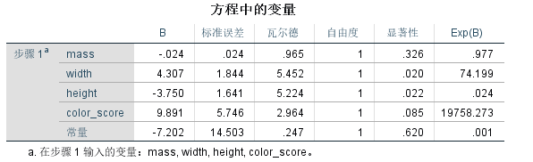

**B 一栏**就是求得的拟合系数 $`\hat\beta_i`$ ，代入Sigmoid 函数即可

> 这里的“显著性”还是 P 值；点进去可以看到各数据的更精确值

###### 分类表

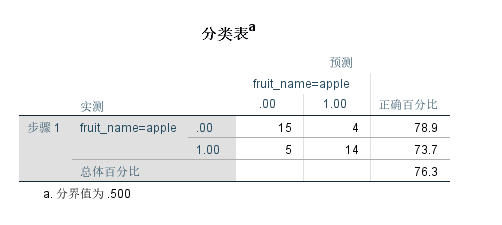

显示了预测成功的比例

##### 进阶操作

###### 逐步回归

在 `Logistic 回归`子窗口 → 下方`方法`中可选择向前 / 向后	*有条件 / LR / 瓦尔德是检验方法*

在右侧`选项`中可调节步进概率

###### 平方项 交互项的添加

转换 → 计算变量，创建新变量之后再把这个变量加进去再回归

*如果之前预测结果差可以这样，加入平方项等*	**预测**性回归可以这样增加变量

##### 过拟合

###### 现象

如果发现 y hat 都是 **0 或 1**，各个变量都**很不显著**，参数估计值很离谱地大...

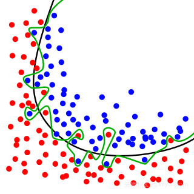

模型只是用一个极复杂的式子去记住了所有样本的特征，反而误差变得极大，已经失去了预测能力

###### 解决方法

把数据分为**训练**组和**测试**组（比例一般八二开），用训练组数据来估计出模型，再用测试组数据来进行测试

**交叉验证**	为消除偶然性影响，多重复几次上述步骤，最终对每个模型求一个**平均的准确率**，可以衡量一套模型的真实效果

------

### 09.2 Fisher 线性判别分析和多分类问题探究 *26 Jan + 16 h delay*

> *知った顔で笑っててよ 底知らず恐れるの 月並みの愛をくれよ You know me*
>
> 歌名：know me...  
> 歌手：八木海莉

#### Fisher 线性判别分析

> 又称 LDA (Linear Discriminant Analysis)  

##### 概念

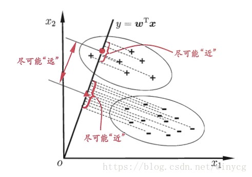

设法将样例**投影到一维直线**上，使得**同类**样例的投影点尽可能**接近和密集**，**异类**投影点尽可能**远离**

> 翻译成数学语言，即让同类投影点位置**方差**尽量小，异类投影点各自位置**均值之差**尽量大

##### 操作

分析 → 判别式 → 选择分组变量 & 定义其范围 → `保存`中勾选“预测组成员”“组成员概率” → `统计`中勾选“费希尔”“未标准化” → `分类`中勾选“摘要表”

> “范围”是逻辑变量的取值，如只有 0 / 1 就设最小值为 0 ，最大值为 1 ；一般Fisher不用标准化的系数

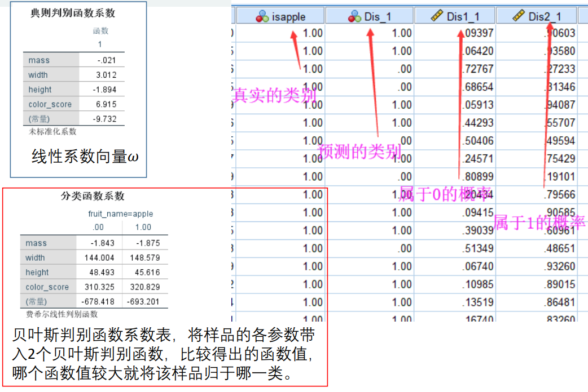

#### 多分类

##### Fisher 判别分析

操作类似二元分类时的情况，但需要提前**在 Excel 中**使用`替换`来手动生成虚拟变量，并在分析时更改定义范围

##### Logistic 回归

将连接函数推广为 Softmax 函数 $`Softmax(z_k)=\exp(z_k)/\sum \exp(z_i)`$

回归 → 多元 Logistic → 移动变量 → `统计`中勾选“分类表” → `保存`中勾选估算响应概率


> **因子**指分类型变量，**协变量**指连续型变量，误混淆

> 如果收到这样警告，说明是多重共线性 / 某些类别的观测值较少，但我们关注的是**分类预测**的准确度，所以可以忽略
>

> 

> 以上各种多分类也会给出分类表 & 新增概率列和预测结果列

------

## 10 聚类模型

分类是已知道类别，聚类则**未知类别**

### 10.1 K-means 聚类算法  26 Jan + 17 h delay

> *消えない 消えない、あの日のカゲロウ！胸の奥に花咲かした*
>
> 歌名：カゲロウ (阳炎)  
> 歌手：ЯeaL

#### K-means 聚类算法

##### 内容

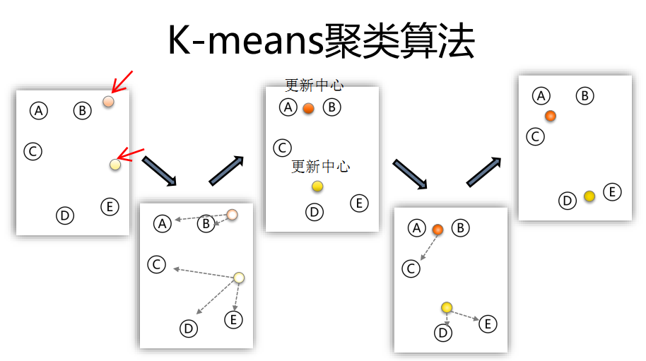

1. 指定需要划分的类的个数K 
2. 随机选择K个初始的聚类中心（不一定是样本点） 
3. 计算其余的各数据对象到这K个初始聚类中心的距离，把数据对象**划归到距离它最近**的那个中心所处在的簇类中
4. 调整新类并且**重新计算**出新类的中心
5. 循环步骤三和四，看中心是否收敛（不变），如果收敛或达到迭代次数则停止循环

可参考[在线演示](https://www.naftaliharris.com/blog/visualizing-k-means-clustering/)

##### 特点

优点	简单、快速，大数据集下相对高效率
缺点	要求用户必须**事先给出**要生成的簇的数目K；对**初值**敏感；对于**孤立点**数据敏感

#### K-means++ 算法

解决了 K-means 聚类算法的**后两个缺点**

##### 内容

只对 K-means 算法“**初始化**K个聚类中心”进行了优化

1. 随机选取一个样本作为第一个聚类中心
2. 计算每个样本与当前已有聚类中心的**最短距离**（这个值越大，表示被选取作为聚类中心的概率较大）
3. **依据距离值**随机抽选选出下一个聚类中心，距离值越大，被选为聚类中心的**概率**越大
4. 重复步骤 2 & 3 ，直到选出 K 个聚类中心

这样得到的初始聚类中心往往会包含离群点，其之后可以自成一类

##### 操作

分析 → 分类 → K-均值聚类 → `保存新变量`中勾选“聚类成员”“与聚类中心的距离” → `选项`中勾选“初始聚类中心”“每个个案的聚类信息”

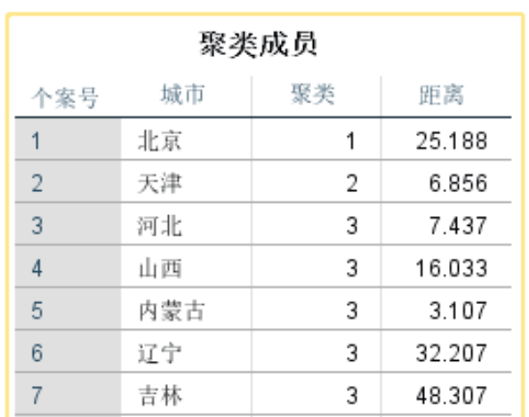

##### 注意

K 值怎么定？*凭感觉，多试试*

量纲不一致？这样**算距离**时没有意义！先**标准化**	分析 → 描述统计 → 描述 → *将标准化值另存为变量*	*标准化了之后聚类结果要自己算回原来值*

------

### 10.2 系统层次聚类算法和聚类效果图的绘制 *27 Jan*

> *これはカマボコかマホロかマコトか，大概な時代抜け出したい*
>
> 歌名：かまぼこかまほろかまことか  
> 歌手：真島ゆろ

#### 系统（层次）聚类

##### 分类

对样本分类 / 对指标分类（少见）

##### 思想

**依次**把**最为接近**的样本 / 类合为一类，到最后得到**谱系图**，再**逆向**取自己想要的类数

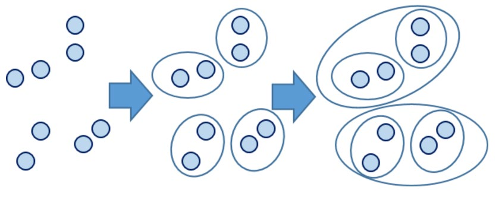

##### 距离

- 样本	绝对值距离（只用于网状道路等） / 欧氏距离（常用）
- 指标	相关系数 / 夹角余弦
- 类	重心法 / 最短/长距离法 / 组间/内平均连接法（常用）

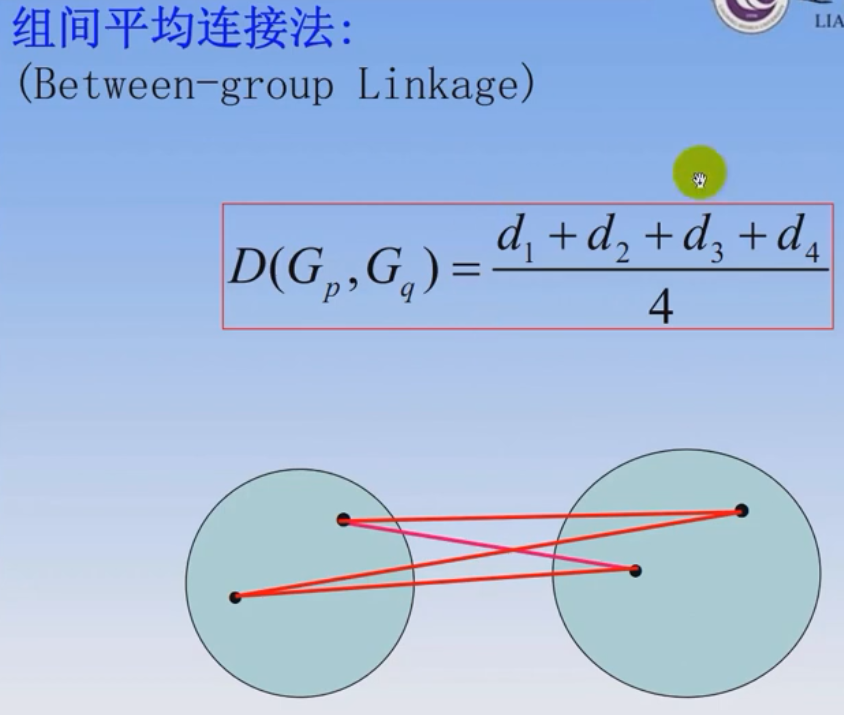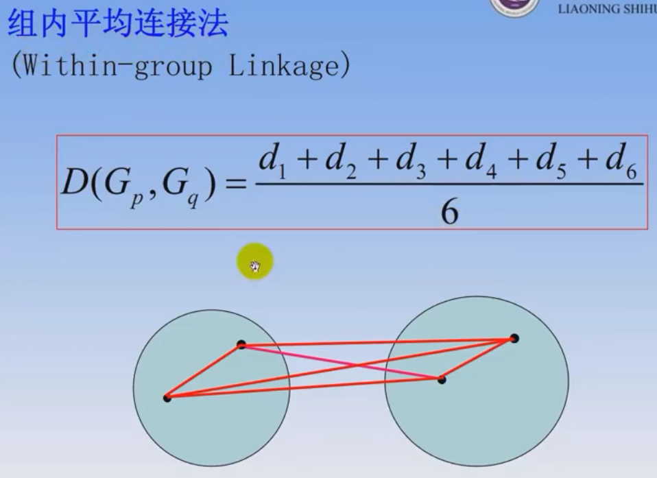

能得到**易于解释的结果**就行，选的什么具体方法不重要，*可以面向结果机动调整*

#### SPSS

##### 基本操作

分析 → 分类 → 系统聚类 → `图`勾选“谱系图” → `方法`可选择聚类 / 计算距离方法；如果要标准化，选择 Z 得分 → `保存`可指定聚类数，可让聚类提前停止，选出对应个数的类

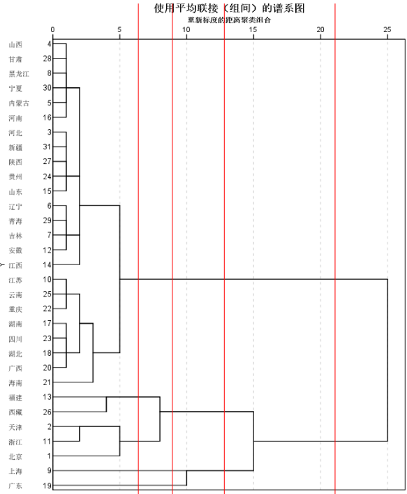

*还有冰柱图，不直观，现在少用了* 

##### 示意图

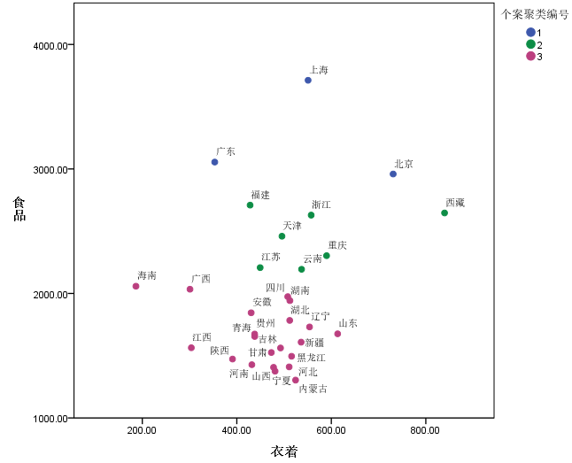

当指标只有 2 / 3 个时，可以作这样的二维 / 三维 示意图

图形 → 图表构建器 → 拖入变量 → `图库`选择散点图/点图 → `组/点 ID`勾选“点 ID 标签”

这样画出的图双击任意元素都**可以调整**

#### 聚类数的确定

**畸变**程度 $`\sim`$ 类重心与内部成员距离位置平方和

所有类总畸变程度称为**聚合系数**$`J\implies\boldsymbol{作\,J-K(聚类数)\,图}\implies`$**肘部**准则：看这个图何处**斜率开始变缓**，截至在下降趋势趋缓处

数据来自平均连接（组间） → 集中计划 表 → 系数 一列，再搬到 Excel 中绘制折线图

------

### 10.3 基于密度的聚类算法DBSCAN算法 *27 Jan*

> *そして風は今日もまた、運んでくるんだろ，流れた時をまるで、洗い流すように*
>
> 歌名：灯星  
> 歌手：中村遥 / suis from ヨルシカ

基于距离 → 基于**密度**

> Density-Based Spatial Clustering of Applications with Noise	具有噪声的基于密度的聚类算法

#### 思想

对已归类的数据点，其周围聚类空间中一定区域内**包含对象不少于阈值**，则将这些周围的点纳入该类	

严谨地说，以下**前两类点**构成一类

- 核心点 半径内含有不少于阈值数的点
- 边界点 半径内含有少于阈值数的点，但在核心点的领域内
- 噪音点 不属于以上两类

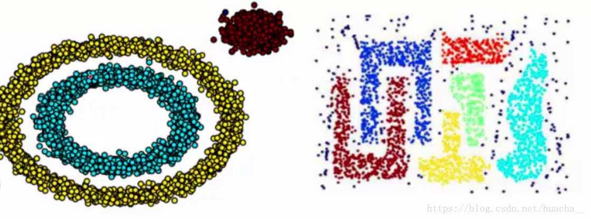

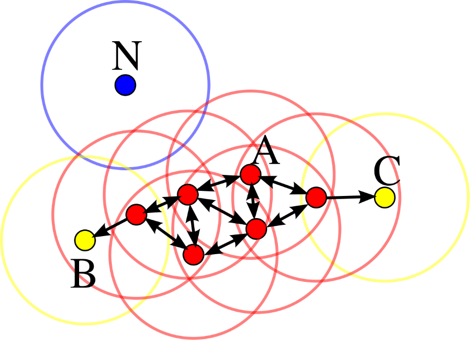

#### 使用（Matlab）

[老版中推荐代码](https://ww2.mathworks.cn/matlabcentral/fileexchange/52905-dbscan-clustering-algorithm)	后来有了[**dbscan 函数**](https://ww2.mathworks.cn/help/stats/dbscan.html)，可参考[该文](https://mp.weixin.qq.com/s/T9DYgP6ZaQ3iTizxslSHrw)

> 需要 MATLAB 版本高于 2019 且安装好了统计与机器学习工具箱 *Statistics and Machine Learning Toolbox*

```matlab
idx = dbscan(X,epsilon,minpts)			% epsilon为半径，minpts为最小阈值
length(unique(idx))  					% 聚类的类别数
gscatter(x,y,idx,[],[],1,'doleg','off') % 根据分类结果来绘制散点图
```

#### 特点

##### 优点

- 能处理任意形状和大小的簇	尤其是**有特定几何形状**的
- 可在聚类的同时发现**异常点**
- 与K-means比较起来，**不需要输入**要划分的聚类个数

##### 缺点

- 对**输入参数** ε 和 Minpts 敏感，确定参数困难
- 聚类的密度**不均匀**时时聚类质量差（因为参数固定，不能随机应变）
- 数据量大时计算密度单元的计算复杂度大（*但MATLAB新函数似乎很快*）

#### 取舍

- 只有两个指标，可以做散点图 & 数据有明显聚合成图形的样子$`\implies`$DBSCAN
- 其他情况建议**全用系统聚类**，相比 K-means 可以在论文上写的东西更多
- 当然 K-means 也可以用

------

## 11 时间序列分析

描述**过去** 分析**规律** 预测**未来**

### 11.1 时间序列分析的概念与时间序列分解模型 *27 Jan*

> *一億と二千年あとも愛してる 君を知ったその日から 僕の地獄に音楽は絶えない*
>
> 歌名：創聖のアクエリオン Myth of Emotions Ver.  
> 歌手：AKINO from bless４/福山芳樹

#### 时间序列

时间要素+数值要素

**时期**序列（中国GDP） **时点**序列（人的体重） *看可不可以相加*

#### 时间序列分解

##### 内容

**长期**趋势 T	**季节**趋势 S	**循环**变动 C	**不规则**变动 I

*循环变动是专指以数年为单位的，较少用*

##### 模型

**叠加**模型（变动之间相互独立，波动较为恒定）

**乘积**模型（变动之间有相互影响关系，波动随时间变化）

*无波动则二者均可*

数据**有周期性**（如逐月/逐季）才能分解，以年为单位的不行

#### 数据预处理


> 活用 Excel 中的**条件格式**，可以可视化

##### 补充缺失数据

- 在头尾	直接**删掉**
- 在中间	转换 → **替换缺失**值 → 选择方法

> 序列平均值（整个序列的平均数）	临近点的平均值/中位数	线性插值（相邻两点平均数）
>
> 临近点的线性趋势（先不包含该点进行线性回归，求得 y hat代入）

##### 定义时间变量

数据 → 定义日期与时间 → 选择类型并键入起始时间值

##### 绘图

分析 → 时间序列预测 → 序列图

#### 季节性分解

##### 操作

分析 → 时间序列预测 → 季节性分析 → 选择加性/乘性模型 → `移动平均值权重`根据**奇偶**选择 → 确定

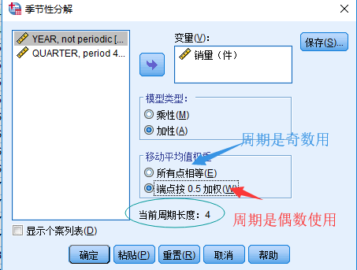

##### 结果

生成的四个变量并不对应于先前讲的那四个分解

> 变量视图里可以看到变量标签，即软件自动生成的变量含义解释

| 名称 | 标签               | 实际含义 |
| ---- | ------------------ | -------- |
| ERR  | 不规则变动         | I        |
| SAS  | 季节性调整后序列   | T+C+I    |
| SAF  | 季节（性调整）因子 | S        |
| STC  | 趋势循环           | T+C      |

加法季节因子的和为 0，乘法季节因子的积为 1

##### 作分解后的序列图（略）

> **改变量标签**可以在作图的时候直接显示你改的标签

#### 时间序列分析

1. 作时间序列**图**
2. 判断时间序列包含的**变动**成分
3. 时间序列**分解**（若有周期性且包含长期趋势、季节变动或循环变动）
4. 建立时间序列分析**模型**
5. **预测**未来的指标数值

------

### 11.2 SPSS中七种指数平滑方法的简单介绍 *27 Jan*

> *ぎりぎりぎりと撚れ 指に生きる意味をつけ 手を放せば 動き出すぼくが*
>
> 歌名：zenmaikatatenikimiwadokoe  
> 歌手：keisei / 初音ミク

#### 平滑模型

> 我们既然要精准地预测，就要尽量应用所有先前的数据
>
> 又想到，可以建立一种**递推**关系，让每相邻两项都符合相同的递推式，自然可以保证**平滑**

$`\hat x_{t+1}=\alpha x_t+(1-\alpha)\hat x_t`$

将这样的式子展开即可发现预测值是此前所有数据的加权平均，且**距离当期越近**权重越大

这样类型的方程可以细分成水平 / 趋势 / 周期 ... 将他们组合即可得到不同情况下的模型

#### 使用方程

$`水平平滑l_t=\alpha x_t+(1-\alpha)(l_{t-1}+\phi b_{t-1})`$

$`趋势平滑b_t=\beta(l_t-l_{t-1})+(1-\phi\beta)b_{t-1}`$

$`季节平滑s_t=\gamma(x_t-l_{t-1}-b_{t-1})+(1-\gamma)s_{t-m};乘法模型则\gamma\frac{x_t}{l_{t-1}+b_{t-1}}`$

$`预测方程\hat x_{t+h}=l_t+hb_t+s_{t+h-m(k+1)},k=[\frac{h-1}{m}];有阻尼则(\phi+\phi^2+...+\phi^h)b_t;乘法模型则(l_t+hb_t)s_{t+h-m(k+1)}`$

#### 具体分类

| 模型                |     趋势      | 季节成分 | 水平平滑 | 趋势平滑 | 季节平滑 |      特殊       | 类似ARIMA模型                  |
| ------------------- | :-----------: | :------: | :------: | :------: | :------: | :-------------: | ------------------------------ |
| Simple/简单指数平滑 |     不含      |   不含   |    √     |          |          |                 | ARIMA$`(0,1,1)`$                 |
| Holt 线性趋势       |     线性      |   不含   |    √     |    √     |          |                 | ARIMA$`(0,2,2)`$                 |
| Brown 线性趋势      |     线性      |   不含   |    √     |    √     |          | $`\alpha=\beta`$  | ARIMA$`(0,2,2)`$                 |
| 阻尼趋势            | 线性 逐渐减弱 |   不含   |    √     |    √     |          | 阻尼$`\phi\neq1`$ | ARIMA$`(1,1,2)`$                 |
| 简单季节性          |     不含      |   稳定   |    √     |          |    √     |                 | SARIMA$`(0,1,1)\times(0,1,1)_s`$ |
| Winters 加法/可加性 |     线性      |   稳定   |    √     |    √     |    √     |                 | SARIMA$`(0,1,0)\times(0,1,1)_s`$ |
| Winters 乘法/相乘性 |     线性      |  不稳定  |    √     |    √     |    √     |      乘法       | 无                             |

> 简单模型中只能预测一期
>
> t 当前期	h 预测超前期数 / 预测步长	x 观测值	x hat 预测值	α/β/γ ⚪⚪的平滑系数
>
> l 预估水平	b 预测趋势 / 坡度	m 周期长度

------

### 11.3 了解即可 与ARIMA模型相关的十大知识点 *28 Jan*

> *朝凪のなかでずっと、声を紡いで海を渡って、貴方のもとまで*
>
> 歌名：朝凪  
> 歌手：あたらよ

- 平稳时间序列（白噪声序列）	**均值**固定（为0），**方差**存在且恒定，**协方差**只与间隔s有关与t无关（为0），为弱平稳（白噪音）序列
- 差分方程和滞后算子	把序列变量表示为滞后项（先前项）/时间/其他变量的函数方程；$`L^iy_t=y_{t-i}`$
- AR模型	自回归，过去若干期**观测值**的加权平均+截距（$`\alpha_0+\sum^p_1\alpha_iy_{t-i}`$，p为阶数），将自己滞后项视为自变量进行回归
- MA模型	移动平均过程，过去若干期**噪声**的加权平均+本期噪声（$`\varepsilon_0+\sum_1^q\varepsilon_iy_{t-i}`$，q为阶数），使用过去的噪音项而非滞后项进行回归，某些情况下可转换为无穷阶自回归，可简化估计参数工作量
- ARMA模型	上述二者结合
- ACF和PACF	（偏）**自相关**系数；白噪音序列的自相关系数$`\rho_s=0(s\neq0)`$
- ARMA模型的估计
- AIC和BIC准则	在**复杂度和解释能力**间找平衡，选择使得下列变量最小的模型$`AIC=2n-2\ln f`$ $`BIC=\ln(T)n-2\ln f`$（参数个数记为n，极大似然函数值记为f（拟合程度），样本个数记为T）
- Q检验	检验残差是否为**白噪声**（如成立则模型可接受），原假设$`\rho_1=\dots=\rho_s=0`$，成立时$`Q=T(T+2)=\sum\frac{r_k^2}{T-k}\sim\chi^2_{s-n}`$
- ARIMA模型	对不平稳时间序列**先差分**为平稳序列后再进行AR和MA，三系数分别为AR/差分d/MA的阶数，$`(1-\sum\alpha_iL^i)(1-L)^dy_t=\alpha_0+(1+\sum\beta_iL^i)\varepsilon_t`$
- SARIMA模型	在ARIMA模型中包含额外的**季节性**项，六系数分别为非季节和季节部分的ARIMA三参数

------

### 11.4 & 11.5 预测实例 *28 Jan*

> *世界中が味方じゃないから 孤独な命で 今 歌を歌うんだ 透明な声は きっと 空っぽじゃない*
>
> 歌名：透明声彩  
> 歌手：YuNi

#### 思路

1. 处理缺失值问题、生成时间变量并画出时间序列图
2. 检查数据是否为季度 / 月份数据且至少有两个完整的周期，若是则观察图形中是否存在**季节性**波动
3. 根据时间序列图大致判断数据是否为**平稳**序列（围绕着均值上下波动，无趋势和季节性）
4. Spss → 分析 → 时间序列预测 → 创建传统模型（高版本的才有），检查**专家建模器**得出的最优的模型类型
   1. 如果结果是ARIMA(p,0,q)$`\implies`$画出时间序列的样本 **ACF 和 PACF 图形**进行分析
   2. 如果结果是ARIMA(p,1,q)$`\implies`$先对数据进行1阶**差分**后再用 ACF 和 PACF 图形分析
   3. 如果结果与季节性相关$`\implies`$考虑使用时间序列分解

#### 操作

在时间序列建模器中`变量` → 移动变量到自变量因变量

下方专家建模器`条件`子窗口中，`模型`内可调选择什么模型 / 考不考虑季节性，`离群值`可用多种方法（建议如果要检测就全部勾选）自动**检测离群值**（并用序列平均值替代）

`统计` → 单个模型的统计 → 参数估算值；`图` → 每个序列的图 → 勾选**拟合**值 **ACF PACF**

> 拟合值是把样本年份也带入进行计算，与真实观测值相比较可以观察模型拟合正确程度
>
> ACF PACF图形可以判断残差是否白噪声

`输出过滤`中可调节输出多少种模型，`保存`中可以保存预测值 / 置信区间上下界等变量，`选项`中“预测期”选到第二个选项可以进行**预测**

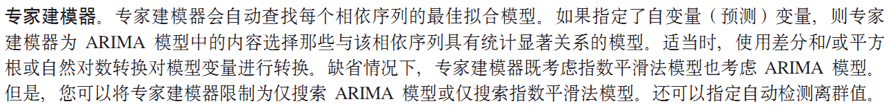

#### 结果

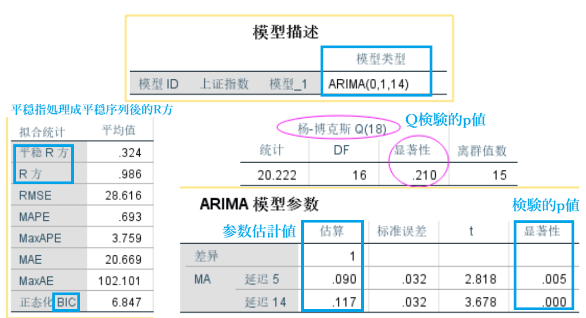

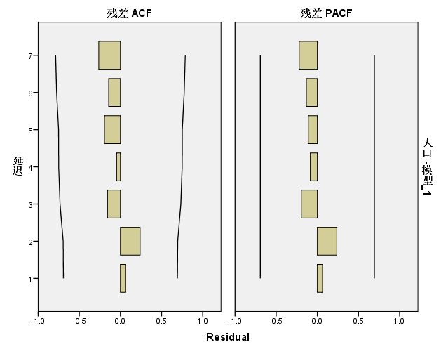

- 如果残差 ACF / PACF 大部分在两条竖线之间，则说明所有滞后阶数的（偏）自相关系数均和 0 没有显著的差异，当然还是要看 Q 检验最根本
- 有时平稳R方 / Q 统计量会变成 0 ，可能由于模型比较特殊
- 发现参数只有几个？因为剩下的都**不显著**，自动省略了

#### 绘图

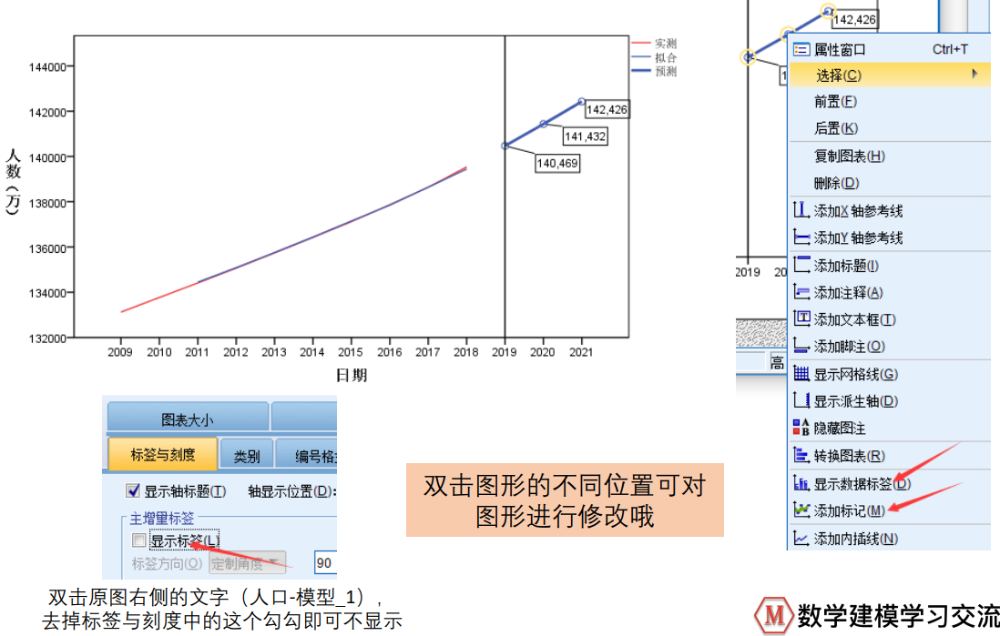

#### 注意

- 要**结合背景**，不要硬套模型

  > 如预测中国GDP，如果把所有数据拿过来拟合结果会很差，需要结合14年以后“不简单以GDP为英雄”的政策 / 新时代下 ... 等

- 要合理假设

  > 如对一些不可能一直保持原速增长下去的社会 / 经济变量，可直接采用阻尼类模型

- 不要不做**解释**

> 有一些更高级的模型，如GARCH（广义的自回归条件异方差模型），后来[MATLAB还有基于LSTM深度学习网络预测时间序列](https://www.bilibili.com/video/BV16V4y1r7jo/)

------

## 12 预测模型

### 12.1 灰色预测 `GM(1,1)` 模型的原理 *28 Jan*

> *簡単過ぎる愛の歌に、始まりの景色を見惚れては，化ける 化ける、月の下の僕らは，ほら何も言えないまま*
>
> 歌名：不革命前夜  
> 歌手：NEE

灰色预测	对既含有**已知**信息又含有**不确定**信息的系统进行预测

#### 原理

> 如果直接使用原始数据，那么受误差影响效果差；但是真信息往往有一定的内在趋势，而误差往往只是**随机**分布，所以想到**累加**可以平均误差的影响，**削弱随机性**

$`原始非负数据列x^{(0)},累加后x^{(1)};紧邻均值生成数列z^{(1)}(m)=\frac{x^{(1)}(m)+x^{(1)}(m-1)}2`$
```math
基本形式\,x^{(0)}(k)=-az^{(1)}(k)+b\,(-a\sim发展系数,\,b\sim灰作用量)
```
然后进行以$`x^{(0)}`$为因变量的线性回归，可以得到 a, b 的估计值

> 某种意义上累加可以视为一种**积分**，可以视为上述得到了一个积分方程，那么现在就要求导化为**微分方程**

注意到$`z^{(1)}\sim \boldsymbol{x}^{(1)}`$在[k,k+1]上的**定积分**，$`x^{(0)}=\Delta x^{(1)}=\boldsymbol{x}^{(1)}`$**导数**在[k,k+1]上的**定积分**，故有
```math
近似/灰微分方程:\frac {\mathrm{d}x^{(1)}(t)}{\mathrm{d}t}=-\hat\alpha x^{(1)}(t)+\hat b
```
容易知道，结果是$`f=C_1e^{C_2x}`$型的指数函数，故GM模型的本质是有条件的**指数**拟合

#### 准指数规律检验

有$`级比\,\sigma(k) `$为该级数据和上一级数据的比值

若任意阶内的所有 $`\sigma(k)`$ **上下限**之差不超过 **0.5** ，则称这一序列有**准指数规律**，这样才能够使用灰色系统建模

对`GM(1,1)`，$`\sigma(k)=1+x^{(0)}(k)/x^{(1)}(k-1)=1+\rho(k)\,[光滑比]`$

由于光滑比的分母项为累加，故其整体定会趋向于 0，故要使检验通过只需 $`\rho`$ **< 0.5**

> 实际中前几期很可能不符合要求，所以这样占比的 $`\rho`$ 越高越好就可以，重点关注后面的期数

#### 发展系数

$`|a|`$**越小**模型越准确

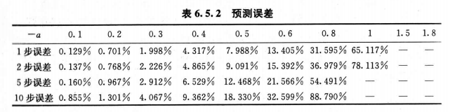

#### 评价

对原数据的拟合程度

##### 残差

将绝对残差除以观测值得到相对残差，将其再求平均得到**平均相对误差**$`\bar\varepsilon_r`$

> 可认为其小于 10%/20% 时模型拟合效果不错 / 达到要求，但不绝对

**也可用于其他**预测模型的检验

##### 级比偏差

```math
级比偏差\,\eta(k)=\left\lvert1-\frac{1-0.5\hat a}{1+0.5\hat a}\frac1{\sigma(k)}\right\rvert,平均级比偏差\bar\eta
```

认为平均级比偏差小于 0.1 / 0.2 时拟合效果不错 / 达到要求

> $`\eta`$ 越小说明 $`x`$ 和 $`\hat x`$ 越接近

#### 拓展

- 普通`GM(1,1)`模型	只用原始数据建模
- 新信息`GM(1,1)`	每次也**将最新预测**的一个数据代入来建模
- 新陈代谢`GM(1,1)`	每次将最新预测的一个数据置入，且**删除一个最老**数据来建模	***最理想**的模型*

#### 使用条件

- 数据是以**年份**度量的非负数据（*月份 / 季度数据用时间序列模型*）
- 数据能经过**准指数**规律的检验（*除了前两期外，至少90%的期数的光滑比低于0.5*）
- 数据的**期数较短**（小于等于10但也不能太短，数据期数较长一般用时间序列模型）且和其他数据之间的关联性不强

------

### 12.2 灰色预测代码的讲解 *28 Jan*

> *千の夜を越えてはまた君と出会い、千の音届けてただ君を謳う，生き足す毎に 日々増す想い、綴ろう二人 千夜一夜*
>
> 歌名：千夜一夜  
> 歌手：Hilcrhyme / 仲宗根泉

1. 画时间序列图，简单分析趋势
2. 将数据分为**训练组和测试组**，使用不同的模型对训练组进行建模，再用测试组的数据判断哪种模型最好（可以SSE**为指标来挑选模型**，如指数平滑 / ARIMA / 灰色预测 / 神经网络 ...）
3. 选择上一步中得到的预测误差最小的模型， 利用全部数据重新建模，并对未来进行预测
4. 画出预测后的数据和原来数据的时序图，观察预测的未来趋势是否合理

> 具体代码略，可以直接照搬资料里的版本
